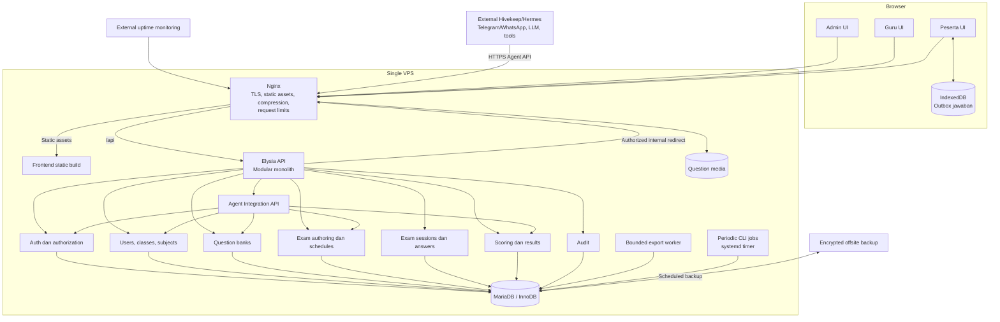
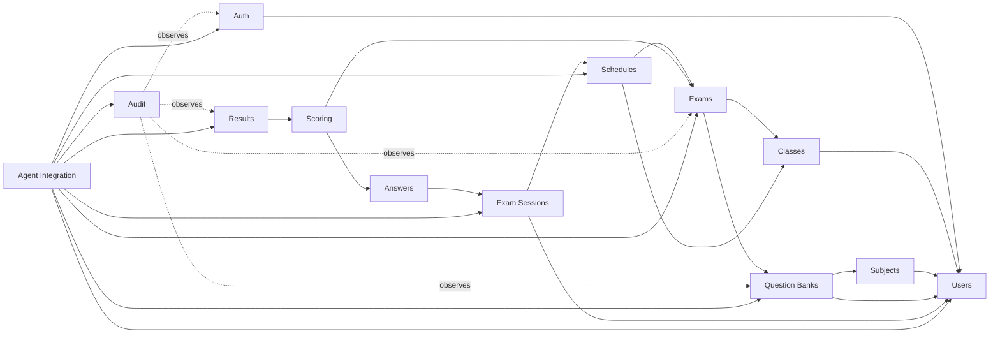
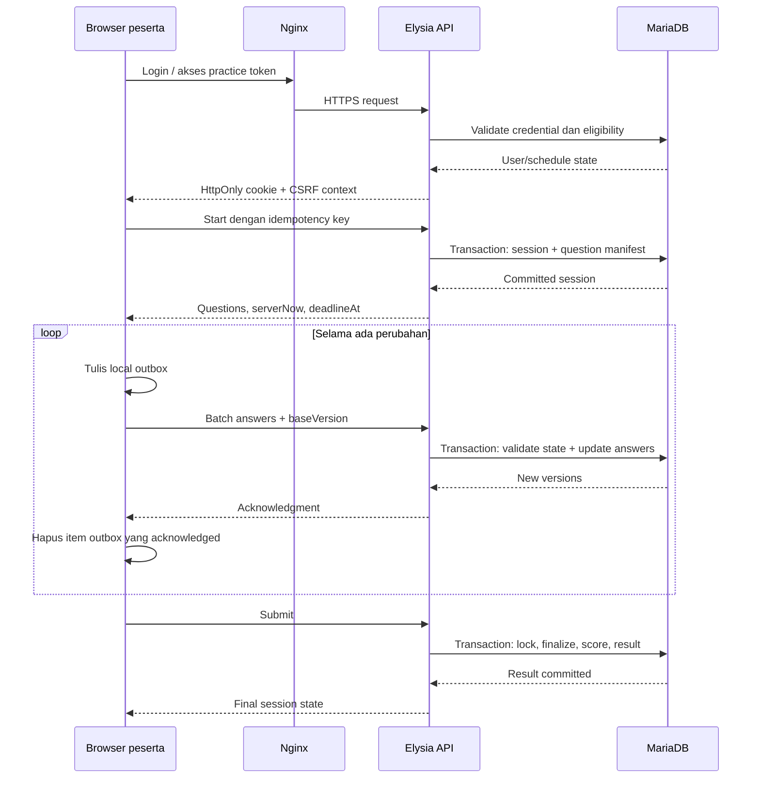
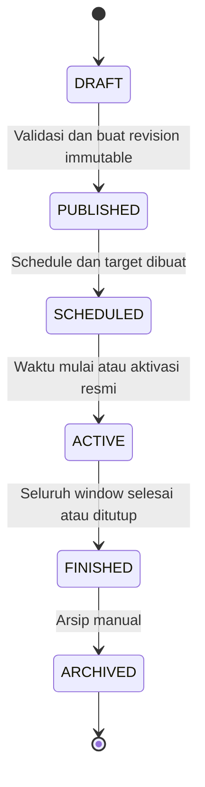
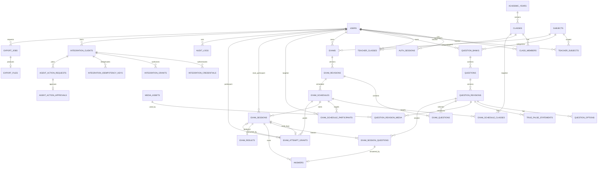
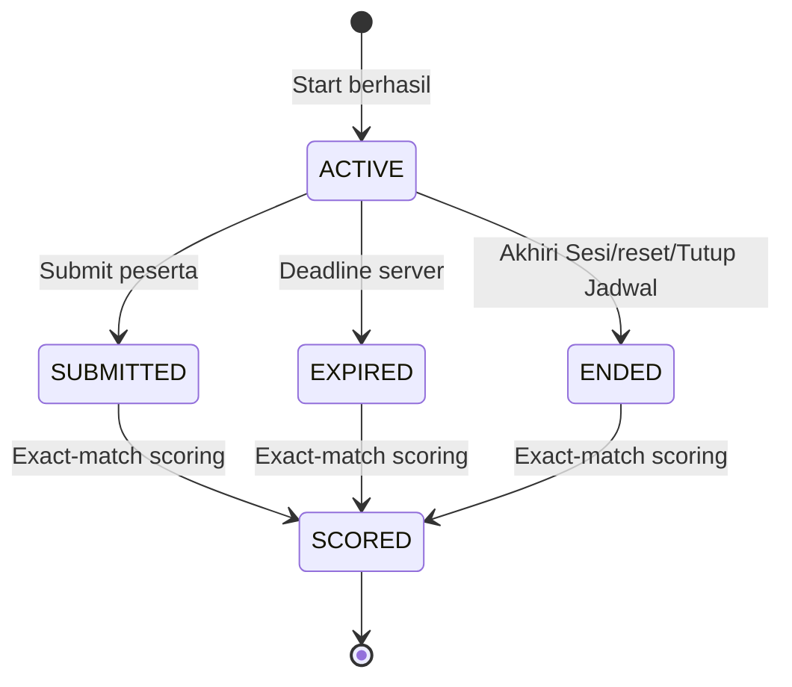
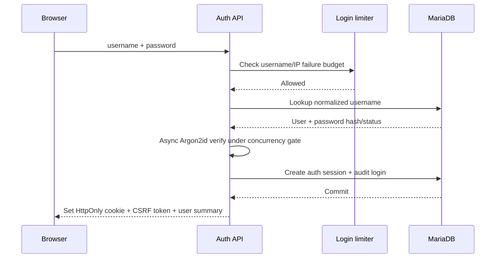

# Arsitektur GezyCBT

**Status:** Baseline arsitektur untuk development, belum diimplementasikan  
**Versi dokumen:** 0.13  
**Terakhir diperbarui:** 16 September 2026  
**Target:** Satu sekolah, hingga 1.000 peserta aktif, VPS sekitar 2 GB RAM  
**Keputusan produk P-01–P-12:** Disetujui 16 September 2026  

Dokumen ini bersifat normatif untuk implementasi awal. Kata **wajib** berarti aturan correctness atau security yang tidak boleh dilewati. Kata **disarankan** berarti keputusan teknis yang dapat diubah melalui Architecture Decision Record (ADR). Keputusan produk P-01 sampai P-12 telah disetujui dan menjadi baseline implementasi.

## Ringkasan keputusan

GezyCBT dirancang sebagai **modular monolith** dalam satu Git repository berbentuk lightweight monorepo. Frontend, backend, kontrak API, migrasi database, pengujian, dan konfigurasi operasional dipisahkan secara jelas tanpa memecah aplikasi menjadi microservices.

Keputusan utama:

| Area | Keputusan |
|---|---|
| Bentuk aplikasi | Modular monolith |
| Tenancy | Single-tenant; satu deployment dan satu database untuk satu sekolah |
| Repository | Satu Git repository dengan Bun workspaces |
| Backend | Bun, Elysia, TypeScript |
| Frontend | Vue 3 SPA, Vite, TypeScript |
| Database | MariaDB dengan InnoDB |
| Komunikasi | REST/JSON melalui HTTPS |
| Login session | Opaque server-side session di MariaDB |
| Exam autosave | HTTP batch request dengan optimistic concurrency |
| Realtime | Tidak diperlukan pada versi awal |
| Cache | Browser, Nginx, dan InnoDB buffer pool |
| Deployment | Nginx, Bun service, dan MariaDB pada satu VPS |
| Background job | Perintah CLI idempotent melalui systemd timer |
| Media soal | Local filesystem dengan otorisasi API dan Nginx internal redirect |
| External agent | Hivekeep/Hermes berjalan terpisah; GezyCBT menyediakan Agent Integration API |
| Izin agent | Machine credential dan capability grant eksplisit dengan scope, approval, idempotency, dan audit |
| UI/UX | Theme mengikuti sistem secara default, dengan pilihan terang/gelap; responsif dan berbasis design tokens |

Compatibility matrix, database test lanes, dan environment pinning berada di [Compatibility Matrix](./6-COMPATIBILITY.md). Bun.SQL dipilih melalui [ADR-003](./adr/ADR-003-bun-sql-vs-mariadb-connector.md), dengan official MariaDB Connector sebagai fallback.

Browser/device support, batas content, SLO, RPO, dan RTO baseline berada di [Operating Baseline](./8-OPERATING-BASELINE.md).

Rancangan rinci integrasi Hivekeep/Hermes berada di [Integrasi External AI Agent](./02-bot-automation.md). Baseline visual, layout, komponen, responsive behavior, accessibility, dan halaman ujian berada di [Rancangan UI/UX Web](./03-ui-ux.md).

### Keputusan produk yang disetujui

| ID | Topik | Keputusan | Dampak jika diubah |
|---|---|---|---|
| P-01 | Jumlah opsi choice | Minimal 2, maksimal 10 | Validasi editor dan kontrak API |
| P-02 | Attempt ujian utama | 1 attempt per peserta per schedule | Constraint session dan UI admin |
| P-03 | Attempt latihan | Dapat diulang; setiap start membuat session baru | Pelaporan dan rate limit |
| P-04 | Akhir jadwal | Hard stop; deadline peserta tidak boleh melewati `ends_at` | Perhitungan timer dan timeout |
| P-05 | Hasil ujian utama | Tidak langsung terlihat; guru/admin merilis hasil | Halaman peserta dan status result |
| P-06 | Hasil latihan | Skor langsung terlihat tanpa answer key | Response submit dan halaman hasil |
| P-07 | Identitas latihan | Nama wajib; instansi dan kelas opsional/configurable | Schema identity snapshot dan form masuk |
| P-08 | Randomisasi | Urutan soal dan opsi choice dapat diacak; tiga pernyataan `TRUE_FALSE` tidak diacak | Session question manifest |
| P-09 | Nilai soal | Bobot per soal berupa angka desimal positif, default 1 | Schema exam question dan result |
| P-10 | Resume ujian utama | Boleh dari perangkat lain setelah login ulang | Konflik device dan audit |
| P-11 | Zona waktu UI | `Asia/Jakarta`; database selalu UTC | Formatting, schedule input, dan laporan |
| P-12 | Retensi audit | Minimal 1 tahun | Storage dan housekeeping |

Keputusan di atas disetujui pada 16 September 2026. Perubahan berikutnya wajib dicatat pada ADR dan diselesaikan sebelum migration atau UI yang bergantung padanya diubah.

Asumsi kapasitas awal adalah 50–100 soal per ujian, mayoritas soal berbasis teks atau gambar berukuran wajar, dan koneksi peserta dapat terputus sewaktu-waktu. Kemampuan riil untuk melayani 1.000 peserta tetap bergantung pada jumlah vCPU dan performa disk. Target infrastruktur yang layak adalah minimal 2 vCPU dan SSD/NVMe.

---

## A. Architecture overview

### A.1 Bentuk aplikasi

Aplikasi terdiri dari dua artifact utama dalam satu repository:

1. Frontend SPA yang dibangun menjadi static assets dan dilayani langsung oleh Nginx.
2. Backend Elysia yang menyediakan API, autentikasi, business rules, dan akses database.

MariaDB menjadi sumber kebenaran untuk seluruh state penting. Backend tidak boleh menggantungkan correctness pada memory process agar restart atau penambahan process tidak merusak sesi ujian.

Vue 3 dipilih karena cukup ringan dan cocok untuk halaman ujian yang membutuhkan timer, autosave, navigasi soal, state lokal, dan IndexedDB. Server-side rendering tidak diperlukan karena aplikasi tidak membutuhkan SEO.

### A.1.1 Baseline teknologi

| Concern | Pilihan awal | Catatan |
|---|---|---|
| Runtime dan package manager | Bun, versi exact dipin | Gunakan satu versi pada local, CI, dan production |
| HTTP framework | Elysia | Route schema menjadi sumber validation dan OpenAPI |
| Database client | `Bun.SQL` adapter MariaDB | Dipilih melalui ADR-003 setelah compatibility spike terhadap MariaDB 11.4 dan 10.11 |
| Fallback database client | Official MariaDB Connector/Node.js | Tetap adapter fallback bila ditemukan gap Bun.SQL yang material |
| SQL abstraction | Repository dengan parameterized SQL | Tidak memakai active-record; query penting tetap terlihat dan dapat dianalisis |
| Migration | File SQL forward-only dengan tabel `schema_migrations` | Dijalankan oleh satu release command, bukan saat setiap process boot |
| Frontend | Vue 3, Vite, TypeScript | SPA tanpa SSR |
| Client state | Vue composables; Pinia hanya untuk state lintas route | State answer session dipisahkan dari state admin |
| Styling | Design tokens, theme system/light/dark, dan scoped CSS | Hindari component suite besar pada halaman peserta |
| API schema | Elysia `t`/TypeBox-compatible schemas | Runtime validation, TypeScript type, dan OpenAPI dari definisi yang sama |
| API documentation | OpenAPI development/staging | Production hanya dapat diakses admin atau dinonaktifkan |
| Unit/integration test | Bun test runner | Integration test memakai MariaDB asli |
| Browser E2E | Playwright | Mobile, tablet, desktop, reconnect, dan multi-tab |
| Load test | k6 atau tool setara | Skenario disimpan dalam repository |

`Bun.SQL` dipilih melalui [ADR-003](./adr/ADR-003-bun-sql-vs-mariadb-connector.md) untuk mengurangi dependency dan menyediakan parameterized query, pooling, prepared statements, serta transaction API. Compatibility spike terhadap MariaDB 11.4 dan 10.11 lulus untuk jalur TCP. Jika salah satu trigger re-evaluation ADR terpenuhi, gunakan official MariaDB Connector tanpa mengubah repository interface.

### A.1.2 Single-tenant boundary

Satu instalasi GezyCBT hanya melayani satu sekolah. Konsekuensinya:

- schema domain tidak memiliki `tenant_id` atau `school_id` pada setiap tabel;
- tidak ada tenant resolver berdasarkan domain, header, atau login;
- tidak ada super-admin lintas sekolah;
- seluruh admin, guru, peserta, kelas, soal, ujian, media, dan hasil berada dalam satu boundary sekolah;
- nama, logo, alamat, dan konfigurasi sekolah disimpan pada singleton `school_settings`;
- integration client, credential, grant, action, dan audit agent hanya berlaku untuk deployment sekolah ini;
- backup dan restore selalu mencakup satu sekolah secara utuh;
- bila sekolah lain ingin memakai aplikasi, sekolah tersebut membutuhkan deployment, database, media storage, integration credential, dan backup terpisah.

Authorization tetap wajib memeriksa role, ownership, dan teacher scope. Single-tenant tidak berarti seluruh user dapat mengakses seluruh data.

### A.2 Satu repository atau monorepo

Gunakan **satu Git repository berbentuk lightweight monorepo**. Monorepo di sini bukan kumpulan banyak layanan; ia hanya memberikan pemisahan package dan ownership yang jelas.

Manfaatnya:

- frontend dan backend memakai kontrak API yang sama;
- satu perubahan fitur dapat mencakup UI, API, migrasi, dan test dalam satu commit;
- proses build dan deployment tetap sederhana;
- tidak ada version drift antarrepository;
- masih mudah dipisahkan di masa depan jika kebutuhan nyata muncul.

### A.3 Struktur project

```text
gezycbt/
├── package.json
├── bun.lock
├── bunfig.toml
├── tsconfig.base.json
├── apps/
│   ├── api/
│   │   └── src/
│   │       ├── bootstrap/
│   │       │   ├── create-app.ts
│   │       │   └── graceful-shutdown.ts
│   │       ├── config/
│   │       │   ├── env.schema.ts
│   │       │   └── config.ts
│   │       ├── http/
│   │       │   ├── middleware/
│   │       │   ├── errors/
│   │       │   ├── presenters/
│   │       │   └── routes/
│   │       ├── modules/
│   │       │   ├── auth/
│   │       │   ├── users/
│   │       │   ├── classes/
│   │       │   ├── subjects/
│   │       │   ├── question-banks/
│   │       │   ├── exams/
│   │       │   ├── exam-sessions/
│   │       │   ├── scoring/
│   │       │   ├── audit/
│   │       │   ├── exports/
│   │       │   └── agent-integrations/
│   │       ├── infrastructure/
│   │       │   ├── database/
│   │       │   ├── clock/
│   │       │   ├── crypto/
│   │       │   ├── files/
│   │       │   └── logging/
│   │       ├── workers/
│   │       │   └── export-worker.ts
│   │       ├── cli/
│   │       └── index.ts
│   └── web/
│       └── src/
│           ├── app/
│           ├── layouts/
│           │   ├── admin/
│           │   ├── teacher/
│           │   └── participant/
│           ├── routes/
│           ├── features/
│           ├── components/
│           ├── stores/
│           ├── infrastructure/
│           │   ├── api/
│           │   ├── indexed-db/
│           │   └── telemetry/
│           └── styles/
├── packages/
│   ├── contracts/
│   │   └── src/
│   │       ├── common/
│   │       ├── admin/
│   │       ├── teacher/
│   │       ├── participant/
│   │       ├── agent-integrations/
│   │       └── exports/
│   ├── database/
│   │   ├── migrations/
│   │   ├── seeds/
│   │   └── queries/
│   ├── shared/
│   │   └── src/
│   └── config/
├── tests/
│   ├── integration/
│   ├── e2e/
│   └── load/
├── ops/
│   ├── nginx/
│   ├── systemd/
│   ├── backup/
│   └── deployment/
└── docs/
    ├── 01-architecture.md
    ├── 02-bot-automation.md
    ├── 03-ui-ux.md
    └── runbooks/
```

`packages/contracts` berisi schema request/response, error codes, dan TypeScript types yang dipakai frontend serta backend. Package ini tidak berisi database entity atau business logic sehingga frontend tidak terikat pada bentuk tabel.

`packages/database` hanya berisi migration, seed development, dan SQL yang memang layak disimpan sebagai file. Ia tidak boleh diimpor frontend. Production seed hanya membuat data bootstrap yang eksplisit, misalnya akun admin pertama melalui CLI.

Fixture representatif berada di `packages/database/src/seeds/representative-fixtures.ts`. Generator ini deterministic berdasarkan `seed`, default menghasilkan 1.500 peserta, 6 kelas, 12 guru, 8 subject, dan scope guru yang konsisten. Namespace username/code selalu memakai prefix fixture sehingga data dapat dibedakan dari data sekolah. Fixture hanya untuk test/load/staging dan tidak boleh dijalankan saat startup production.

### A.3.1 Struktur internal sebuah modul backend

```text
modules/exam-sessions/
├── domain/
│   ├── exam-session.ts
│   ├── policies.ts
│   └── errors.ts
├── application/
│   ├── start-session.ts
│   ├── save-answers.ts
│   ├── submit-session.ts
│   └── get-session.ts
├── infrastructure/
│   └── exam-session.repository.ts
├── http/
│   ├── routes.ts
│   ├── schemas.ts
│   └── presenter.ts
└── index.ts
```

Aturan dependency:

```text
http -> application -> domain
infrastructure -> domain/application ports
domain -> tidak bergantung pada Elysia, SQL client, atau browser contract
```

Route tidak boleh berisi SQL atau business rule. Repository tidak boleh menentukan authorization. Presenter tidak boleh mengembalikan kolom database secara langsung.

Frontend tetap satu aplikasi, tetapi dibagi menjadi route group dan lazy-loaded bundle:

- `/admin/*`
- `/guru/*`
- `/peserta/*`
- `/latihan/*`

Pemisahan route dan layout meningkatkan maintainability dan mengurangi bundle peserta. Ia bukan batas keamanan; otorisasi tetap dilakukan backend.

### A.4 Batas modul backend

Setiap modul memiliki:

- route/controller;
- request dan response schema;
- application service;
- domain rules;
- repository/database access;
- authorization policy;
- test yang relevan.

Modul tidak membaca tabel modul lain secara sembarangan. Interaksi lintas modul dilakukan melalui application service yang jelas. Seluruh modul tetap berjalan dalam proses dan deployment yang sama.

### A.5 Request lifecycle

Urutan pemrosesan request API:

1. Nginx memberi atau meneruskan request ID dan menerapkan ukuran body serta connection limit.
2. Elysia menentukan route dan melakukan schema validation.
3. Middleware mengautentikasi cookie dan memuat auth context minimal.
4. CSRF dan Origin diverifikasi untuk state-changing request.
5. Authorization policy memeriksa role, ownership, dan scope.
6. Application service menjalankan use case.
7. Repository memakai parameterized SQL dan transaction bila diperlukan.
8. Presenter membentuk response contract dan menghapus field internal.
9. Structured log mencatat outcome, latency, dan error code tanpa secret atau answer body.

### A.6 Konvensi API

- Base path: `/api/v1`.
- JSON memakai `camelCase`; database memakai `snake_case`.
- ID `BIGINT` dikirim sebagai string decimal pada JSON agar aman lintas runtime JavaScript.
- Timestamp dikirim sebagai ISO 8601 UTC dengan akhiran `Z`.
- Request body yang tidak dikenal ditolak atau di-strip secara konsisten oleh schema.
- Mutasi penting menerima `Idempotency-Key` atau idempotency field yang scope-nya didefinisikan.
- List memakai cursor pagination untuk tabel besar; offset pagination hanya untuk master data kecil.
- Sorting hanya menerima allowlist field.
- Endpoint list memiliki maksimum `limit` 100; default 25.
- API tidak mengembalikan stack trace atau raw SQL error.
- Breaking change memerlukan `/api/v2`; penambahan field optional tetap di v1.

Format error konsisten:

```json
{
  "error": {
    "code": "ANSWER_VERSION_CONFLICT",
    "message": "Jawaban telah berubah pada sesi lain.",
    "requestId": "...",
    "details": {}
  }
}
```

`message` aman untuk pengguna, sedangkan detail diagnostik lengkap hanya masuk log server.

### A.7 Route frontend dan ownership state

Spesifikasi visual serta interaction behavior seluruh route mengikuti [Rancangan UI/UX Web](./03-ui-ux.md).

| Area | Route utama | State penting |
|---|---|---|
| Admin | `/admin/login`, `/admin/users`, `/admin/classes`, `/admin/subjects`, `/admin/audit` | Filter dan form master data |
| Guru | `/guru/login`, `/guru/questions`, `/guru/exams`, `/guru/schedules`, `/guru/results` | Draft editor dan monitoring |
| Peserta utama | `/peserta/login`, `/peserta/dashboard`, `/peserta/ujian/:sessionId`, `/peserta/hasil/:sessionId` | Exam runtime dan local outbox |
| Latihan | `/latihan`, `/latihan/identitas`, `/latihan/ujian/:sessionId`, `/latihan/hasil/:sessionId` | Practice access dan local outbox |

State exam runtime tidak dipakai bersama state admin/guru. Navigasi keluar dari halaman ujian wajib menunggu flush singkat, tetapi browser close tetap dianggap dapat terjadi kapan saja; reliability berasal dari autosave dan outbox, bukan dialog tersebut.

Menu frontend dibentuk dari role dan effective scope yang diberikan bootstrap/current-user response. Menyembunyikan menu hanya membantu UX dan tidak menggantikan authorization backend. Deep link yang tidak diizinkan tetap menghasilkan `403`, bukan redirect yang menyamarkan kegagalan izin.

Theme mempunyai pilihan `SYSTEM`, `LIGHT`, dan `DARK`; default pengguna baru adalah `SYSTEM`. Perubahan theme hanya memengaruhi presentasi, tidak boleh me-reset form, filter, outbox, timer, atau exam state.

Frontend memakai Vue error boundary pada tingkat route group, route, dan section. Kegagalan widget non-kritis hanya mengganti widget tersebut dengan recovery state. Pada halaman ujian, renderer soal diisolasi dari shell yang memegang timer, connectivity state, navigation, dan IndexedDB outbox. Error boundary tidak boleh menghapus pending answer atau mengubah state server; recovery selalu membaca kembali session authoritative sebelum melanjutkan. Detail interaction, focus recovery, dan redaction telemetry mengikuti [Rancangan UI/UX Web](./03-ui-ux.md#143-vue-error-boundary).

### A.8 Halaman ujian peserta

Halaman ujian adalah critical UI dan menggunakan layout khusus tanpa menu admin/guru.

#### Komponen wajib

- Header ringkas: judul, timer, connectivity, dan save status.
- Stimulus area yang mendukung teks serta gambar responsive.
- Question area sesuai tiga tipe.
- Tombol sebelumnya/berikutnya dengan touch target besar.
- Question palette yang menunjukkan `belum dijawab`, `sudah dijawab`, dan `ditandai`.
- Tombol submit yang tidak mudah terpencet tanpa sengaja.
- Dialog submit yang menampilkan jumlah belum dijawab dan status unsynced.
- Offline/reconnecting banner yang tetap terlihat tetapi tidak menutupi soal.

#### Responsive behavior

| Viewport | Layout |
|---|---|
| Ponsel | Satu kolom; header dan navigasi bawah sticky; palette menjadi drawer |
| Tablet | Konten utama dengan palette collapsible |
| Desktop | Konten utama dan palette samping; lebar teks dibatasi agar mudah dibaca |

Tidak ada hover-only interaction. Orientasi berubah tidak menghapus state. Gambar memakai ukuran container, dapat diperbesar secara terkontrol, dan tidak memaksa horizontal scroll halaman.

#### Rendering tipe soal

- `SINGLE_CHOICE`: semantic radio group; memilih satu opsi mengganti pilihan lama.
- `MULTIPLE_RESPONSE`: semantic checkbox group; teks menjelaskan bahwa lebih dari satu jawaban mungkin benar.
- `TRUE_FALSE`: tiga row pernyataan; setiap row memiliki radio `Benar` dan `Salah`; belum memilih berbeda dari `false`.

#### Client state machine

```text
BOOTSTRAPPING
  -> READY
  -> DIRTY -> SAVING -> READY
  -> OFFLINE_DIRTY -> RECONNECTING -> SAVING
  -> FINALIZING -> FINAL
  -> FATAL_ERROR
```

- `READY` berarti seluruh mutation lokal sudah acknowledged.
- `DIRTY`/`OFFLINE_DIRTY` berarti tidak boleh menampilkan klaim “tersimpan”.
- `FINALIZING` menonaktifkan perubahan UI dan mencegah submit kedua di client.
- `FINAL` membersihkan timer/outbox dan mengarahkan sesuai result release policy.
- `FATAL_ERROR` tetap menawarkan reload/resume dan menampilkan request ID, bukan stack trace.

### A.9 External agent integration boundary

Hivekeep atau Hermes berjalan sebagai aplikasi terpisah dan mengelola Telegram/WhatsApp, percakapan, memory, LLM, serta pemilihan tool. GezyCBT tidak membuat channel webhook atau agent loop sendiri.

GezyCBT menyediakan Agent Integration API melalui HTTPS. External agent menjadi integration client dengan machine credential, explicit capability grant, resource scope, idempotency, rate limit, dan audit. Agent hanya memanggil application service yang juga mendasari route web; ia tidak mempunyai akses langsung ke repository, MariaDB, shell, atau secret.

REST/OpenAPI menjadi kontrak canonical. Custom tool/plugin atau MCP bridge berjalan di sisi Hivekeep/Hermes dan menerjemahkan tool call menjadi request API. Mutasi material memakai exact action plan serta approval; grant penuh hanya dibuat dari web oleh admin dengan step-up. Detail normatif berada di [Integrasi External AI Agent](./02-bot-automation.md).

---

## B. Component diagram



Nginx melayani frontend dan media secara langsung. Untuk media terlindungi, API melakukan authorization lalu menginstruksikan Nginx memakai internal redirect. Bun tidak perlu membaca file besar ke memory.

### B.1 Dependency antar domain



Panah menunjukkan dependency use case, bukan izin melakukan join bebas. Contoh: exam-sessions meminta eligibility dari schedule policy dan menyimpan snapshot yang dibutuhkan; ia tidak mengambil keputusan role guru.

Dependency agent integration berarti endpoint machine API memanggil application service publik-internal dengan actor context terverifikasi. Hivekeep/Hermes dan MCP/tool adapter tetap berada di luar process GezyCBT serta tidak dapat mengakses repository atau tabel domain langsung.

### B.2 Jalur data ujian



---

## C. Domain/module architecture

### C.0 Katalog modul

| Modul | Aggregate utama | Mutasi utama | Query utama | Event audit |
|---|---|---|---|---|
| Auth | AuthSession | login, logout, revoke, rotate | current session | login success/failure, revoke |
| Users | User | create, import, disable, reset password | user list/detail | create, role/status/password reset |
| Classes | Class, ClassMember | create class, assign/remove member | roster | membership change |
| Subjects | Subject, TeacherScope | create subject, assign teacher | teacher scope | scope change |
| Question banks | Question, QuestionRevision | draft, validate, publish revision, archive | list/detail/preview | revision published, key changed |
| Exams | Exam, ExamRevision | draft, attach questions, publish | exam detail/revision | publish/archive |
| Schedules | ExamSchedule | create, target, activate, close | availability/monitoring | schedule change |
| Exam sessions | ExamSession | start, heartbeat, submit, expire | runtime/resume | end session/reset attempt |
| Answers | Answer | batch save | answers by session | tidak diaudit per save |
| Scoring/results | ExamResult | finalize, release/unrelease | participant/report | release/export |
| Audit | AuditLog | append | filtered audit list | n/a |
| Exports | ExportJob, ExportFile | request, generate, expire | status/download | requested, downloaded, expired |
| Agent integration | IntegrationClient, IntegrationGrant, AgentAction | issue/revoke credential, plan, approve, execute | capabilities/action status | credential/grant/action events |

### C.1 Users

Modul users menangani:

- akun admin, guru, dan peserta utama;
- impor peserta;
- aktivasi dan nonaktivasi akun;
- pergantian password;
- profil peserta;
- role utama.

Gunakan satu role utama per akun pada versi awal:

```text
ADMIN | TEACHER | PARTICIPANT
```

Tidak diperlukan permission builder yang dapat dikonfigurasi lewat UI. Role digabungkan dengan pemeriksaan ownership dan scope resource.

Invariants:

- `username_normalized` unik secara global dan tidak berubah tanpa audit;
- user disabled tidak dapat membuat auth session baru;
- menonaktifkan user mencabut seluruh auth session aktif;
- user yang sudah mempunyai histori ujian tidak dihapus secara fisik;
- reset password mencabut session staff dan dapat mencabut session peserta sesuai kebijakan admin;
- impor bersifat idempotent berdasarkan username normalized, dengan mode `create-only` sebagai default aman.

Impor peserta wajib mempunyai tahap preview yang menunjukkan baris valid, duplikat, perubahan, dan error. Preview disimpan sementara server-side dan dibaca dengan pagination; browser tidak menjadi sumber row yang akan di-commit. Preview response mengembalikan ID aman, ringkasan count, expiry, dan commit token opaque. Plaintext commit token hanya berada di memory frontend, tidak ditampilkan kepada pengguna, tidak masuk URL/log/localStorage, dan hanya digest-nya yang disimpan server. Commit membaca normalized preview yang sama, memverifikasi token, expiry, checksum, actor, serta mode import, lalu menjadi no-op aman bila idempotency key yang sama diulang.

Blocking error mencakup format kolom salah, nilai wajib kosong, username tidak valid/duplikat dalam file, referensi kelas tidak ditemukan, kolom password plaintext, atau operasi yang melanggar mode import. Row `UNCHANGED` bukan error; row `WOULD_UPDATE` menjadi blocking pada mode `create-only`. Daftar preview dapat difilter dan file error yang diunduh tidak boleh memuat credential atau commit token. Template baseline tidak menerima password; akun baru mendapat temporary password acak saat commit melalui protected one-time credential artifact.

### C.2 Classes

Modul classes menangani:

- kelas dan tahun ajaran;
- keanggotaan peserta;
- relasi guru dengan kelas jika diperlukan;
- target peserta suatu schedule.

Identitas dan kelas peserta disalin sebagai snapshot ketika session dimulai. Perubahan kelas setelah ujian tidak mengubah laporan historis.

Satu peserta boleh berada pada satu kelas aktif per tahun ajaran pada baseline. Histori membership disimpan dengan `joined_at` dan `left_at`; constraint aplikasi mencegah dua membership aktif pada tahun ajaran yang sama.

### C.3 Subjects

Modul subjects menangani:

- mata pelajaran;
- relasi guru dengan mata pelajaran;
- hubungan subject dengan bank soal dan ujian.

Teacher scope tidak memberi guru hak mengubah akun peserta. Scope hanya menentukan subject/class mana yang boleh dipakai ketika membuat bank soal, schedule, dan melihat result.

### C.4 Question banks

Question bank:

- dimiliki oleh guru;
- terkait dengan subject;
- dapat dibagikan kepada guru tertentu jika kebutuhan tersebut muncul;
- memiliki status aktif atau archived.

Admin dapat mengakses seluruh bank soal. Guru hanya dapat mengakses bank milik sendiri atau yang diberikan kepadanya.

Question bank tidak dihapus bila sudah memiliki published revision. Archive hanya mencegah pemakaian baru; exam revision lama tetap valid.

### C.5 Questions dan question options

Pisahkan identitas logis soal dari kontennya:

- `questions`: identitas logis dan metadata umum;
- `question_revisions`: tipe, stimulus, pertanyaan, dan konten immutable per versi;
- `question_options`: opsi milik satu revision untuk `SINGLE_CHOICE` dan `MULTIPLE_RESPONSE`;
- `true_false_statements`: tiga pernyataan milik satu revision `TRUE_FALSE`;
- answer key disimpan server-side dan tidak masuk DTO pengerjaan.

Saat soal yang pernah dipublish diedit, sistem membuat revision baru. Exam session lama tetap menunjuk revision lama.

Jenis soal versi awal dibatasi tepat pada tiga tipe berikut:

| Tipe | Struktur | Jawaban peserta | Aturan benar |
|---|---|---|---|
| `SINGLE_CHOICE` | Stimulus, pertanyaan, dan beberapa opsi | Tepat satu opsi | Opsi yang dipilih harus sama dengan satu-satunya answer key |
| `MULTIPLE_RESPONSE` | Stimulus, pertanyaan, dan beberapa opsi | Satu atau lebih opsi | Himpunan opsi yang dipilih harus sama persis dengan himpunan answer key |
| `TRUE_FALSE` | Stimulus dan tepat tiga pernyataan | Nilai Benar/Salah untuk setiap pernyataan | Ketiga nilai harus sama dengan answer key |

Ketiga tipe memakai **exact-match scoring** dan tidak memberikan partial score. Jawaban kosong, `MULTIPLE_RESPONSE` tanpa pilihan, atau `TRUE_FALSE` yang belum menjawab ketiga pernyataan mendapat skor nol.

Aturan validasi ketika menyimpan draft dan publish:

- ketiga tipe memiliki stimulus; stimulus dapat memadukan teks dan media;
- `SINGLE_CHOICE` dan `MULTIPLE_RESPONSE` memiliki pertanyaan setelah stimulus;
- `SINGLE_CHOICE` memiliki beberapa opsi dan tepat satu opsi benar;
- `MULTIPLE_RESPONSE` memiliki beberapa opsi dan minimal satu opsi benar;
- `TRUE_FALSE` memiliki tepat tiga pernyataan dengan posisi unik 1, 2, dan 3;
- setiap pernyataan `TRUE_FALSE` memiliki satu answer key boolean;
- ID opsi atau pernyataan yang diterima dari peserta harus berasal dari question revision pada session tersebut;
- stimulus boleh memuat teks dan media sesuai kebijakan upload;
- kunci jawaban dan penjelasan tidak dikirim dalam payload pengerjaan.

Representasi response dalam kontrak API menggunakan discriminated union berdasarkan tipe soal:

```text
SINGLE_CHOICE:
  selectedOptionId

MULTIPLE_RESPONSE:
  selectedOptionIds[]

TRUE_FALSE:
  statements[] = { statementId, value: boolean }
```

Server menormalisasi pilihan `MULTIPLE_RESPONSE` sebagai himpunan: urutan pilihan tidak memengaruhi scoring dan duplicate option ID ditolak. Response dapat disimpan sebagai JSON tervalidasi pada `answers.response`, karena isinya kecil, tidak dipakai sebagai filter laporan, dan bentuknya berbeda per tipe. Data tersebut tidak diberi database index.

Validator draft/publish mengembalikan readiness report terstruktur, bukan hanya boolean. Setiap issue minimal memuat `severity` (`ERROR` atau `WARNING`), stable `code`, entity/reference ID, `fieldPath`, message aman, dan optional remediation hint. `ERROR` memblokir publish; `WARNING` harus ditinjau tetapi tidak memblokir kecuali policy khusus menyatakannya. Urutan issue deterministik agar UI dapat mengelompokkan serta menautkannya ke field yang tepat.

Media ditempelkan pada question revision melalui relasi yang memuat `usage`, `alt_text`, dan penanda dekoratif. Gambar informatif wajib mempunyai alt text; gambar dekoratif harus dipilih secara eksplisit dan memakai alt kosong. Asset yang direferensikan revision published bersifat immutable dan tidak dapat dihapus. Editor draft hanya boleh melepas relasinya sendiri atau mengganti dengan asset lain; penghapusan fisik dilakukan housekeeping setelah terbukti orphan sesuai retention.

### C.6 Exams

`exams` adalah identitas logis ujian. `exam_revisions` menyimpan konfigurasi immutable:

- judul dan instruksi;
- durasi;
- aturan penilaian;
- kebijakan review hasil;
- revision soal yang dipilih;
- bobot;
- posisi;
- aturan randomisasi.

`exam_questions` menghubungkan exam revision dengan question revision.

Invariants exam revision:

- memiliki minimal satu soal;
- setiap entry menunjuk published question revision;
- satu question revision muncul maksimal sekali dalam satu exam revision;
- bobot lebih besar dari nol;
- total maksimum score dihitung dan disimpan saat publish;
- konfigurasi randomisasi dibekukan;
- published revision tidak dapat diedit atau dihapus;
- perubahan menghasilkan draft revision baru.

Randomisasi tidak mengubah scoring. Final question order dan option order untuk setiap peserta disimpan pada session manifest agar resume, audit, dan re-scoring selalu menghasilkan tampilan yang sama.

Publish readiness exam memakai kontrak issue yang sama dengan question readiness. Report mencakup metadata wajib, jumlah soal, status revision soal, points, duplicate, randomization config, duration, dan total score. Publish endpoint selalu menjalankan validator kembali di server; report lama dari browser tidak menjadi bukti bahwa revision masih valid.

#### Draft service dan question list mutation

Application service `ExamDraftService` menjadi satu-satunya boundary untuk
authoring draft dari web maupun external agent. Service menerima `ActorContext`
yang sudah diverifikasi dan idempotency key; route tidak boleh menulis tabel
exam secara langsung. Guru harus menjadi owner exam dan memiliki scope subject
yang sesuai. Admin dapat mengelola semua subject, tetapi `owner_teacher_id`
tetap disimpan sebagai identitas pemilik resource.

Operasi draft yang tersedia pada baseline:

| Operasi | Perilaku |
|---|---|
| Create exam | Membuat `exams` dan revision nomor 1 dalam satu transaksi; status keduanya `DRAFT`, `total_points` `0.00` |
| Create revision | Mengunci logical exam, mengambil nomor revision berikutnya, lalu membuat draft baru tanpa mengubah published pointer |
| Update metadata | Mengubah title, instructions, duration, dan shuffle flags hanya pada draft dengan `expectedUpdatedAt` |
| Add question | Hanya menerima question revision `PUBLISHED`, subject harus sama, duplicate ditolak, posisi default append, points disimpan sebagai decimal dua digit |
| Remove question | Menghapus satu question revision dan merapatkan posisi menjadi 1..N |
| Reorder questions | Menerima seluruh daftar ID yang sudah dipilih tepat satu kali; daftar yang tidak lengkap, duplicate, atau foreign ditolak |

Setiap mutasi existing revision mengunci revision dan question rows di dalam
transaksi, kemudian membandingkan `expectedUpdatedAt` dengan timestamp server.
Versi yang tidak cocok menghasilkan conflict tanpa perubahan parsial. Published
revision selalu menghasilkan `ExamImmutableError`; service tidak menyediakan
jalur edit in-place. Saat reorder atau insert, repository memindahkan posisi
sementara ke rentang yang tidak berbenturan sebelum menetapkan posisi final,
sehingga unique key `(exam_revision_id, position)` tidak mengalami collision
transient.

`exam_questions.question_revision_id` hanya menyimpan referensi published yang
berada pada subject exam. Status published dan kesesuaian subject diperiksa
ulang oleh readiness/publish service; FK database menjaga referensi row, bukan
seluruh business invariant. Draft tetap boleh kosong selama authoring, tetapi
publish harus menolak revision tanpa minimal satu published question.

Error authoring yang dipetakan oleh adapter meliputi invalid metadata/points,
revision not found, question not found atau tidak published, duplicate question,
invalid order, immutable revision, authorization denied, dan optimistic version
conflict. Pesan tidak membocorkan resource lintas scope.

#### Readiness report dan publish

`ExamReadinessService` adalah validator deterministik yang dipakai oleh tombol
**Validate** dan sebagai pemeriksaan awal sebelum publish. Service memuat
revision soal berdasarkan urutan `exam_questions`, lalu mengembalikan report
yang dapat langsung dipakai UI. Setiap issue memiliki severity, stable code,
entity ID, `fieldPath`, pesan aman, dan remediation hint; urutan issue selalu
stabil agar hasil validasi tidak berubah-ubah antar request.

Readiness menghasilkan `ERROR` untuk kondisi yang membuat ujian tidak dapat
dikerjakan secara konsisten: judul atau durasi invalid, daftar soal kosong,
posisi tidak unik/berurutan mulai dari 1, question revision duplikat atau tidak
ditemukan, soal belum `PUBLISHED`, subject soal berbeda, atau bobot tidak
positif dan tidak dapat dinormalisasi ke dua angka desimal. Instruksi kosong
ditandai sebagai `WARNING`; warning tidak memblokir publish pada baseline.
Report juga menghitung `questionCount` dan `totalPoints` menggunakan aritmetika
decimal berbasis integer cents, sehingga tidak bergantung pada floating point.

`ExamPublishService` mewajibkan `expectedUpdatedAt` dari editor. Report yang
dibuat browser tidak dipercaya sebagai bukti readiness: server selalu memuat
ulang revision dan question revision, menjalankan validator, lalu menolak
dengan `ExamPublishBlockedError` beserta report jika masih ada error.

Publish dilakukan atomik di repository. Transaksi mengunci exam revision dan
semua question row terkait, memeriksa kembali status published serta subject,
lalu memperbarui `exam_revisions.status` menjadi `PUBLISHED`, menyimpan
`published_at` dan total poin, serta memajukan
`exams.current_published_revision_id` dan status logical exam. Tidak ada state
setengah publish yang dapat dilihat request lain. Versi timestamp yang sudah
kedaluwarsa menghasilkan conflict tanpa perubahan. Setelah berhasil, revision
dan seluruh question reference/points-nya immutable; perubahan berikutnya
harus dibuat sebagai draft revision baru.

### C.7 Exam schedules

Schedule menentukan:

- waktu mulai dan berakhir;
- target kelas atau peserta;
- batas attempt;
- kebijakan keterlambatan;
- hard end time;
- mode `MAIN` atau `PRACTICE`;
- kode akses utama atau token latihan sesuai mode;
- field identitas latihan yang diminta.

Kode akses melekat pada schedule, bukan pada akun peserta. `MAIN` tetap memerlukan login username/password dan eligibility; kode utama hanya lapisan tambahan untuk memastikan peserta masuk ke schedule yang benar. `PRACTICE` tidak memerlukan akun dan memakai token bersama sebagai akses awal sebelum identity form.

Format kode baseline untuk MAIN dan PRACTICE sama: tepat lima karakter canonical dari alfabet `ABCDEFGHJKMNPQRSTUVWXYZ23456789` (huruf kapital dan angka tanpa `I`, `L`, `O`, `0`, atau `1`). Input lowercase dinormalisasi ke uppercase; hyphen yang hanya dipakai sebagai pemisah tampilan diabaikan sebelum validasi; contoh tampilan canonical adalah `ABCDE`. Generator server memakai CSPRNG. Guru yang berwenang pada scope schedule boleh mengusulkan kode saat membuat atau mengubah schedule, dan admin dapat melakukan operasi yang sama; server tetap menormalisasi, memvalidasi, menolak collision pada schedule aktif, dan menyimpan digest saja.

Lima karakter adalah convenience access code dengan entropy sekitar 25 bit, bukan secret berentropy tinggi. Karena itu server wajib menerapkan window schedule, generic error, rate limit per IP dan schedule, audit mutation, serta rotasi. Kode yang dibuat atau dirotasi ditampilkan plaintext hanya pada confirmation saat itu; setelahnya UI menampilkan hint. Rotasi membuat kode lama tidak dapat memulai session baru, tetapi tidak membatalkan practice cookie atau exam session yang sudah dibuat.

Schedule mempunyai dua jenis target:

- `MAIN`: satu atau lebih kelas dan/atau participant account eksplisit;
- `PRACTICE`: siapa pun yang memiliki token valid dan memenuhi form identitas.

Schedule state:

```text
DRAFT -> READY -> OPEN -> CLOSED -> ARCHIVED
```

- `DRAFT`: konfigurasi belum lengkap dan tidak dapat diakses peserta.
- `READY`: valid dan menunggu `starts_at`.
- `OPEN`: waktu akses sedang berlaku; endpoint tetap memeriksa waktu aktual.
- `CLOSED`: tidak menerima start atau save baru; session aktif difinalisasi dari answer terakhir yang sudah committed.
- `ARCHIVED`: hanya untuk histori.

Perubahan target, `starts_at`, `ends_at`, duration, atau attempt policy setelah ada session wajib dibatasi. Default-nya perubahan hanya boleh memperpanjang waktu atau menambah target; perubahan yang dapat merugikan session aktif ditolak dan memerlukan admin override dengan alasan audit.

`identity_fields_json` practice hanya boleh memilih field dari katalog server: `name` wajib; `institution`, `class`, dan field tambahan yang telah didefinisikan sekolah dapat optional/wajib. Nama berisi 1–200 karakter Unicode setelah trim; baseline tidak memaksakan minimum dua karakter agar nama sah yang sangat pendek tidak ditolak. Setiap definisi memuat key stabil, label, type, required, batas panjang, serta optional allowed values. Client tidak dapat mengirim field arbitrer di luar konfigurasi schedule. Nilai divalidasi dan dinormalisasi server sebelum menjadi identity snapshot. Setelah session berhasil dibuat, snapshot tidak dapat diedit; koreksi identitas memerlukan session latihan baru bila attempt policy mengizinkan, tanpa mengubah histori session lama.

Monitoring schedule menyediakan aggregate counts dan participant/session page terpisah. Endpoint list memakai cursor pagination, filter, sort allowlist, dan tidak mengirim answer body. Polling UI tidak mengubah authorization atau lifecycle; setiap response memuat `serverNow` dan `generatedAt` agar usia data dapat ditampilkan.

Operasi **Tutup Jadwal** berlaku untuk seluruh schedule dan request wajib membawa reason, expected schedule version, serta idempotency key. Jika dilakukan sebelum `ends_at`, server mencatat waktu penutupan efektif, menolak start/save yang divalidasi setelah penutupan committed, lalu mengubah session aktif menjadi `ENDED` secara batch dengan finalization reason `SCHEDULE_CLOSE` dan menilai answer terakhir yang sudah committed. Request save yang telah memperoleh lock lebih dahulu boleh selesai; setelah itu penutupan/finalizer menang sesuai urutan lock. Confirmation UI wajib menampilkan jumlah session aktif yang terdampak. Operasi ini berbeda dari **Akhiri Sesi** yang hanya menargetkan satu exam session.

### C.8 Exam sessions

Exam session adalah satu attempt pengerjaan dan berbeda dari login session. Ia menyimpan:

- participant account atau identitas tamu;
- schedule dan exam revision;
- snapshot identitas peserta;
- waktu mulai;
- deadline server;
- status;
- seed atau hasil randomisasi;
- waktu aktivitas terakhir;
- waktu submit atau timeout;
- attempt number.

Invariants:

- session selalu menunjuk satu immutable exam revision;
- satu session hanya dimiliki satu participant account atau satu practice identity snapshot;
- `deadline_at` tidak berubah setelah start, kecuali admin atau guru berwenang memberi time extension yang diaudit;
- hanya status `ACTIVE` yang menerima perubahan answer;
- `SUBMITTED`, `EXPIRED`, `ENDED`, dan `SCORED` tidak kembali ke `ACTIVE`;
- reset attempt membuat attempt baru dan tidak menghapus histori lama;
- session credential tidak pernah digunakan sebagai identifier publik tanpa authentication.

Time extension hanya menerima menit positif dalam batas konfigurasi, reason wajib, dan expected session version. Extension memperbarui deadline secara atomic, tidak pernah memendekkan waktu, serta menghasilkan audit event dengan deadline sebelum/sesudah. Response participant berikutnya membawa deadline baru dan event/notifikasi satu kali.

**Akhiri Sesi** adalah operasi individual untuk admin atau guru yang berwenang atas schedule. Request wajib membawa reason, expected session version, dan idempotency key. Server mengunci session; bila masih `ACTIVE`, server menandainya `ENDED`, menolak save berikutnya, menilai hanya answer yang sudah committed, membuat tepat satu result, dan mencatat actor/reason. Pending outbox yang hanya berada di perangkat peserta tidak dapat diambil oleh staf dan tidak ikut dinilai. Bila save bersamaan memperoleh lock lebih dahulu, save tersebut masuk penilaian; bila end memperoleh lock lebih dahulu, save ditolak dengan final state. Retry mengembalikan outcome yang sama.

Reset attempt adalah admin-only baseline. Bila session lama masih `ACTIVE`, operasi mengakhirinya dengan finalization reason `RESET_ATTEMPT`; bila sudah final, finalization reason historis tidak ditulis ulang. Operasi selalu mempertahankan answers/result/audit lalu membuat satu `exam_attempt_grant` untuk attempt number berikutnya. Request wajib memuat reason, expected state, dan idempotency key. Reset tidak menghapus atau membuka kembali session lama, dan baseline menolak reset baru selama masih ada grant yang belum dipakai. Dashboard participant membaca grant tersebut sebagai eligibility state `ATTEMPT_RESET_AVAILABLE`. Start transaction mengunci dan mengonsumsi grant bersamaan dengan pembuatan session baru agar retry tidak menghasilkan dua attempt.

Read model detail session untuk monitoring hanya memuat identitas sesuai scope, attempt, status, waktu mulai/deadline/final, progress answered/total, last activity, version, serta result summary bila sudah boleh dilihat staf. `last_seen_at` adalah waktu aktivitas terakhir, bukan bukti bahwa peserta sedang online. Detail monitoring tidak mengirim raw answer, answer key, pending answer yang masih berada di browser, cookie, IP mentah, atau device fingerprint.

### C.9 Answers

Satu jawaban authoritative disimpan untuk setiap pasangan berikut:

```text
exam_session + session_question
```

Jawaban menyimpan:

- response terstruktur dan tervalidasi sesuai tipe soal;
- version number;
- waktu diterima server;
- `is_correct` dan `awarded_points` setelah finalisasi.

Scoring selalu dilakukan server-side terhadap answer key milik question revision yang sudah dibekukan:

- `SINGLE_CHOICE`: selected option ID sama dengan correct option ID;
- `MULTIPLE_RESPONSE`: himpunan selected option IDs sama persis dengan himpunan correct option IDs, tanpa opsi kurang atau berlebih;
- `TRUE_FALSE`: tepat tiga pasangan `statementId/value` tersedia dan seluruh nilainya cocok;
- hasil benar memperoleh seluruh bobot soal, selain itu memperoleh nol.

### C.10 Exam results

Satu result dimiliki oleh satu exam session:

- skor total otomatis;
- jumlah benar, salah, dan kosong;
- waktu finalisasi.

`exam_results.session_id` harus memiliki unique constraint.

Result memisahkan waktu perhitungan dan waktu rilis:

- `scored_at`: scoring sudah final;
- `released_at`: peserta boleh melihat hasil;
- untuk practice, default `released_at = scored_at`;
- untuk ujian utama, default `released_at` null sampai guru/admin merilis;
- unrelease hanya menyembunyikan tampilan peserta dan tidak mengubah score.

Result menyimpan `max_score`, `earned_score`, dan `percentage`. `percentage` dihitung secara deterministik dan aturan pembulatan ditetapkan satu kali pada shared scoring policy; default dua digit desimal dengan round-half-up.

Hasil latihan menampilkan score serta aggregate `correct_count`, `incorrect_count`, dan `unanswered_count` segera setelah final. Baseline tidak menyediakan review benar/salah per soal atau answer key karena percobaan latihan dapat diulang dan detail tersebut memudahkan inferensi kunci. Response menyertakan `canRetry` dan `canRetryReason`; server menghitungnya dari status schedule, token, serta attempt policy, bukan dari asumsi UI.

Kontrak `canRetryReason`:

| `canRetry` | `canRetryReason` | Makna aman untuk UI |
|---|---|---|
| `true` | `null` | Percobaan baru diizinkan setelah pemeriksaan start diulang |
| `false` | `SCHEDULE_CLOSED` | Jadwal latihan telah ditutup |
| `false` | `ATTEMPT_LIMIT_REACHED` | Batas percobaan telah tercapai |
| `false` | `TOKEN_INVALID_OR_EXPIRED` | Token sudah tidak berlaku atau telah dirotasi |

Nilai enum ini sengaja aman untuk peserta dan tidak membedakan detail internal yang dapat membantu enumerasi token. Client wajib mempunyai fallback generik untuk enum versi server yang belum dikenalnya.

Release hasil utama dapat menargetkan result ID yang dipilih atau seluruh result yang cocok dengan filter/scope snapshot. Request memuat selection mode, expected filter/scope, dan idempotency key; response memuat jumlah released, already released, skipped, serta failed. Unrelease memakai mekanisme selection yang sama, mewajibkan reason, dan mengosongkan visibility peserta tanpa mengubah score atau histori. Tindakan tersebut tidak dapat menarik kembali informasi yang sudah dilihat, disalin, atau diunduh peserta, sehingga confirmation dan audit wajib menjelaskan batas ini.

Export result adalah job terkontrol dengan status `QUEUED`, `RUNNING`, `READY`, `FAILED`, atau `EXPIRED`. Job menyimpan requester, filter/scope snapshot, format, progress yang aman, expiry, dan error code. File hanya dapat diunduh melalui authorization atau short-lived download token, dan setiap download berhasil diaudit. Expired file tidak dapat diaktifkan kembali; pengguna membuat job baru.

### C.11 Audit logs

Audit log bersifat append-only dan mencatat aktivitas penting:

- pembuatan dan nonaktivasi akun;
- perubahan role;
- publish ujian;
- perubahan jadwal;
- pembukaan atau penutupan ujian;
- Akhiri Sesi individual beserta actor dan reason;
- perubahan kunci jawaban;
- reset attempt;
- import user dan download credential hasil;
- ekspor hasil.

Autosave setiap jawaban tidak masuk audit log umum karena volumenya tinggi. Jejak teknis autosave terdapat pada version dan timestamp answer.

Audit entry minimal memuat actor, action, entity, request ID, timestamp, IP yang sudah dinormalisasi, dan metadata ringkas. Audit metadata tidak boleh memuat password, raw token, full answer response, atau answer key.

Metadata audit memakai schema allowlist per action. Detail viewer hanya boleh menampilkan scalar aman, entity/reference ID, reason, status, timestamp, dan before/after field yang memang diaudit. Secret, credential, token, password, answer key, raw answer, dan PII yang tidak diperlukan diganti marker `[REDACTED]`; viewer tidak mencoba me-render HTML dari key/value. JSON unknown ditampilkan sebagai escaped read-only tree dengan depth, item, dan panjang value yang dibatasi.

### C.12 Matriks authorization

| Operasi | Admin | Guru | Peserta |
|---|---:|---:|---:|
| Kelola seluruh akun | Ya | Tidak | Tidak |
| Kelola kelas dan subject | Ya | Sesuai scope | Tidak |
| Kelola question bank | Semua | Milik atau diberikan | Tidak |
| Membuat ujian | Ya | Ya | Tidak |
| Publish dan schedule | Ya | Ujian yang dikelola | Tidak |
| Melihat seluruh hasil | Ya | Ujian yang dikelola | Tidak |
| Perpanjang/akhiri satu session | Ya | Schedule yang dikelola | Tidak |
| Tutup seluruh schedule | Ya | Schedule yang dikelola | Tidak |
| Reset attempt | Ya | Tidak | Tidak |
| Memulai ujian | Tidak | Tidak | Jika eligible |
| Membaca exam session | Sesuai kebutuhan admin | Ujian yang dikelola | Milik sendiri |
| Melihat hasil sendiri | Sesuai kebijakan | Sesuai scope | Sesuai kebijakan ujian |

Authorization query wajib memasukkan ownership/scope dalam SQL atau policy lookup yang sama. Pola “ambil record dahulu lalu lupa memeriksa owner” tidak diperbolehkan. Admin override pada operasi sensitif tetap memerlukan reason dan audit event.

Implementasi baseline berada di `apps/api/src/application/authorization.ts`. `ActorContext` membawa role yang sudah diverifikasi oleh auth/session adapter; role, user ID, dan status aktif tidak pernah diambil dari parameter resource atau body. `AuthorizationPolicyService` menyediakan pemeriksaan `ADMIN_ONLY`, `STAFF_ONLY`, teacher assigned scope, teacher ownership plus scope, participant eligibility, exam-session ownership, dan result visibility. Teacher hanya dapat mengubah resource miliknya pada subject/class scope yang ditetapkan; untuk read schedule/session/result, teacher dapat membaca resource yang berada dalam assigned subject/class scope meskipun owner resource adalah teacher lain. Pemeriksaan scope tanpa ownership tersedia untuk operasi akademik yang memang berbasis assignment. Participant hanya dapat membaca session/result miliknya, dan result utama harus sudah released. Practice credential yang telah diverifikasi dapat mengakses session/result guest yang sesuai tanpa memberikan akses ke resource lain. Resource loader wajib mengambil resource dan predicate authorization secara atomik atau meneruskan snapshot minimum ke policy; caller tidak boleh mengandalkan hidden menu sebagai security boundary.

Policy melempar `AuthorizationRequiredError` untuk actor yang tidak terautentikasi atau session nonaktif dan `AuthorizationDeniedError` untuk role, ownership, scope, eligibility, atau release yang gagal. HTTP adapter memetakan keduanya ke envelope `401 AUTHENTICATION_REQUIRED` atau `403 AUTHORIZATION_DENIED` tanpa membocorkan apakah ID resource ada. Negative test wajib mencakup deep-link lintas teacher, lintas participant, subject/class di luar scope, participant result belum released, disabled actor, serta IDOR dengan ID yang valid milik pihak lain. Flag `practiceCredentialValid` hanya boleh diisi oleh verifier server setelah credential terikat pada session dengan `participant_id` null; flag itu tidak boleh berasal dari request peserta.

### C.13 Lifecycle ujian



#### Draft

- Isi dan konfigurasi boleh diedit.
- Belum dapat dikerjakan.
- Publish gagal jika soal, kunci, durasi, atau bobot belum valid.

#### Published

- Exam revision sudah immutable.
- Koreksi dilakukan dengan revision baru.
- Belum tersedia bagi peserta tanpa schedule.

#### Scheduled

- Memiliki target dan waktu akses.
- Perubahan material harus diaudit dan dapat memerlukan schedule atau revision baru.
- Endpoint tetap memeriksa waktu aktual.

#### Active

- Peserta eligible dapat start atau resume.
- Konten revision tidak dapat berubah.
- Guru hanya dapat melakukan tindakan operasional yang diizinkan.

#### Finished

- Tidak menerima start atau perubahan jawaban baru.
- Auto-scoring dan finalisasi result dapat berjalan.
- Result dirilis sesuai kebijakan ujian.

#### Archived

- Bersifat read-only.
- Tidak tampil dalam daftar operasional utama.
- Tetap tersedia untuk audit dan laporan.

Jika satu exam memiliki beberapa schedule, status exam adalah ringkasan workflow. Eligibility selalu dihitung berdasarkan schedule peserta dan waktu server, bukan hanya `exams.status`.

### C.14 Tabel transisi lifecycle

| Dari | Ke | Preconditions | Side effect | Actor |
|---|---|---|---|---|
| `DRAFT` | `PUBLISHED` | Seluruh soal valid, revision published, bobot valid | Buat immutable exam revision dan audit | Admin/guru pemilik |
| `PUBLISHED` | `SCHEDULED` | Minimal satu schedule `READY` | Simpan target dan access policy | Admin/guru pemilik |
| `SCHEDULED` | `ACTIVE` | `starts_at <= now < ends_at` atau manual open yang diizinkan | Monitoring aktif | Sistem/admin |
| `ACTIVE` | `FINISHED` | Seluruh schedule closed | Tolak start/save baru, jalankan finalizer | Sistem/admin |
| `FINISHED` | `ARCHIVED` | Tidak ada proses finalisasi tertunda | Sembunyikan dari daftar aktif | Admin/guru pemilik |

Lifecycle display boleh diperbarui oleh reconciler, tetapi authorization dan deadline selalu memakai timestamp serta state schedule/session aktual. Dengan demikian keterlambatan cron tidak membuka atau memperpanjang ujian.

### C.15 API inventory admin dan guru

Daftar ini menetapkan boundary awal, bukan nama handler implementasi. Semua mutasi membutuhkan auth, CSRF, validation, authorization resource-level, dan audit sesuai jenis operasi.

#### Authentication/current user

| Method dan path | Kegunaan |
|---|---|
| `POST /api/v1/auth/staff/login` | Login admin/guru |
| `POST /api/v1/auth/participant/login` | Login peserta utama |
| `POST /api/v1/auth/logout` | Revoke current auth session |
| `GET /api/v1/auth/me` | Current actor, role, CSRF context, expiry |
| `POST /api/v1/auth/change-password` | Ganti password sendiri dan rotate session |

#### Admin master data

| Method dan path | Kegunaan |
|---|---|
| `GET/POST /api/v1/admin/users` | List/create user |
| `GET/PATCH /api/v1/admin/users/:id` | Detail/update safe profile/status |
| `POST /api/v1/admin/users/:id/reset-password` | Reset password dan revoke session |
| `POST /api/v1/admin/users/import/preview` | Parse dan validasi file tanpa commit |
| `GET /api/v1/admin/users/import-previews/:id/rows` | Preview row paginated dan filter status |
| `GET /api/v1/admin/users/import-previews/:id/errors.csv` | Unduh error row yang aman |
| `POST /api/v1/admin/users/import/commit` | Commit normalized preview dengan opaque token |
| `POST /api/v1/admin/users/import-previews/:id/credentials/download` | Unduh credential hasil sekali dengan re-auth dan audit |
| `GET/POST /api/v1/admin/academic-years` | Tahun ajaran |
| `GET/POST /api/v1/admin/classes` | Kelas |
| `PATCH /api/v1/admin/classes/:id` | Ubah/archive kelas |
| `PUT /api/v1/admin/classes/:id/members` | Batch membership change |
| `GET/POST /api/v1/admin/subjects` | Mata pelajaran |
| `PUT /api/v1/admin/teachers/:id/scopes` | Subject/class scope guru |
| `GET /api/v1/admin/audit-logs` | Audit viewer cursor-paginated |

Import preview menghasilkan ID dan opaque commit token berumur pendek yang mereferensikan normalized payload server-side. Endpoint row/error tetap memeriksa staff session serta ownership preview; commit menerima token melalui request body/header, bukan URL. Commit tidak mempercayai row hasil manipulasi browser dan tidak meminta browser mengirim ulang normalized rows.

#### Question banks

| Method dan path | Kegunaan |
|---|---|
| `GET/POST /api/v1/teacher/question-banks` | List/create bank dalam scope |
| `GET/PATCH /api/v1/teacher/question-banks/:id` | Detail/update/archive bank |
| `GET/POST /api/v1/teacher/question-banks/:id/questions` | List/create logical question |
| `GET /api/v1/teacher/questions` | Search revision paginated lintas bank yang diizinkan untuk question picker |
| `POST /api/v1/teacher/questions/:id/revisions` | Buat draft revision |
| `GET/PATCH /api/v1/teacher/question-revisions/:id` | Read/update draft |
| `POST /api/v1/teacher/question-revisions/:id/validate` | Validation report tanpa publish |
| `POST /api/v1/teacher/question-revisions/:id/publish` | Freeze revision |
| `POST /api/v1/teacher/media` | Upload asset |
| `DELETE /api/v1/teacher/media/:id` | Hapus asset orphan/draft yang diizinkan |
| `POST /api/v1/teacher/question-revisions/:id/media` | Attach asset ke draft revision dengan alt/decorative policy |
| `DELETE /api/v1/teacher/question-revisions/:id/media/:mediaId` | Detach asset dari draft revision |

`GET` revision untuk editor guru boleh memuat answer key; route peserta tidak pernah memakai contract ini.

Kontrak field-level question authoring menggunakan Elysia `t`/TypeBox di
`apps/api/src/modules/questions/api-contract.ts`. Contract tersebut menjadi
sumber runtime validation dan route inventory OpenAPI 3.1 di
`apps/api/src/modules/questions/openapi.ts`. Response guru boleh memuat
`isCorrect`/`correctValue`; response peserta selalu memakai `ParticipantQuestion`
yang tidak memiliki answer key, explanation, content hash, question bank, atau
storage metadata. Upload memakai `multipart/form-data`, sedangkan mutation JSON
memakai `expectedUpdatedAt` untuk optimistic concurrency dan header idempotency
yang diproses oleh application layer.

Pada environment development, test, dan staging, dokumen tersebut disajikan
melalui `GET /openapi.json` dengan `Cache-Control: no-store`. Route ini tidak
terdaftar pada production baseline; akses dokumentasi production membutuhkan
route admin terautentikasi yang akan ditentukan kemudian.

#### Exams dan schedules

| Method dan path | Kegunaan |
|---|---|
| `GET/POST /api/v1/teacher/exams` | List/create exam |
| `GET/PATCH /api/v1/teacher/exams/:id` | Detail/archive logical exam |
| `POST /api/v1/teacher/exams/:id/revisions` | Buat draft exam revision |
| `GET/PATCH /api/v1/teacher/exam-revisions/:id` | Edit metadata dan question list draft |
| `POST /api/v1/teacher/exam-revisions/:id/validate` | Publish readiness report |
| `POST /api/v1/teacher/exam-revisions/:id/publish` | Freeze exam revision |
| `GET/POST /api/v1/teacher/schedules` | List/create schedule |
| `GET/PATCH /api/v1/teacher/schedules/:id` | Detail/update schedule sesuai lifecycle |
| `POST /api/v1/teacher/schedules/:id/rotate-token` | Rotate practice token; tampil sekali |
| `POST /api/v1/teacher/schedules/:id/rotate-main-code` | Rotate MAIN access code; tampil sekali |
| `POST /api/v1/teacher/schedules/:id/close` | Tutup seluruh schedule dengan reason, version, dan idempotency |
| `GET /api/v1/teacher/schedules/:id/monitor` | Aggregate monitoring + `generatedAt`/`serverNow` |
| `GET /api/v1/teacher/schedules/:id/sessions` | Session cursor page untuk monitoring |
| `POST /api/v1/teacher/exam-sessions/:id/extend-time` | Positive time extension dengan audit |
| `POST /api/v1/teacher/exam-sessions/:id/end` | Akhiri satu session dan nilai answer committed |
| `POST /api/v1/admin/exam-sessions/:id/reset-attempt` | Admin override membuat attempt baru |

#### Results dan exports

| Method dan path | Kegunaan |
|---|---|
| `GET /api/v1/teacher/schedules/:id/results` | Result cursor page |
| `GET /api/v1/teacher/exam-sessions/:id` | Detail session dalam scope |
| `POST /api/v1/teacher/schedules/:id/release-results` | Release selected/all-filtered batch secara idempotent |
| `POST /api/v1/teacher/schedules/:id/unrelease-results` | Unrelease selected/all-filtered dengan audit |
| `POST /api/v1/teacher/schedules/:id/exports` | Buat controlled export |
| `GET /api/v1/teacher/exports` | Riwayat export requester yang dipaginasi |
| `GET /api/v1/teacher/exports/:id` | Status/download bila ready |
| `POST /api/v1/teacher/exports/:id/download-token` | Buat short-lived authorized download |

### C.16 Read/write model

Tidak diperlukan CQRS framework. Gunakan pemisahan sederhana:

- write repository mengembalikan domain outcome minimum;
- read query membentuk view model langsung dari indexed SQL;
- participant read model tidak memilih key columns;
- admin/guru list tidak memuat LONGTEXT atau JSON besar bila tidak diperlukan;
- export query terpisah dari interactive list query;
- seluruh query diberi nama stabil untuk logging dan performance metric.

### C.17 External agent dan export boundary

Agent Integration API mengekspos capability dari application service yang sama dengan UI. Ia tidak membuat versi aturan users, questions, exams, schedules, sessions, results, atau exports yang terpisah. Actor context memuat owner/delegator, integration client, credential ID, action request bila ada, dan grant version.

Public integration surface awal:

| Method dan path | Kegunaan |
|---|---|
| `GET /api/v1/integrations/agent/me` | Identitas client dan metadata aman |
| `GET /api/v1/integrations/agent/capabilities` | Effective capabilities dan scope |
| `GET/POST /api/v1/integrations/agent/questions` | Search/create question draft |
| `PATCH /api/v1/integrations/agent/question-revisions/:id` | Update draft dengan expected version |
| `POST /api/v1/integrations/agent/exam-revisions/:id/questions` | Tambah soal ke draft exam |
| `GET /api/v1/integrations/agent/schedules/:id/results` | Hasil paginated dalam scope |
| `POST /api/v1/integrations/agent/schedules/:id/exports` | Buat controlled export job |
| `POST /api/v1/integrations/agent/actions/:id/confirm` | Konfirmasi exact stored plan |
| `GET/POST /api/v1/admin/integration-clients` | Kelola client melalui web admin |
| `GET/POST /api/v1/admin/integration-clients/:id/grants` | Kelola grants melalui web admin |

Agent routes memakai Bearer machine credential, HTTPS, request schema, rate limit, dan idempotency key untuk mutation; route tersebut tidak menerima cookie atau CSRF. Route management memakai staff session, CSRF, resource authorization, dan step-up. Kontrak rinci berada di [Integrasi External AI Agent](./02-bot-automation.md).

---

## D. Database overview

Gunakan InnoDB untuk seluruh tabel karena menyediakan transaksi ACID, foreign key, row-level locking, dan crash recovery.

### D.0 Entity relationship overview



Diagram menunjukkan relasi inti. Nullable participant pada practice session dan actor system pada audit dinyatakan dengan relasi optional. Constraint rinci tetap mengikuti data dictionary dan migration.

### D.1 Kelompok tabel

#### Identity dan akademik

- `school_settings`
- `users`
- `auth_sessions`
- `academic_years`
- `classes`
- `class_members`
- `subjects`
- `teacher_subjects`
- `teacher_classes`

#### Soal

- `question_banks`
- `questions`
- `question_revisions`
- `question_options`
- `true_false_statements`
- `media_assets`
- `question_revision_media`

#### Definisi ujian

- `exams`
- `exam_revisions`
- `exam_questions`
- `exam_schedules`
- `exam_schedule_classes`
- `exam_schedule_participants`

#### Runtime ujian

- `exam_sessions`
- `exam_attempt_grants`
- `exam_session_questions`
- `answers`
- `exam_results`

#### Operasional

- `audit_logs`
- `system_locks`
- `schema_migrations`
- `auth_throttles` jika throttling per akun tidak ditempatkan pada `users`
- `user_import_previews`
- `user_import_preview_rows`
- `user_import_credential_artifacts`

#### External agent integration dan export

- `integration_clients`
- `integration_credentials`
- `integration_grants`
- `integration_idempotency_keys`
- `agent_action_requests`
- `agent_action_approvals`
- `export_jobs`
- `export_files`

### D.1.1 Konvensi schema

- Nama tabel berbentuk plural `snake_case`.
- Primary key bernama `id` dan menggunakan `BIGINT UNSIGNED`.
- Foreign key bernama `<entity>_id` dengan tipe dan unsigned flag yang sama.
- API mengirim ID sebagai string decimal.
- Boolean menggunakan `BOOLEAN`/`TINYINT(1)` dan diberi `NOT NULL` bila tidak mempunyai tiga keadaan.
- Uang tidak digunakan. Score menggunakan `DECIMAL(10,2)`, bukan floating point.
- Timestamp domain menggunakan `DATETIME(6)` UTC.
- `created_at` dan `updated_at` diisi aplikasi atau database secara konsisten; jangan mencampur clock tanpa test.
- Enum domain disimpan sebagai `VARCHAR` plus application validation dan, bila versi MariaDB production mendukung dengan konsisten, `CHECK` constraint.
- Semua tabel memakai `ENGINE=InnoDB` dan `utf8mb4` dengan collation yang dipilih satu kali pada database.
- Username memakai nilai normalized terpisah agar aturan case-insensitive tidak bergantung pada collation display text.
- Nama constraint eksplisit: `pk_*`, `fk_*`, `uq_*`, `idx_*`, `chk_*`.

### D.1.2 Identity dan akademik

#### `school_settings`

Tabel singleton ini memuat satu row konfigurasi sekolah: `id`, `school_name`, `school_code`, `address`, `logo_media_asset_id`, `timezone`, dan timestamps. Application service mencegah pembuatan row kedua. Tabel ini bukan tenant registry dan tidak digunakan sebagai foreign key pada seluruh tabel domain.

#### `users`

| Kolom | Tipe logis | Aturan |
|---|---|---|
| `id` | BIGINT UNSIGNED | Primary key |
| `username` | VARCHAR(100) | Nilai display, `NOT NULL` |
| `username_normalized` | VARCHAR(100) ASCII | `NOT NULL`, unique |
| `password_hash` | VARCHAR(255) ASCII | Argon2id PHC string, `NOT NULL` |
| `role` | VARCHAR(20) | `ADMIN`, `TEACHER`, `PARTICIPANT` |
| `status` | VARCHAR(20) | `ACTIVE`, `DISABLED` |
| `display_name` | VARCHAR(200) | `NOT NULL` |
| `force_password_change` | BOOLEAN | Default false |
| `password_changed_at` | DATETIME(6) | Untuk invalidasi session |
| `last_login_at` | DATETIME(6) | Nullable |
| `created_at`, `updated_at` | DATETIME(6) | Wajib |

Tidak ada hard delete user yang telah direferensikan histori. Username lama tidak langsung boleh dipakai ulang karena dapat membingungkan audit.

#### `auth_sessions`

| Kolom | Tipe logis | Aturan |
|---|---|---|
| `id` | BIGINT UNSIGNED | Primary key |
| `user_id` | BIGINT UNSIGNED | FK users, `NOT NULL` |
| `token_hash` | BINARY(32) | SHA-256/HMAC digest, unique |
| `csrf_secret_hash` | BINARY(32) | Secret pembanding CSRF |
| `created_at` | DATETIME(6) | Wajib |
| `last_seen_at` | DATETIME(6) | Di-update secara throttled, bukan setiap request |
| `idle_expires_at` | DATETIME(6) | Wajib |
| `absolute_expires_at` | DATETIME(6) | Wajib |
| `revoked_at` | DATETIME(6) | Nullable |
| `revoke_reason` | VARCHAR(100) | Nullable |
| `ip_prefix_hash` | BINARY(32) | Optional privacy-preserving telemetry |
| `user_agent_hash` | BINARY(32) | Optional |

Lookup authentication hanya melalui `token_hash`. Raw token tidak disimpan.

#### `academic_years`

| Kolom | Tipe logis | Aturan |
|---|---|---|
| `id` | BIGINT UNSIGNED | Primary key |
| `name` | VARCHAR(50) | Contoh `2026/2027`, unique |
| `starts_on`, `ends_on` | DATE | `starts_on < ends_on` |
| `is_active` | BOOLEAN | Maksimal satu aktif melalui transaction policy |

#### `classes`

| Kolom | Tipe logis | Aturan |
|---|---|---|
| `id` | BIGINT UNSIGNED | Primary key |
| `academic_year_id` | BIGINT UNSIGNED | FK academic years |
| `code` | VARCHAR(50) | Unique per academic year |
| `name` | VARCHAR(150) | Display name |
| `status` | VARCHAR(20) | `ACTIVE`, `ARCHIVED` |

#### `class_members`

| Kolom | Tipe logis | Aturan |
|---|---|---|
| `id` | BIGINT UNSIGNED | Primary key |
| `class_id` | BIGINT UNSIGNED | FK classes |
| `participant_id` | BIGINT UNSIGNED | FK users dengan role participant |
| `joined_at` | DATETIME(6) | Wajib |
| `left_at` | DATETIME(6) | Nullable, null berarti aktif |

Unique histori ditentukan oleh `(class_id, participant_id, joined_at)`. Application service mencegah membership aktif ganda pada tahun ajaran yang sama.

#### `subjects`, `teacher_subjects`, dan `teacher_classes`

- `subjects`: `id`, `code`, `name`, `status`, timestamps; `code` unique.
- `teacher_subjects`: composite unique `(teacher_id, subject_id)`.
- `teacher_classes`: composite unique `(teacher_id, class_id)`.
- Assignment dihapus secara fisik hanya bila belum dipakai sebagai basis authorization historis; perubahan selalu dicatat audit.

### D.1.3 Question bank dan media

#### `question_banks`

| Kolom | Tipe logis | Aturan |
|---|---|---|
| `id` | BIGINT UNSIGNED | Primary key |
| `subject_id` | BIGINT UNSIGNED | FK subject |
| `owner_teacher_id` | BIGINT UNSIGNED | FK teacher |
| `name` | VARCHAR(200) | Wajib |
| `description` | TEXT | Nullable |
| `status` | VARCHAR(20) | `ACTIVE`, `ARCHIVED` |
| timestamps | DATETIME(6) | Wajib |

#### `questions`

| Kolom | Tipe logis | Aturan |
|---|---|---|
| `id` | BIGINT UNSIGNED | Primary key |
| `question_bank_id` | BIGINT UNSIGNED | FK bank |
| `created_by` | BIGINT UNSIGNED | FK teacher/admin |
| `status` | VARCHAR(20) | `ACTIVE`, `ARCHIVED` |
| timestamps | DATETIME(6) | Wajib |

#### `question_revisions`

| Kolom | Tipe logis | Aturan |
|---|---|---|
| `id` | BIGINT UNSIGNED | Primary key |
| `question_id` | BIGINT UNSIGNED | FK logical question |
| `revision_no` | INT UNSIGNED | Unique bersama question ID |
| `type` | VARCHAR(30) | Tiga tipe yang didukung |
| `status` | VARCHAR(20) | `DRAFT`, `PUBLISHED` |
| `stimulus_html` | LONGTEXT | Sanitized HTML, wajib saat publish |
| `prompt_html` | LONGTEXT | Wajib untuk dua tipe choice, null untuk true/false bila tidak dipakai |
| `explanation_html` | LONGTEXT | Nullable, tidak pernah masuk exam payload |
| `content_hash` | BINARY(32) | Mendeteksi perubahan dan membantu audit |
| `published_at` | DATETIME(6) | Nullable saat draft |
| timestamps | DATETIME(6) | Wajib |

Draft revision boleh diedit. Begitu published atau direferensikan exam revision, seluruh content row dan anaknya immutable. Edit berikutnya membuat draft revision baru.

#### `question_options`

| Kolom | Tipe logis | Aturan |
|---|---|---|
| `id` | BIGINT UNSIGNED | Primary key |
| `question_revision_id` | BIGINT UNSIGNED | Hanya untuk choice types |
| `position` | SMALLINT UNSIGNED | Unique per revision |
| `content_html` | TEXT | Sanitized dan `NOT NULL` |
| `is_correct` | BOOLEAN | Answer key, tidak masuk participant DTO |

Publish validator memastikan tepat satu `is_correct=true` untuk `SINGLE_CHOICE`, dan satu atau lebih untuk `MULTIPLE_RESPONSE`.

#### `true_false_statements`

| Kolom | Tipe logis | Aturan |
|---|---|---|
| `id` | BIGINT UNSIGNED | Primary key |
| `question_revision_id` | BIGINT UNSIGNED | Hanya untuk `TRUE_FALSE` |
| `position` | TINYINT UNSIGNED | Hanya 1, 2, atau 3; unique per revision |
| `statement_html` | TEXT | Sanitized dan `NOT NULL` |
| `correct_value` | BOOLEAN | Answer key, tidak masuk participant DTO |

Database `CHECK` membatasi posisi, sedangkan publish transaction memverifikasi jumlah row tepat tiga.

#### `media_assets` dan `question_revision_media`

`media_assets` minimal memuat `id`, `storage_key`, `original_name`, `mime_type`, `byte_size`, `sha256`, `width`, `height`, `status`, `created_by`, dan timestamps. `storage_key` adalah nama acak dan tidak berasal dari filename pengguna.

`question_revision_media` menghubungkan revision dan asset dengan `usage`, `alt_text`, `is_decorative`, serta unique `(question_revision_id, media_asset_id)`. `alt_text` wajib dan tidak kosong untuk media informatif; media dekoratif memakai `is_decorative=true` serta alt kosong. Asset yang masih direferensikan revision published tidak boleh dihapus. Baseline menerima JPEG, PNG, dan WebP; SVG/HTML ditolak.

### D.1.4 Exam definition dan schedule

#### `exams`

| Kolom | Tipe logis | Aturan |
|---|---|---|
| `id` | BIGINT UNSIGNED | Primary key |
| `subject_id` | BIGINT UNSIGNED | FK subject |
| `owner_teacher_id` | BIGINT UNSIGNED | FK teacher |
| `status` | VARCHAR(20) | Lifecycle aggregate |
| `current_published_revision_id` | BIGINT UNSIGNED | Nullable pointer untuk read path |
| timestamps | DATETIME(6) | Wajib |

#### `exam_revisions`

| Kolom | Tipe logis | Aturan |
|---|---|---|
| `id` | BIGINT UNSIGNED | Primary key |
| `exam_id` | BIGINT UNSIGNED | FK exam |
| `revision_no` | INT UNSIGNED | Unique per exam |
| `status` | VARCHAR(20) | `DRAFT`, `PUBLISHED` |
| `title` | VARCHAR(250) | Wajib |
| `instructions_html` | LONGTEXT | Sanitized |
| `duration_seconds` | INT UNSIGNED | Positif dan dibatasi product rule |
| `shuffle_questions` | BOOLEAN | Default false |
| `shuffle_options` | BOOLEAN | Default false; tidak mengacak true/false statements |
| `total_points` | DECIMAL(10,2) | Dihitung saat publish |
| `published_at` | DATETIME(6) | Nullable saat draft |

Draft menyimpan `total_points = 0.00` sampai readiness service menghitung total
bobot. Status `PUBLISHED` wajib memiliki `published_at`; status `DRAFT` wajib
memiliki nilai null.

#### `exam_questions`

| Kolom | Tipe logis | Aturan |
|---|---|---|
| `id` | BIGINT UNSIGNED | Primary key |
| `exam_revision_id` | BIGINT UNSIGNED | FK exam revision |
| `question_revision_id` | BIGINT UNSIGNED | FK published question revision; unik per exam revision |
| `position` | INT UNSIGNED | Unique per exam revision |
| `points` | DECIMAL(10,2) | Lebih besar dari nol |

#### `exam_schedules`

| Kolom | Tipe logis | Aturan |
|---|---|---|
| `id` | BIGINT UNSIGNED | Primary key |
| `exam_revision_id` | BIGINT UNSIGNED | FK immutable revision |
| `mode` | VARCHAR(20) | `MAIN`, `PRACTICE` |
| `status` | VARCHAR(20) | `DRAFT`, `READY`, `OPEN`, `CLOSED`, `ARCHIVED` |
| `starts_at`, `ends_at` | DATETIME(6) | UTC, start lebih kecil dari end |
| `max_attempts` | SMALLINT UNSIGNED | Default sesuai mode |
| `hard_end` | BOOLEAN | Baseline true |
| `allow_late_start` | BOOLEAN | Baseline true selama belum ends_at |
| `result_release_policy` | VARCHAR(30) | `MANUAL`, `IMMEDIATE_SCORE` |
| `practice_token_hash` | BINARY(32) | Nullable, unique untuk practice |
| `practice_token_hint` | VARCHAR(20) | Petunjuk tersamarkan untuk UI guru/admin, misalnya `••••-AB7K`; bukan credential |
| `main_access_code_hash` | BINARY(32) | Nullable, unique untuk MAIN |
| `main_access_code_hint` | VARCHAR(20) | Petunjuk tersamarkan untuk UI guru/admin; bukan credential |
| `identity_fields_json` | JSON | Config field practice yang diizinkan |
| `closed_at` | DATETIME(6) | Nullable; waktu penutupan manual/sistem efektif |
| `closed_by_user_id` | BIGINT UNSIGNED | Nullable untuk penutupan oleh sistem |
| `close_reason` | VARCHAR(500) | Nullable; wajib untuk penutupan manual |
| timestamps | DATETIME(6) | Wajib |

Kode plaintext hanya tampil saat dibuat/dirotasi. Setelah itu UI hanya menerima hint, waktu rotasi, dan status kode. Hint dibentuk server dari sebagian kecil kode dan tidak pernah dipakai untuk autentikasi atau lookup. Normalisasi kode harus konsisten sebelum digest lookup.

#### Target schedule

- `exam_schedule_classes`: unique `(schedule_id, class_id)`.
- `exam_schedule_participants`: unique `(schedule_id, participant_id)`.
- Main participant eligible bila termasuk target participant eksplisit atau anggota aktif kelas target pada policy snapshot yang ditetapkan.
- Baseline mengevaluasi membership saat start dan menyimpan snapshot; bila sekolah membutuhkan roster yang dibekukan sejak schedule dibuat, keputusan tersebut harus mengganti P/ADR terkait.

### D.1.5 Runtime ujian

#### `exam_sessions`

| Kolom | Tipe logis | Aturan |
|---|---|---|
| `id` | BIGINT UNSIGNED | Primary key, dikirim sebagai string |
| `schedule_id` | BIGINT UNSIGNED | FK schedule |
| `exam_revision_id` | BIGINT UNSIGNED | Redundant FK untuk read path dan integrity check |
| `participant_id` | BIGINT UNSIGNED | Nullable untuk practice guest |
| `attempt_no` | SMALLINT UNSIGNED | Positif |
| `status` | VARCHAR(30) | `ACTIVE`, `SUBMITTED`, `EXPIRED`, `ENDED`, `SCORED` |
| `start_idempotency_key` | CHAR(36) ASCII | UUID dari browser, unique dalam schedule |
| `practice_access_token_hash` | BINARY(32) | Nullable; hanya guest session |
| `participant_name_snapshot` | VARCHAR(200) | Wajib untuk report |
| `class_snapshot` | VARCHAR(150) | Nullable |
| `institution_snapshot` | VARCHAR(200) | Nullable |
| `identity_extra_json` | JSON | Field practice tambahan |
| `random_seed` | BINARY(32) | Dibuat CSPRNG |
| `started_at`, `deadline_at` | DATETIME(6) | Wajib |
| `last_seen_at` | DATETIME(6) | Update throttled |
| `submitted_at`, `expired_at`, `ended_at`, `scored_at` | DATETIME(6) | Nullable sesuai state |
| `finalization_reason` | VARCHAR(30) | Nullable saat active; wajib final: `PARTICIPANT_SUBMIT`, `DEADLINE`, `SCHEDULE_CLOSE`, `STAFF_END`, `RESET_ATTEMPT` |
| `finalized_by_user_id` | BIGINT UNSIGNED | Nullable; staff actor untuk end/reset/close |
| `finalization_note` | VARCHAR(500) | Nullable; reason administratif yang diaudit |
| `created_ip_hash` | BINARY(32) | Optional telemetry |

Untuk main mode, unique `(schedule_id, participant_id, attempt_no)`. Untuk practice guest, uniqueness attempt berdasarkan session dan idempotency key; nama tidak dipakai sebagai identity key.

#### `exam_attempt_grants`

Tabel ini menyimpan override admin yang memberi satu attempt pengganti tanpa mengubah histori atau `max_attempts` schedule. Kolom minimal: `id`, `schedule_id`, `participant_id`, `source_session_id`, `granted_attempt_no`, `reason`, `granted_by_user_id`, `reset_idempotency_key`, `consumed_by_session_id` nullable, `created_at`, dan `consumed_at` nullable. `granted_attempt_no` adalah nomor attempt persis yang diizinkan grant; session yang mengonsumsinya wajib memiliki `exam_sessions.attempt_no = exam_attempt_grants.granted_attempt_no`.

Unique `source_session_id` mencegah session yang sama di-reset dua kali, sedangkan unique `(schedule_id, participant_id, granted_attempt_no)` mencegah dua grant untuk attempt yang sama. `UNIQUE(consumed_by_session_id)` memastikan satu session tidak dikaitkan ke lebih dari satu grant; MariaDB mengizinkan banyak nilai null pada index ini. Constraint tersebut bukan pengganti lock: start session harus memilih grant tertentu dengan `FOR UPDATE`, memeriksa `consumed_by_session_id IS NULL`, membuat session dengan attempt number yang sama, lalu mengisi `consumed_by_session_id` dan `consumed_at` dalam transaction yang sama. Update konsumsi memakai kondisi `WHERE consumed_by_session_id IS NULL` dan wajib memengaruhi tepat satu row. Dengan row lock ini, dua request tidak dapat mengonsumsi satu grant menjadi dua session. Application service juga menolak lebih dari satu grant belum terpakai untuk pasangan schedule/peserta.

#### `exam_session_questions`

| Kolom | Tipe logis | Aturan |
|---|---|---|
| `id` | BIGINT UNSIGNED | Primary key |
| `session_id` | BIGINT UNSIGNED | FK session |
| `question_revision_id` | BIGINT UNSIGNED | FK revision |
| `display_position` | INT UNSIGNED | Unique per session |
| `points` | DECIMAL(10,2) | Snapshot bobot |
| `option_order_json` | JSON | Array option ID untuk choice; null untuk true/false |
| `statement_order_json` | JSON | Tiga statement ID; baseline urutan asli |

Manifest ini immutable setelah transaction start committed.

#### `answers`

| Kolom | Tipe logis | Aturan |
|---|---|---|
| `session_id` | BIGINT UNSIGNED | Bagian composite primary key |
| `session_question_id` | BIGINT UNSIGNED | Bagian composite primary key |
| `response_json` | JSON | Discriminated response yang telah divalidasi |
| `version` | INT UNSIGNED | Mulai 1 dan bertambah setiap perubahan |
| `answered_at` | DATETIME(6) | Waktu server menerima nilai terbaru |
| `is_correct` | BOOLEAN | Nullable sebelum scoring |
| `awarded_points` | DECIMAL(10,2) | Nullable sebelum scoring |
| `scored_at` | DATETIME(6) | Nullable sebelum scoring |

`answered_at` selalu menggunakan server clock. Client timestamp boleh diterima untuk telemetry, tetapi tidak menentukan urutan authoritative.

#### `exam_results`

| Kolom | Tipe logis | Aturan |
|---|---|---|
| `id` | BIGINT UNSIGNED | Primary key |
| `session_id` | BIGINT UNSIGNED | Unique FK session |
| `schedule_id` | BIGINT UNSIGNED | Denormalisasi untuk report |
| `participant_id` | BIGINT UNSIGNED | Nullable untuk guest |
| `correct_count`, `incorrect_count`, `unanswered_count` | INT UNSIGNED | Wajib |
| `earned_score`, `max_score` | DECIMAL(10,2) | Wajib |
| `percentage` | DECIMAL(5,2) | 0.00–100.00 |
| `scored_at` | DATETIME(6) | Wajib |
| `released_at` | DATETIME(6) | Nullable |

Result adalah snapshot. Perubahan scoring rule tidak menghitung ulang histori secara diam-diam; re-score harus berupa use case admin eksplisit dengan audit.

### D.1.6 Operasional

#### `audit_logs`

Kolom minimal: `id`, `actor_user_id` nullable, `actor_type`, `integration_client_id` nullable, `agent_action_request_id` nullable, `action`, `entity_type`, `entity_id`, `request_id`, `ip_hash`, `metadata_json`, dan `created_at`. Pada tindakan agent, `actor_user_id` adalah owner/delegator dan `integration_client_id` menunjukkan executor teknis. Tidak ada update/delete melalui aplikasi normal.

#### `auth_throttles`

Menyimpan key hash, category, failure count, window start, dan blocked-until. Hanya kegagalan atau block yang memerlukan persistensi; limiter trafik umum tetap berada di Nginx/in-memory. Row lama dibersihkan berkala.

#### `user_import_previews` dan `user_import_preview_rows`

`user_import_previews` menyimpan admin pemilik, source checksum, mode import, commit-token digest yang nullable setelah commit, aggregate counts, status (`PENDING`, `COMMITTING`, `COMMITTED`, `EXPIRED`, `FAILED`), expiry, idempotency reference, commit summary, dan timestamps. Raw commit token tidak disimpan. `user_import_preview_rows` menyimpan nomor row, normalized safe fields, classification (`CREATE`, `UNCHANGED`, `WOULD_UPDATE`, `DUPLICATE`, `ERROR`), blocking flag, serta error codes/messages yang aman. `user_import_credential_artifacts` menyimpan payload credential terenkripsi, owner, expiry, dan `downloaded_at`; plaintext temporary password tidak disimpan.

Password plaintext tidak diterima atau disalin ke preview row. Untuk akun baru, temporary password acak dibentuk saat commit melalui protected one-time artifact dan mengikuti aturan download yang sama ketatnya dengan export sensitif. Setelah commit berhasil, header preview berubah menjadi `COMMITTED`, commit token dihapus/diinvalidasi, dan commit berikutnya dengan idempotency key yang sama hanya mengembalikan outcome terdahulu. Preview `EXPIRED` atau `COMMITTED` tidak dapat dipakai untuk mutation baru. Row detail dapat dibersihkan lebih cepat daripada header agar halaman hasil masih dapat menampilkan ringkasan aman.

#### `schema_migrations`

Menyimpan migration ID, checksum, waktu apply, duration, dan release identifier. Checksum migration yang sudah diterapkan tidak boleh berubah.

#### `system_locks`

Berisi row lock operasional yang stabil, termasuk `ADMIN_BOOTSTRAP`. CLI bootstrap mengunci row ini dengan `SELECT ... FOR UPDATE` dalam transaction yang sama dengan pemeriksaan admin dan insert akun pertama. Row tidak dapat dihapus melalui aplikasi normal sehingga dua invocation paralel tidak dapat membuat dua admin pertama.

### D.1.7 External agent integration dan exports

`integration_clients` mewakili Hivekeep/Hermes instance atau personal agent. `integration_credentials` hanya menyimpan token prefix dan digest. `integration_grants` menyimpan capability, resource scope, constraints, issuer, version, expiry, dan revocation. Full-application grant tetap diekspansi menjadi capability eksplisit.

`integration_idempotency_keys` mencegah mutation ganda pada retry. `agent_action_requests` menyimpan normalized plan, plan hash, risk, expected versions, grant version, status, dan expiry; `agent_action_approvals` mengikat approval ke exact plan. `export_jobs` dan `export_files` dipakai bersama UI dan agent dengan protected storage dan download-token digest.

GezyCBT tidak menyimpan conversation, memory, Telegram/WhatsApp update, atau credential channel. Field, index, transaction boundary, dan state machine rinci mengikuti [Integrasi External AI Agent](./02-bot-automation.md).

### D.2 Prinsip penyimpanan

- Gunakan `BIGINT UNSIGNED` sebagai primary key internal.
- Gunakan UTC `DATETIME(6)` untuk waktu penting.
- Semua tabel penting memiliki `created_at`.
- Gunakan `updated_at` hanya untuk record yang mutable.
- Hindari soft delete universal; gunakan `disabled` atau `archived` pada domain yang memerlukannya.
- Gunakan foreign key dan utamakan `RESTRICT` untuk data historis.
- Gunakan JSON hanya untuk data fleksibel yang tidak sering dicari.
- `answers.response` memakai JSON tervalidasi berdasarkan discriminated union tipe soal dan tidak dipakai untuk pencarian laporan.
- Nama, instansi, dan kelas peserta latihan yang dibutuhkan laporan disimpan pada kolom biasa; field tambahan dapat memakai JSON.
- Simpan username display dan username normalized.
- Login token, practice token, dan MAIN access code disimpan sebagai digest atau keyed HMAC, bukan plaintext.

#### Foreign key dan deletion policy

| Parent | Child | Policy |
|---|---|---|
| User | Auth session | `CASCADE` diperbolehkan karena session adalah credential sementara |
| User | Exam session/result/audit | `RESTRICT` atau `SET NULL` sesuai kebutuhan histori; user normal tidak di-hard-delete |
| Question | Question revision | `RESTRICT` setelah published |
| Question revision | Option/statement | `CASCADE` hanya untuk draft yang belum pernah dipublish |
| Exam | Exam revision | `RESTRICT` |
| Exam revision | Schedule/session | `RESTRICT` |
| Exam session | Session question/answer/result | `RESTRICT`; purge hanya melalui retention job khusus |
| Media asset | Published revision | `RESTRICT` |

Application service tetap memeriksa lifecycle sebelum delete. Foreign key adalah pertahanan integrity terakhir, bukan pengganti domain rule.

#### Retention baseline

- Auth session expired: hapus setelah 30 hari.
- Auth throttle: hapus setelah 30 hari tanpa aktivitas.
- Import preview yang belum di-commit: header dan row dihapus paling lambat 24 jam setelah expiry.
- Import yang sudah berhasil: row detail dan commit-token digest dihapus segera setelah commit; header serta commit summary aman dipertahankan 30 hari agar halaman hasil dan audit operasional dapat dibuka kembali.
- One-time credential artifact hasil import memakai expiry yang lebih singkat dan terpisah dari retention summary.
- Answer outbox browser: hapus setelah server mengonfirmasi final state atau logout/clear-site-data.
- Audit log: minimal 1 tahun sesuai keputusan P-12.
- Exam session, answer, dan result: tidak dipurge pada versi awal.
- Media orphan draft: dapat dihapus setelah 7 hari bila tidak direferensikan.
- Backup mengikuti retention terpisah dan tidak diperlakukan sebagai archive aplikasi.

### D.3 Strategi indexing

| Tabel | Index utama |
|---|---|
| `users` | `UNIQUE(username_normalized)`, `(role, status)` |
| `auth_sessions` | `UNIQUE(token_hash)`, `(user_id, revoked_at, absolute_expires_at)`, `(absolute_expires_at)` |
| `auth_throttles` | `UNIQUE(category, key_hash)`, `(category, blocked_until)`, `(last_failure_at)` |
| `user_import_previews` | `UNIQUE(commit_token_hash)`, `(owner_user_id, status, expires_at)`, `(expires_at)` |
| `user_import_preview_rows` | `UNIQUE(preview_id, row_number)`, `(preview_id, classification, blocking, row_number)` |
| `user_import_credential_artifacts` | `UNIQUE(preview_id)`, `(owner_user_id, expires_at)`, `(expires_at)` |
| `academic_years` | `UNIQUE(name)`, `(is_active)` |
| `classes` | `UNIQUE(academic_year_id, code)`, `(academic_year_id, status, name)` |
| `class_members` | `UNIQUE(class_id, participant_id, joined_at)`, `(participant_id, left_at, class_id)`, `(class_id, left_at, participant_id)` |
| `question_banks` | `(owner_teacher_id, subject_id, status)` |
| `questions` | `(question_bank_id, status, created_at)` |
| `question_revisions` | `UNIQUE(question_id, revision_no)` |
| `question_options` | `UNIQUE(question_revision_id, position)` |
| `true_false_statements` | `UNIQUE(question_revision_id, position)` dengan posisi dibatasi 1–3 |
| `media_assets` | `UNIQUE(storage_key)`, `(sha256)`, `(status, created_at)` |
| `question_revision_media` | `UNIQUE(question_revision_id, media_asset_id)` |
| `exam_revisions` | `UNIQUE(exam_id, revision_no)` |
| `exam_questions` | `UNIQUE(exam_revision_id, position)`, `UNIQUE(exam_revision_id, question_revision_id)` |
| `exam_schedules` | `(status, starts_at)`, `(exam_revision_id, starts_at)`, `UNIQUE(practice_token_hash)`, `UNIQUE(main_access_code_hash)` untuk nilai non-null |
| `exam_schedule_classes` | `UNIQUE(schedule_id, class_id)` |
| `exam_schedule_participants` | `UNIQUE(schedule_id, participant_id)`, `(participant_id, schedule_id)` |
| `exam_sessions` | `(schedule_id, status)`, `(participant_id, status)`, `(status, deadline_at)` |
| `exam_attempt_grants` | `UNIQUE(source_session_id)`, `UNIQUE(schedule_id, participant_id, granted_attempt_no)`, `UNIQUE(schedule_id, reset_idempotency_key)`, `UNIQUE(consumed_by_session_id)`, `(participant_id, consumed_at, schedule_id)` |
| `exam_session_questions` | `UNIQUE(session_id, position)`, `UNIQUE(session_id, question_revision_id)` |
| `answers` | `PRIMARY KEY(session_id, session_question_id)` |
| `exam_results` | `UNIQUE(session_id)`, `(schedule_id, earned_score, id)` |
| `audit_logs` | `(actor_user_id, created_at)`, `(entity_type, entity_id, created_at, id)` |

Untuk peserta utama, tambahkan unique constraint sesuai kebijakan attempt:

```text
(schedule_id, participant_id, attempt_no)
```

Untuk idempotency start:

```text
(schedule_id, start_idempotency_key)
```

Jangan mengindeks kolom TEXT atau JSON jawaban. Hindari index terpisah jika kolom foreign key sudah menjadi leftmost prefix dari composite index yang sesuai. Tinjau query produksi menggunakan `EXPLAIN` dan `ANALYZE`.

Nama kolom pada migration wajib mengikuti data dictionary final. Perubahan nama harus memperbarui schema, repository, query plan, dan dokumen dalam pull request yang sama.

#### Index berdasarkan hot query

| Hot query | Index yang harus dipakai | Target row scan |
|---|---|---:|
| Resolve auth cookie | `auth_sessions(token_hash)` unique | 1 |
| Dashboard peserta upcoming exam | Target participant/class dan schedule time | Puluhan, bukan seluruh schedule |
| Start: cari attempt peserta | `(schedule_id, participant_id, attempt_no)` | <= max attempts |
| Resume active session | `(participant_id, status, deadline_at)` | Sangat kecil |
| Autosave answer | PK `(session_id, session_question_id)` | 1 per answer |
| Timeout reconciler | `(status, deadline_at, id)` | Batch terbatas |
| Monitoring schedule | `(schedule_id, status, last_seen_at)` | Session satu schedule |
| Result report | `(schedule_id, earned_score, id)` dan participant lookup | Satu page |
| Audit entity | `(entity_type, entity_id, created_at, id)` | Satu cursor page |

Sebelum production, setiap hot query harus mempunyai captured `EXPLAIN` pada dataset representatif. Index yang tidak dipakai dan mahal pada write path dihapus berdasarkan bukti.

### D.4 Strategi transaksi

Gunakan transaksi pendek untuk:

1. publish exam revision;
2. membuat exam session;
3. menyimpan satu batch jawaban;
4. submit atau timeout;
5. membuat exam result;
6. reset attempt atau perubahan schedule penting.

Aturan transaksi:

- Semua perubahan exam session mengunci baris `exam_sessions` lebih dahulu.
- Setelah itu baru lock atau update answers.
- Gunakan urutan lock yang konsisten.
- Jangan menjalankan upload, hashing password, atau network I/O dalam transaksi.
- Tangani deadlock dengan retry terbatas dua atau tiga kali disertai jitter.
- Gunakan unique constraint sebagai lapisan terakhir idempotency.
- Evaluasi isolation level `READ COMMITTED` setelah integration dan load test; workload menggunakan short transaction serta indexed row lookup.

#### Transaction boundary per use case

| Use case | Lock pertama | Write set | Idempotency |
|---|---|---|---|
| Publish question | Logical question/draft revision | Revision, options/statements, audit | Revision number unique |
| Publish exam | Exam row | Exam revision, exam questions, pointer, audit | Revision number unique |
| Start session | Schedule lalu existing attempt | Session dan session questions | Start key + attempt unique |
| Save answers | Exam session | Answer rows dalam urutan ID | Base version + payload equality |
| Submit | Exam session | Answer scoring, result, session | Result unique by session |
| Timeout | Exam session | Session, answer scoring, result | Final state + result unique |
| Import users | Import preview | User/class membership batch, preview status, credential artifact, audit | Preview token + request idempotency key |
| Release results | Schedule/result selection | `released_at`, audit | Repeating release/unrelease is no-op |
| Extend time | Exam session | Deadline dan audit | Request idempotency key |
| End session | Exam session | Session finalization, result, actor/reason, audit | Request key + final state + result unique |
| Close schedule | Schedule | Effective close metadata, audit, finalizer candidates | Request key + closed state |
| Reset attempt | Session lalu attempt grant set | Optional finalization, new grant, audit | Reset key + unique granted attempt |

Semua transaction memiliki batas waktu. Lock wait timeout dan deadlock dipetakan ke application error yang dapat di-retry hanya untuk use case aman. Retry memakai transaction baru dan membaca ulang state; connection lama tidak digunakan setelah fatal database error.

#### Isolation decision

Baseline memilih `READ COMMITTED` untuk request transaction setelah compatibility test karena:

- setiap critical write memakai row lock atau unique constraint;
- transaction pendek tidak membutuhkan snapshot panjang;
- mengurangi risiko range/gap lock pada operasi konkuren;
- report yang memerlukan snapshot konsisten dapat membuka read-only transaction terpisah.

Jika production MariaDB menggunakan replication atau binary log, isolation dan binlog format harus diuji bersama. Jangan mengubah isolation global tanpa load dan correctness test.

#### Migration safety

- Migration DDL tidak dijalankan bersamaan dengan ujian aktif.
- Migration telah diuji pada salinan data berukuran production.
- Penambahan kolom dimulai nullable atau memakai default aman; backfill dipisah bila besar.
- Drop atau rename dilakukan setelah minimal satu release tidak lagi memakai field lama.
- Migration command memegang advisory lock atau lock row tunggal agar hanya satu runner aktif.
- Backup dan restore point dibuat sebelum migration berisiko.

---

## E. Exam session architecture

### E.1 Memulai ujian utama

1. Peserta login dengan username dan password.
2. Bila schedule MAIN memiliki kode akses, peserta memasukkan kode tersebut; server menormalisasi uppercase dan mengabaikan hyphen.
3. Backend memeriksa status akun, eligibility, schedule code, attempt limit, dan waktu server.
4. Browser mengirim `start_idempotency_key` yang telah disimpan di IndexedDB.
5. Backend membuka transaction.
6. Backend melakukan lock pada record schedule atau attempt yang relevan.
7. Jika idempotency key atau attempt sudah ada, backend mengembalikan session yang sama.
8. Backend membuat `exam_session`.
9. Backend menghitung `deadline_at` sebagai nilai minimum dari durasi peserta dan hard end schedule.
10. Backend memilih serta mengacak soal tanpa `ORDER BY RAND()`.
11. Backend melakukan bulk insert ke `exam_session_questions`.
12. Transaction di-commit.
13. Backend mengembalikan manifest, soal tanpa answer key, `server_now`, dan `deadline_at`.

Jika eligibility berasal dari reset attempt, langkah 5 mengunci row `exam_attempt_grants` terpilih. Session baru memakai `attempt_no` yang sama dengan `granted_attempt_no`; pembuatan session dan pengisian `consumed_by_session_id` harus commit atau rollback bersama. Unique attempt session, unique consumed session, conditional update grant, dan row lock menjadi pertahanan berlapis terhadap dua request start yang bersamaan.

Formula deadline:

```text
deadline_at = minimum(started_at + duration, hard_schedule_end)
```

#### Start request dan response

Request minimal memuat `scheduleId`, `startIdempotencyKey`, dan `accessCode` bila schedule mengaktifkan kode MAIN. Identity peserta utama tidak diterima dari body; server mengambilnya dari auth context dan class membership. Response minimal:

```text
sessionId
status
startedAt
deadlineAt
serverNow
exam: title, instructions, totalQuestions, maxScore
questions[]: sessionQuestionId, type, stimulus, prompt,
             ordered options/statements, points
answers[]: existing response + version
```

Tidak ada `is_correct`, `correct_value`, explanation, atau scoring metadata internal pada response.

#### Detail start transaction

1. Ambil database time dan lock schedule row.
2. Periksa schedule mode, state efektif, rentang waktu, user status, target, dan attempt limit.
3. Cari session berdasarkan idempotency key; jika ada dan owner sama, kembalikan session itu.
4. Cari active/existing attempt peserta sesuai policy.
5. Tentukan attempt number berikutnya.
6. Buat CSPRNG seed dan session row.
7. Ambil seluruh exam question IDs dari immutable revision dengan indexed query.
8. Acak dalam application memory memakai deterministic Fisher–Yates dari seed; jangan memakai `ORDER BY RAND()`.
9. Bentuk option order hanya dari option ID milik revision tersebut.
10. Bulk insert session question manifest.
11. Commit lalu baca participant-safe manifest.

Jika response hilang setelah commit, retry dengan idempotency key yang sama wajib mengembalikan session yang sama. Jika key yang sama dipakai user lain atau payload schedule berbeda, response adalah conflict dan kejadian dicatat sebagai security signal.

### E.2 Memulai ujian latihan

1. Peserta memasukkan token lima karakter melalui form.
2. Backend menormalisasi uppercase, mengabaikan hyphen, mencari digest token, dan memeriksa schedule.
3. Peserta mengisi identitas yang disyaratkan.
4. Backend memvalidasi dan menyimpan snapshot identitas.
5. Backend membuat exam session dengan flow idempotent yang sama.
6. Browser menerima cookie akses session latihan.

Practice token hanya digunakan untuk masuk. Setelah session dibuat, request selanjutnya memakai credential session acak. Token bersama tidak boleh dapat membaca session peserta lain.

Untuk peserta tanpa akun, refresh dan pembukaan ulang pada browser yang sama dapat di-resume melalui cookie. Pemulihan setelah cookie atau browser hilang memerlukan recovery code terpisah dan dapat ditambahkan kemudian.

Practice flow menggunakan dua endpoint:

1. `POST /api/v1/practice/resolve` memvalidasi token, melakukan rate limit, dan hanya mengembalikan judul singkat serta daftar identity fields; raw token tetap hanya berada di memory halaman.
2. `POST /api/v1/practice/sessions` menerima token, identity, dan idempotency key, lalu membuat session serta practice access cookie.

Response resolve tidak memuat question count rinci, peserta, answer key, atau informasi internal. Error token tidak membedakan token tidak ada, expired, atau schedule closed.

### E.3 Timer

Timer browser hanya merupakan tampilan. Sumber waktu authoritative adalah:

```text
exam_sessions.deadline_at
```

Frontend menghitung offset memakai `server_now`. Mengubah jam perangkat, refresh, menutup tab, atau mematikan JavaScript tidak menghentikan waktu. Setiap endpoint save dan submit memeriksa deadline berdasarkan waktu server.

Aturan boundary baseline:

- request save diterima hanya jika database `NOW(6) < deadline_at` saat session sudah berhasil di-lock;
- pada `NOW(6) >= deadline_at`, session diperlakukan expired;
- tidak ada grace period tersembunyi;
- network latency peserta dimitigasi dengan autosave kontinu, bukan memperpanjang deadline;
- time extension hanya dapat diberikan admin/guru berwenang, harus positif, tidak boleh memendekkan waktu, dan selalu diaudit.

Frontend menyinkronkan offset saat start/resume dan pada response save. Timer memakai monotonic clock browser untuk animasi, lalu dikoreksi bila offset server berubah secara material.

### E.4 Mengambil soal

Saat session dibuat, `exam_session_questions` membekukan:

- question revision;
- urutan soal;
- urutan option jika diacak;
- urutan tiga pernyataan `TRUE_FALSE`;
- bobot;
- status soal untuk session tersebut.

Konten dan gambar tidak diduplikasi untuk setiap peserta. Session menunjuk revision yang immutable.

Payload dapat dikirim bertahap untuk mempercepat first render, lalu frontend mengunduh seluruh soal setelah session dimulai. Answer key dan explanation tidak ikut dikirim.

Baseline mengirim satu manifest terkompresi setelah start untuk 50–100 soal teks. Jika ukuran terkompresi melewati target 512 KiB, API memisahkan metadata session dan page soal, tetapi browser tetap melakukan prefetch seluruh page. Media memakai URL otorisasi terpisah dan tidak di-inline sebagai base64.

Participant-safe read model dibuat oleh query/presenter khusus. Repository guru yang membaca answer key tidak boleh dipakai oleh route peserta.

### E.5 Menyimpan jawaban

Frontend menggunakan outbox di IndexedDB:

1. Perubahan jawaban langsung masuk UI state dan IndexedDB.
2. Perubahan dikirim setelah debounce singkat atau ketika peserta berpindah soal.
3. Beberapa jawaban digabung menjadi satu batch.
4. Interval diberi jitter agar browser tidak mengirim serentak.
5. Setiap jawaban membawa `base_version`.
6. Backend mengunci session, memeriksa status dan deadline, lalu meng-update answer bila version cocok.
7. Backend menaikkan `answer_version`.
8. Response berisi version dan waktu save authoritative.
9. Frontend menghapus item outbox setelah mendapat acknowledgment.

Jika update sudah committed tetapi response hilang, retry dengan isi yang sama diperlakukan secara idempotent. Jika version telah berubah, server mengembalikan conflict beserta state authoritative.

Autosave dipicu oleh perubahan, dengan flush tambahan sekitar 5–10 detik hanya ketika masih ada data yang belum tersimpan. Request heartbeat tanpa perubahan harus dihindari.

#### Answer contract

Setiap item batch memuat:

```text
sessionQuestionId
baseVersion
response
clientMutationId
```

`clientMutationId` membantu observability dan deduplikasi di browser; correctness tetap berasal dari base version dan normalized payload. `baseVersion=0` berarti belum ada answer di server.

Backend memproses batch sebagai berikut:

1. Tolak duplicate `sessionQuestionId` dalam request.
2. Batasi maksimal 20 answer items dan ukuran body maksimal yang kecil.
3. Lock exam session lalu periksa owner, status, dan deadline.
4. Urutkan item berdasarkan session question ID untuk lock order konsisten.
5. Validasi response terhadap tipe dan manifest session.
6. Jika version cocok, simpan dan increment version.
7. Jika version berbeda tetapi normalized payload identik, kembalikan `UNCHANGED` beserta version saat ini.
8. Jika version berbeda dan payload berbeda, kembalikan `CONFLICT` beserta authoritative answer.
9. Commit item valid; conflict satu soal tidak menggagalkan save soal lain.

Response HTTP 200 memuat status per item: `SAVED`, `UNCHANGED`, atau `CONFLICT`. Error session-level seperti expired, submitted, atau bukan owner menggagalkan seluruh batch dengan 4xx yang sesuai.

#### Bentuk response yang valid

- `SINGLE_CHOICE`: satu option ID milik revision.
- `MULTIPLE_RESPONSE`: array 1–10 ID unik; server mengurutkan sebelum membandingkan/menyimpan.
- `TRUE_FALSE`: tepat tiga statement ID unik, masing-masing dengan boolean.
- Mengosongkan jawaban dilakukan dengan operation eksplisit `clear=true`, bukan bentuk response ambigu.

### E.6 Refresh dan koneksi terputus

Ketika refresh:

1. Cookie mengidentifikasi login atau practice session.
2. Frontend membuka IndexedDB.
3. Backend mengirim session dan answers authoritative.
4. Frontend menggabungkan outbox lokal yang belum diakui.
5. Konflik diselesaikan menggunakan answer version.
6. Jawaban yang tertunda dikirim kembali.

Ketika offline:

- peserta tetap dapat membaca soal yang sudah diunduh;
- perubahan masuk outbox;
- UI menunjukkan bahwa perubahan belum tersimpan ke server;
- retry menggunakan exponential backoff dengan batas;
- outbox dikirim kembali ketika online.

UI tidak boleh menampilkan status “tersimpan” sebelum menerima acknowledgment server.

#### IndexedDB outbox

Minimal object stores:

- `sessionMetadata`: session ID, deadline, last server offset, manifest version;
- `answerSnapshots`: jawaban server terakhir dan version;
- `pendingMutations`: mutation ID, session question ID, base version, response, retry count, created time.

Outbox tidak menyimpan cookie atau raw practice token. Setelah final state diterima, pending mutation dihentikan, data exam dibersihkan setelah halaman hasil aman ditampilkan, dan private API tetap memakai `Cache-Control: no-store`.

#### Multi-tab dan multi-device

- Tab berkomunikasi melalui `BroadcastChannel` bila tersedia untuk memberi peringatan session yang sama sedang terbuka.
- Tidak ada distributed device lock pada baseline karena dapat menghambat recovery.
- Optimistic version menjadi arbiter server-side.
- Main participant dapat resume dari perangkat lain setelah login; device lama akan menerima version conflict atau final-state error.
- Practice guest hanya dijamin resume pada browser yang memiliki practice cookie.

### E.7 Submit

Submit dilakukan dalam transaction:

1. Lock baris `exam_sessions` menggunakan `FOR UPDATE`.
2. Jika sudah submitted, expired, ended, atau scored, kembalikan final state yang sama.
3. Jika masih active dan belum lewat deadline, ubah status.
4. Blok seluruh save berikutnya.
5. Hitung exact-match score untuk ketiga tipe menggunakan answer key server-side.
6. Buat `exam_results` dengan unique `session_id`.
7. Commit.

Submit request boleh membawa `finalAnswers` dengan kontrak version yang sama. Server menerapkan final answers dan scoring dalam transaction yang sama. Jika ada version conflict dan deadline belum lewat, submit ditolak dengan `409 ANSWER_VERSION_CONFLICT` agar client dapat menampilkan authoritative state dan mencoba lagi. Jika deadline sudah lewat, tidak ada answer baru yang diterima dan server menilai answer terakhir yang telah committed.

Baseline frontend selalu menyertakan seluruh mutation outbox yang belum acknowledged sebagai `finalAnswers`; tidak ada tahap “sync dahulu” yang harus selesai sebelum submit. Dengan demikian submit adalah final sync sekaligus finalisasi. Setiap item membawa `baseVersion` dan normalized response yang sama dengan answer contract. Jika submit gagal sebelum commit, outbox tetap disimpan. Jika `409` terjadi sebelum deadline, request tersebut dipastikan tidak melakukan finalisasi; frontend memperlihatkan answer authoritative, meminta peserta menyelesaikan conflict, lalu mengirim submit baru dengan version terkini. Payload yang berubah setelah reconciliation memakai idempotency key baru, sedangkan retry karena outcome tidak diketahui tetap memakai key dan payload lama. Jika deadline telah lewat saat request diproses, pending local answer tidak diterima dan hasil memakai answer terakhir yang sudah committed di server.

Karena save dan submit selalu mengunci session lebih dahulu, answer tidak dapat masuk setelah submit. Double-click, retry, dan dua request paralel tidak menghasilkan dua result.

Submit memakai idempotency key stabil sampai outcome diketahui. Bila network timeout atau `503`, client lebih dahulu membaca state session; jika masih `ACTIVE`, retry memakai key dan payload yang sama, sedangkan final state langsung ditampilkan. `409 ANSWER_VERSION_CONFLICT` sebelum deadline memicu reconciliation dengan answer authoritative lalu meminta peserta mengulang submit. `401 AUTH_SESSION_EXPIRED` pada peserta utama memulai re-authentication/resume flow tanpa menghapus IndexedDB outbox. Error validation tidak di-retry otomatis. UI wajib membedakan retryable, conflict, authentication, dan final-state response.

### E.8 Timeout

- Save yang diterima setelah deadline ditolak.
- Browser meminta finalisasi ketika timer mencapai nol.
- Periodic job mencari session melalui `(status, deadline_at)` dan memprosesnya dalam batch kecil.
- Halaman result dapat memicu finalisasi idempotent bila job belum berjalan.
- Session dapat ditandai expired lebih dahulu, lalu scoring diselesaikan setelahnya.

Correctness tidak bergantung pada ketepatan background job karena seluruh endpoint selalu memeriksa deadline.

Timeout reconciler bekerja dalam batch, misalnya 25–50 session per invocation, agar tidak menahan banyak lock atau memory. Ia memilih candidate melalui index deadline, kemudian memfinalisasi satu per satu dengan transaction yang sama seperti submit. Kegagalan satu session tidak menggagalkan batch lain.

### E.9 State exam session



Status `SUBMITTED`, `EXPIRED`, atau `ENDED` dapat sangat singkat bila scoring selesai dalam transaction yang sama. Status tersebut tetap dipertahankan agar retry, recovery, finalization reason, dan future asynchronous scoring mempunyai state yang eksplisit. Hasil dari `ENDED` mengikuti result release policy normal; operasi staf tidak otomatis merilis nilai.

`status` menjelaskan tahap teknis session, sedangkan `finalization_reason` menjelaskan penyebab akhirnya. UI peserta dan staf memakai pemetaan tunggal berikut agar session yang sama tidak mendapat label berbeda di halaman yang berbeda:

| `finalization_reason` | Pemicu | Label aman peserta |
|---|---|---|
| `PARTICIPANT_SUBMIT` | Peserta mengumpulkan ujian | Dikumpulkan |
| `DEADLINE` | Deadline authoritative terlewati | Waktu Habis |
| `STAFF_END` | Staf mengakhiri satu session | Diakhiri Petugas |
| `SCHEDULE_CLOSE` | Staf menutup seluruh jadwal | Jadwal Ditutup |
| `RESET_ATTEMPT` | Admin mereset attempt | Attempt Direset |

Label ini tidak menyatakan apakah hasil telah dirilis. Visibility hasil tetap ditentukan oleh `exam_results.released_at` dan `result_release_policy`. `finalization_note` hanya untuk staf berwenang dan audit; participant API tidak boleh mengirim field tersebut, termasuk di error response.

`finalization_reason` bersifat write-once setelah session final. Reset terhadap session yang sudah `SUBMITTED`, `EXPIRED`, `ENDED`, atau `SCORED` tidak menimpa alasan awal; operasi reset hanya membuat audit dan attempt grant. `RESET_ATTEMPT` dipakai bila reset itu sendiri harus memfinalisasi session yang masih `ACTIVE`.

### E.10 Participant API surface

| Method dan path | Tujuan | Auth | Idempotency |
|---|---|---|---|
| `POST /api/v1/auth/participant/login` | Login ujian utama | Username/password | Tidak; rate limited |
| `GET /api/v1/participant/schedules` | Dashboard eligibility | Participant cookie | Read only |
| `POST /api/v1/participant/sessions` | Start main session | Participant + CSRF | Start key |
| `POST /api/v1/practice/resolve` | Resolve token dan form identity | Public, rate limited | Read-like POST |
| `POST /api/v1/practice/sessions` | Start practice session | Token + identity | Start key |
| `GET /api/v1/exam-sessions/:id` | Resume dan manifest | Owner session | Read only |
| `PUT /api/v1/exam-sessions/:id/answers` | Batch autosave | Owner + CSRF | Answer version |
| `POST /api/v1/exam-sessions/:id/submit` | Finalize | Owner + CSRF | Session final state |
| `GET /api/v1/exam-sessions/:id/result` | Result bila released | Owner | Read only |

### E.11 Error codes exam runtime

| Code | HTTP | Makna dan aksi client |
|---|---:|---|
| `SCHEDULE_NOT_AVAILABLE` | 404/409 | Kembali ke dashboard; jangan bocorkan detail target |
| `ATTEMPT_LIMIT_REACHED` | 409 | Tampilkan pesan final |
| `SESSION_ALREADY_ACTIVE` | 409 | Tawarkan resume session yang dikembalikan |
| `SESSION_EXPIRED` | 409 | Hentikan outbox dan ambil final state |
| `SESSION_SUBMITTED` | 409 | Hentikan outbox dan arahkan ke status/result |
| `SESSION_ENDED` | 409 | Hentikan outbox dan gunakan final state; response boleh membawa `finalizationReason` aman, tetapi tidak pernah `finalization_note` |
| `ANSWER_VERSION_CONFLICT` | 409 | Rekonsiliasi authoritative answer |
| `INVALID_ANSWER_SHAPE` | 422 | Tandai client bug; jangan retry otomatis |
| `PRACTICE_ACCESS_INVALID` | 401/404 | Minta token kembali tanpa detail sensitif |
| `RATE_LIMITED` | 429 | Hormati `Retry-After` |
| `SERVICE_BUSY` | 503 | Retry dengan jitter; pertahankan outbox |

---

## F. Authentication architecture

### F.1 Staff dan peserta utama

Gunakan opaque server-side session, bukan JWT:

1. Username dinormalisasi.
2. Password diverifikasi memakai Argon2id.
3. Server menghasilkan cryptographically secure random token.
4. Database hanya menyimpan hash token.
5. Token asli dikirim sebagai cookie dengan atribut berikut:

```text
__Host-gezycbt-auth
Secure
HttpOnly
SameSite=Strict atau Lax
Path=/
```

Database-backed session memungkinkan logout, forced logout, pencabutan akun, rotasi setelah reset password, pembatasan perangkat, dan pemulihan setelah process restart.

Nama cookie baseline:

- `__Host-gezycbt-auth` untuk admin, guru, dan peserta utama;
- `__Host-gezycbt-practice` untuk practice guest session.

Cookie hanya memuat random opaque token, bukan user ID, role, username, JWT payload, atau exam data. Token mempunyai minimal 256 bit entropy dan dirotasi pada login. Logout menghapus cookie dan merevoke row server-side.

Implementasi baseline berada pada `AuthSessionService` dan `SqlAuthSessionRepository`. Token dan CSRF secret dibuat dengan 32 byte random lalu di-hash SHA-256 sebelum ditulis ke `auth_sessions`; raw value hanya dikembalikan sekali kepada layer login untuk dipasang sebagai cookie atau dipakai sebagai CSRF context. Resolusi session selalu memeriksa row belum direvoke, user masih `ACTIVE`, serta idle dan absolute expiry masih valid. `last_seen_at` hanya diperbarui setelah interval minimal lima menit. Rotasi mengunci session lama dan membuat session pengganti dalam satu transaksi; logout dan revoke user bersifat idempotent.

Login staff dan participant menggunakan endpoint terpisah untuk UX dan rate policy, tetapi keduanya memakai user store yang sama. Backend menentukan role dari database; role tidak pernah diterima sebagai klaim dari browser. Staff endpoint hanya menerima `ADMIN` atau `TEACHER`, participant endpoint hanya menerima `PARTICIPANT`.

### F.2 Password hashing

Gunakan asynchronous `Bun.password` dengan Argon2id. Konfigurasi awal pada VPS 2 GB:

- memory cost sekitar 19 MiB;
- iteration count 2;
- parallelism 1;
- maksimum sekitar 4–8 verifikasi bersamaan, ditentukan melalui benchmark;
- antrean pendek dan backpressure saat lonjakan login;
- fungsi sinkron tidak digunakan dalam HTTP handler.

Peserta sebaiknya dapat login beberapa menit sebelum waktu mulai agar password hashing tidak bertepatan dengan lonjakan pembuatan exam session.

Password policy baseline:

- panjang 8–128 karakter untuk participant dan 12–128 untuk staff;
- tidak mewajibkan kombinasi simbol/huruf besar yang kaku;
- menerima paste dan password manager;
- menolak password yang sama dengan username normalized;
- admin-created password dapat diberi `force_password_change`;
- tidak pernah memangkas atau mengubah password secara diam-diam;
- seluruh hash mempunyai parameter dalam PHC string sehingga dapat di-rehash setelah login bila policy berubah.

Implementasi baseline memakai satu `PasswordService` bersama untuk bootstrap admin, akun staff, dan akun participant. Service memvalidasi policy sebelum masuk antrean, hanya menerima hasil hash Argon2id PHC yang valid, dan menjalankan `hash`/`verify` secara asynchronous. Antrean dibatasi (default 4 operasi aktif dan 32 operasi menunggu) agar lonjakan login tidak menghabiskan RAM/CPU VPS; ketika antrean penuh, endpoint authentication mengembalikan error sementara `503 SERVICE_BUSY` dengan `Retry-After`. Password hash tidak pernah dikembalikan ke application response, log, audit metadata, atau browser.

Import massal participant dapat menghasilkan password sementara, tetapi file hasil hanya boleh diunduh sekali oleh admin, tidak masuk log, dan harus diperlakukan sebagai data sensitif.

### F.3 CSRF

Karena autentikasi memakai cookie:

- seluruh perubahan menggunakan POST, PUT, PATCH, atau DELETE;
- gunakan synchronizer CSRF token per auth session;
- kirim CSRF token melalui custom header;
- validasi `Origin` pada state-changing request;
- gunakan SameSite sebagai lapisan tambahan.

CSRF token diberikan melalui bootstrap/current-session response dan disimpan hanya dalam memory frontend. Token dikirim melalui `X-CSRF-Token`. Setelah login, logout, atau session rotation, token lama tidak berlaku. Request yang tidak mempunyai Origin pada browser normal ditolak untuk state-changing route kecuali terdapat alasan operasional yang terdokumentasi.

Implementasi guard berada di `apps/api/src/modules/auth/csrf.ts`. Method `GET`, `HEAD`, dan `OPTIONS` tidak memerlukan CSRF. Method `POST`, `PUT`, `PATCH`, dan `DELETE` wajib memiliki header `Origin` yang sama persis dengan `APP_ORIGIN` (scheme, host, dan port); Origin hilang, malformed, atau berbeda ditolak. Route yang sudah memiliki auth session juga wajib mengirim `X-CSRF-Token` yang cocok dengan digest `csrf_secret_hash` session aktif. Guard memetakan session hilang ke `401 AUTHENTICATION_REQUIRED` dan Origin/token gagal ke `403 CSRF_INVALID`; route publik seperti login dapat memakai mode Origin-only tanpa mengklaim session.

### F.4 Practice access

- Practice token memiliki entropy yang cukup dan expiry.
- Token disimpan sebagai digest atau keyed HMAC.
- Guru dapat merotasi token.
- Setelah token valid, gunakan credential exam session acak.
- Identitas latihan tidak dianggap sebagai identitas terverifikasi.
- Laporan harus membedakan peserta akun dengan peserta tamu.

Practice cookie hanya memberi akses ke satu exam session tertentu. Ia tidak memberi akses ke dashboard participant, session guest lain, atau endpoint staff. Cookie expiry tidak boleh melebihi deadline session ditambah retention singkat untuk membuka halaman hasil.

### F.5 Session duration

- Admin dan guru: idle timeout serta absolute timeout, misalnya 30 menit idle dan 8–12 jam maksimum.
- Peserta utama: auth session dapat berlaku selama hari ujian.
- Exam session: berlaku sampai deadline dan finalisasi.
- Menghapus auth session tidak menghapus answers atau exam session.

`last_seen_at` auth session tidak di-update pada setiap request karena menambah write load. Update maksimal sekali setiap 5 menit per session, sedangkan validity tetap dihitung dari expiry fields dan request time.

Jika auth session peserta utama berakhir ketika exam session masih `ACTIVE`, API mengembalikan `401 AUTH_SESSION_EXPIRED` tanpa mengubah exam session. Frontend mempertahankan manifest dan pending outbox di IndexedDB, menghentikan request baru, lalu menampilkan re-login overlay/page dengan return context opaque. Setelah login berhasil, backend memeriksa ownership dan session state, frontend menjalankan resume/reconciliation, kemudian mengirim pending mutation yang masih valid. Waktu ujian tetap berjalan berdasarkan deadline server dan tidak diperpanjang karena re-login. Practice guest memakai practice cookie terpisah; kehilangan cookie tidak dapat diganti hanya dengan mengisi identitas yang sama.

Implementasi contract tersedia di `apps/api/src/modules/auth/expiry.ts`. `requireAuthSession` membedakan request tanpa cookie (`401 AUTHENTICATION_REQUIRED`) dari request yang membawa cookie tetapi session tidak lagi aktif (`401 AUTH_SESSION_EXPIRED`). Cookie malformed diperlakukan sebagai tidak ada dan tidak menghasilkan detail expiry. `createParticipantReloginContext` menghasilkan nonce random 128-bit, route resume yang allowlisted, dan expiry 30 menit; context hanya correlation/navigation state di memory frontend, bukan bearer credential. Context tidak menyimpan password, cookie, CSRF secret, answer, atau permission dan tidak dapat menggantikan ownership check. Setelah login ulang, resume wajib menggunakan auth session baru, memverifikasi `participant_id` terhadap user yang login, memeriksa status session (`ACTIVE`/final), lalu melakukan reconciliation sebelum mengirim outbox. Deadline dan version server tetap authoritative; login ulang tidak membuat exam session baru, tidak menghapus outbox, dan tidak menambah waktu.

### F.6 Authentication request flow



Kegagalan username tidak dikenal tetap melakukan bounded dummy password verification agar response timing tidak menjadi user enumeration. Limiter diperiksa sebelum operasi hashing yang mahal.

Implementasi baseline tersedia di `apps/api/src/modules/auth/login.ts` dan `routes.ts`. Endpoint dipisah berdasarkan audience: `POST /api/v1/auth/staff/login` hanya menerima akun `ADMIN` atau `TEACHER`, sedangkan `POST /api/v1/auth/participant/login` hanya menerima akun `PARTICIPANT`; seluruh akun harus berstatus `ACTIVE`. Username dinormalisasi sebelum lookup. Username tidak dikenal, akun nonaktif, role yang salah, dan password salah menjalankan dummy/normal verification sesuai kebutuhan lalu mengembalikan pesan dan envelope kegagalan yang sama. Failure limiter diperiksa sebelum lookup/hash dan kegagalan dicatat berdasarkan normalized username serta alamat IP yang diperoleh dari adapter server tepercaya. Alamat IP tidak pernah diterima dari field body klien. Setelah berhasil, service membuat opaque auth session dan route mengirim cookie `__Host-gezycbt-auth` serta CSRF secret ke bootstrap frontend.

Baseline limiter adalah 5 kegagalan per username dalam 15 menit dan 300 kegagalan per IP dalam 15 menit. `SqlLoginFailureLimiter` menyimpan bucket `LOGIN_ACCOUNT` dan `LOGIN_IP` di tabel `auth_throttles`; key yang disimpan hanya digest SHA-256, sehingga failure budget tetap berlaku setelah restart dan dapat dibagi antar-process. Update bucket memakai row lock transaction agar increment tidak hilang ketika request bersamaan. Housekeeping menghapus bucket tanpa aktivitas selama 30 hari secara batch bounded (maksimum 1.000 row per invocation). `InMemoryLoginFailureLimiter` tetap tersedia sebagai fallback untuk test atau deployment satu-process tanpa database; ia bukan pilihan production multi-process. Ketika antrean Argon2 penuh, login berhenti sebelum pekerjaan tambahan dan mengembalikan `503 SERVICE_BUSY` dengan retry hint.

### F.7 Authorization policies

| Policy | Rule |
|---|---|
| `adminOnly` | Role admin dan user active |
| `staffOnly` | Role admin/guru dan user active |
| `teacherOwnsBank` | Admin atau owner teacher; shared access bila fitur aktif |
| `teacherOwnsExam` | Admin atau owner teacher dengan subject scope valid |
| `teacherCanReadSchedule` | Admin atau pemilik exam/scope yang ditetapkan |
| `participantEligible` | Participant active dan target schedule terpenuhi |
| `ownsExamSession` | Participant ID cocok, atau practice credential hash cocok |
| `resultVisible` | Owner cocok dan `released_at` tidak null |

Policy menerima actor dan resource reference yang minimum. Application service sensitif memeriksa policy kembali meski route middleware sudah memeriksa role.

### F.8 Account recovery dan bootstrap

- Akun admin pertama dibuat melalui one-time CLI pada server, bukan public registration route.
- Invocation production memakai `GEZYCBT_DATABASE_URL` dan password melalui stdin: `bun run bootstrap:admin -- --username admin --display-name "Administrator" --password-stdin`. Password tidak boleh dikirim sebagai argument atau ditulis ke log.
- Tidak ada self-service email recovery pada baseline karena aplikasi single-school dan belum bergantung pada email.
- Admin dapat mereset password guru/peserta; tindakan membutuhkan password admin saat ini atau session yang baru diautentikasi ulang.

Implementasi baseline password management berada di `apps/api/src/modules/auth/password-management.ts`. `changeOwnPassword` mewajibkan mutation context/idempotency key, mengambil akun dari actor session, memverifikasi password saat ini dengan Argon2id, membuat hash baru sesuai role dan username, memperbarui `password_changed_at`, mencabut seluruh auth session lama dengan reason `PASSWORD_CHANGED`, lalu menerbitkan satu session pengganti agar pengguna tidak terputus setelah berhasil. `resetPassword` hanya menerima actor `ADMIN`, mewajibkan password admin saat ini, hanya menargetkan akun aktif yang ada, membuat hash sesuai role target dengan `force_password_change = true`, dan mencabut seluruh session target dengan reason `PASSWORD_RESET`; reset tidak mengembalikan password plaintext. Kegagalan password saat ini tidak mengubah akun atau session. Repository memperbarui hash serta metadata password dalam transaction dan memakai optimistic `updated_at` check.

Operasi password management harus dicatat sebagai audit mutation pada HTTP/application adapter (actor, target, request ID, outcome, revoked count, dan reason), tanpa password, hash, token, atau input sensitif. Re-authentication pada flow web dilakukan sebelum service dipanggil atau melalui verifier yang sama; endpoint reset tidak boleh menerima kredensial admin dari field target atau query string. Bila kegagalan terjadi setelah hash tersimpan tetapi sebelum revoke dapat diselesaikan, deployment wajib memperlakukan request sebagai error operasional dan menjalankan recovery/revoke ulang sebelum mengizinkan session target; implementation lanjutan dapat menggabungkan update password dan revoke session dalam transaction coordinator yang sama.
- Reset staff mencabut seluruh auth session staff tersebut.
- Kehilangan seluruh akun admin ditangani CLI recovery yang hanya dapat dijalankan lewat akses server dan selalu menulis audit/system log.
- Tidak ada MFA pada baseline; dukungan MFA staff dapat ditambahkan tanpa mengubah participant authentication.

---

## G. Performance strategy

### G.1 Model beban

Seribu peserta tidak berarti seribu database connection. HTTP diproses secara asynchronous dan akses MariaDB dibatasi oleh connection pool kecil.

Target load test awal:

- 1.000 virtual users;
- login dan start bertahap;
- skenario spike saat start;
- autosave dengan jitter;
- reconnect;
- submit dan timeout berdekatan;
- p95 read di bawah 300 ms;
- p95 autosave di bawah 500 ms;
- error non-validasi di bawah 0,5%;
- tidak ada acknowledged answer yang hilang.

Target latency harus dikonfirmasi kembali setelah diketahui spesifikasi CPU, disk, jumlah soal, dan ukuran media produksi.

#### Workload model untuk load test

| Aktivitas | Model awal | Perkiraan tekanan |
|---|---:|---|
| Login 1.000 peserta selama 10 menit | 1,7 login/detik rata-rata | CPU/memory Argon2, bukan database connection |
| Start 1.000 peserta selama 5 menit | 3,4 start/detik rata-rata | Sekitar 100.000 session-question inserts untuk 100 soal |
| Autosave change-driven | 30–100 request/detik normal | Small indexed writes |
| Worst synchronized autosave 5 detik | 200 request/detik | Harus diredam jitter dan batching |
| Submit 1.000 peserta selama 2 menit | 8,4 submit/detik | Row lock per session dan exact-match scoring |
| Admin monitoring | Sekitar 1 request/15 detik per viewer | Aggregate query terbatas satu schedule |

Angka tersebut adalah model pengujian, bukan jaminan kapasitas. Load test wajib memakai jumlah soal, ukuran manifest, distribusi tipe soal, dan media yang mendekati produksi.

#### Service-level objectives awal

| Operation | Target p95 | Target p99 | Error budget |
|---|---:|---:|---:|
| Current session/auth lookup | 150 ms | 300 ms | <0,1% server error |
| Dashboard/list ringan | 300 ms | 750 ms | <0,5% |
| Start exam | 1.000 ms | 2.500 ms | <0,5%, retry idempotent |
| Batch autosave | 500 ms | 1.000 ms | <0,5%, tidak ada acknowledged loss |
| Resume manifest | 750 ms | 1.500 ms | <0,5% |
| Submit/finalize | 1.500 ms | 3.000 ms | <0,5%, tidak ada result ganda |

SLO diukur di reverse proxy sampai response selesai, tidak termasuk kualitas jaringan peserta.

### G.2 Strategi utama

- Database pool sekitar 10–16 connection per process.
- Tidak membuka connection per peserta.
- Batasi total connection MariaDB sekitar 50–80 setelah pengujian.
- Bulk insert daftar soal saat start.
- Batch autosave beberapa jawaban.
- Tidak memakai `ORDER BY RAND()`.
- Hindari query laporan berat saat ujian berlangsung.
- Terapkan pagination pada halaman admin.
- Jalankan export CSV/report secara streaming atau melalui job terkontrol.
- Kompres JSON dan static asset di Nginx.
- Lazy-load bundle admin, guru, dan peserta.
- Gunakan ukuran gambar yang wajar serta format terkompresi.
- Tidak menggunakan WebSocket untuk timer atau autosave.
- Tambahkan jitter pada request periodik.
- Ukur database pool wait dan beri backpressure sebelum server kehabisan memory.

#### Database pool dan query budget

Baseline satu API process:

- pool minimum 2 dan maksimum 12 connection;
- connection acquire timeout 1 detik untuk interactive request;
- query timeout 2 detik untuk hot path;
- report/export memakai timeout terpisah dan concurrency maksimum 1–2;
- transaction lock wait dibuat singkat dan error-nya dapat diamati;
- connection lifetime dibatasi agar koneksi lama diganti bertahap;
- pool queue depth diekspos sebagai metric.

Jika memakai dua API process, mulai dari maksimum 8 connection per process sehingga total aplikasi 16. `max_connections` MariaDB menyisakan ruang untuk migration, backup, monitoring, dan emergency admin connection. Jangan menaikkan pool hanya untuk menyembunyikan slow query.

#### Backpressure

- Bila pool queue melebihi threshold, endpoint non-kritis seperti report/export ditolak lebih dahulu.
- Bila password hash queue penuh, login menerima `503 SERVICE_BUSY` dan `Retry-After`.
- Upload dan export memiliki concurrency semaphore sendiri.
- API menetapkan body size limit sebelum parsing JSON.
- Nginx membatasi connection per IP dengan nilai longgar untuk NAT sekolah.
- Tidak ada unbounded Promise queue atau collection yang tumbuh berdasarkan jumlah request.

### G.3 Bagian yang stateless

Komponen berikut harus stateless:

- Elysia request handlers;
- authorization middleware;
- scoring service;
- exam lifecycle reconciler;
- frontend assets;
- background command.

Data authoritative berikut tidak boleh hanya berada dalam memory process:

- auth sessions;
- exam sessions;
- deadline;
- soal yang diberikan kepada session;
- answers;
- results;
- idempotency state;
- rate limit per account yang harus bertahan setelah restart.

In-memory cache boleh dipakai hanya sebagai optimasi yang aman jika hilang.

### G.4 Data di browser dan server

#### Boleh disimpan di browser

- soal dan opsi yang sudah boleh dilihat;
- `deadline_at` untuk tampilan;
- jawaban lokal yang belum tersinkron;
- answer version terakhir;
- posisi navigasi soal;
- deadline-threshold announcement flags per deadline untuk mencegah screen-reader announcement berulang;
- preferensi tampilan termasuk theme `SYSTEM`, `LIGHT`, atau `DARK`;
- start idempotency key.

Gunakan IndexedDB untuk outbox, bukan localStorage. LocalStorage hanya boleh dipakai untuk preferensi non-sensitif seperti theme dan sidebar density; jangan menyimpan token, permission, jawaban, identity practice, atau exam manifest di sana. Theme default `SYSTEM` mengikuti `prefers-color-scheme` dan perubahan OS diterapkan langsung selama pengguna belum memilih override.

#### Wajib authoritative di server

- identitas login dan permissions;
- eligibility;
- waktu mulai dan deadline;
- status exam session;
- urutan soal;
- jawaban terakhir yang diakui;
- answer key;
- skor;
- status submit;
- attempt count;
- audit trail.

Credential autentikasi hanya disimpan browser sebagai HttpOnly cookie dan tidak dapat dibaca JavaScript.

### G.5 Rate limiting

Gunakan beberapa lapisan tanpa Redis:

1. Nginx membatasi connection, request body, dan laju request abnormal.
2. Login dibatasi berdasarkan username normalized dan kegagalan login.
3. IP limit dibuat cukup longgar karena ratusan peserta sekolah dapat berbagi satu NAT IP.
4. Hashing password memakai concurrency limiter tersendiri.
5. Practice token memakai limiter untuk percobaan gagal berdasarkan token digest dan IP.
6. Start exam dibatasi per participant dan diproteksi idempotency.
7. Autosave dibatasi per exam session dengan burst yang masih mendukung retry.
8. Endpoint import, export, dan upload memiliki limit lebih ketat.

Respons rate limit menggunakan HTTP `429` dan `Retry-After`. Jangan menerapkan limit login per IP yang terlalu rendah karena dapat memblokir seluruh sekolah.

Nilai awal berikut wajib dituning lewat simulasi NAT sekolah:

| Scope | Baseline | Catatan |
|---|---:|---|
| Kegagalan login per username | 5 / 15 menit | Progressive delay, tidak permanent lock |
| Kegagalan login per IP (staff dan participant) | 300 / 15 menit | Tinggi karena shared NAT; success tidak dihitung sebagai failure |
| Invalid practice token atau MAIN access code per IP | 30 / 10 menit | Kode valid tidak menghabiskan failure budget; bucket schedule juga dibatasi |
| Start per actor/session | 10 / menit | Retry idempotent tetap mengembalikan session lama |
| Autosave per exam session | 60 / menit, burst 20 | Lebih tinggi dari traffic normal |
| Submit per exam session | 5 / menit | Idempotent setelah final |
| Upload per staff user | 20 / menit | Ditambah size/concurrency limit |
| Export per staff user | 3 / 10 menit | Satu export aktif per user |

Unknown username dan invalid token limiter dapat memakai in-memory bucket ditambah coarse IP protection. Failure untuk user yang ada dipersistenkan secukupnya agar restart tidak menghapus seluruh proteksi.

### G.6 Caching

Versi awal tidak membutuhkan Redis.

Gunakan:

- hashed frontend assets: `Cache-Control: public, immutable`;
- HTML entry: no-cache atau revalidation;
- login dan private API response: `Cache-Control: no-store`;
- media soal: private browser cache dengan expiry sesuai kebutuhan ujian;
- InnoDB buffer pool sebagai cache data utama.

Bounded in-process cache untuk immutable exam revision dapat ditambahkan jika profiling membuktikan manfaatnya. Redis baru dipertimbangkan jika aplikasi dipindahkan ke beberapa host dan kebutuhan shared cache atau distributed limiter sudah terbukti.

Cache key wajib memasukkan revision ID, bukan mutable exam ID. Cache participant manifest tidak dibagikan antaruser karena order dapat berbeda. In-process cache mempunyai maksimum entry/byte dan metric hit/miss; tidak ada cache tanpa eviction policy.

### G.7 Bottleneck VPS 2 GB

| Bottleneck | Mitigasi |
|---|---|
| InnoDB buffer pool | Mulai sekitar 512–768 MB, lalu ukur working set |
| Terlalu banyak DB connection | Pool kecil, timeout, dan backpressure |
| Argon2 bersamaan | Async hashing dan concurrency limiter |
| Start 1.000 session | Idempotency, bulk insert, tanpa random SQL |
| Autosave sinkron | Debounce, batch, dan jitter |
| Submit/timeout bersamaan | Short row-level transaction dan worker batch |
| Query laporan berat | Index, pagination, query budget, batasi saat ujian active |
| Media besar | Nginx internal redirect, tidak dibuffer Bun |
| Log membesar | Structured log tanpa answer body dan log rotation |
| MariaDB temporary tables | Batasi agregasi dan per-connection memory |
| Disk fsync lambat | SSD/NVMe dan load test dengan durability aktif |
| Memory leak | Soak test dan pemantauan RSS |
| Process crash | systemd restart dan graceful shutdown |

Sisakan memory untuk operating system, Nginx, filesystem cache, dan proses deployment. Swap 1–2 GB dapat menjadi perlindungan darurat, tetapi bukan kapasitas normal.

#### Memory budget awal untuk VPS 2 GB

| Komponen | Budget awal | Catatan |
|---|---:|---|
| OS dan system services | 250–350 MB | Minimal installation |
| MariaDB | 650–800 MB | Buffer pool sekitar 512–640 MB, sisanya connection/per-thread buffers |
| Satu Bun API process | 200–350 MB | Diukur saat soak; heap tidak memuat seluruh media |
| Nginx | 20–50 MB | Tergantung connection buffers |
| Job/backup sementara | 50–150 MB | Jangan bersamaan dengan peak exam |
| Headroom dan filesystem cache | 350–550 MB | Mencegah OOM dan menjaga disk read |

Budget bukan konfigurasi final. Dua Bun process hanya dipakai bila measured total RSS masih menyisakan headroom aman. `tmp_table_size`, sort/join buffers, dan connection count MariaDB harus dipandang sebagai potensi alokasi per connection.

### G.8 Query dan report isolation

- Monitoring active exam memakai pre-aggregated small queries per schedule, bukan join seluruh answer body.
- Count progress berasal dari answer row count/status dan tidak membaca `response_json`.
- Ranking atau distribusi nilai dihitung setelah peak period atau melalui indexed results.
- CSV export menggunakan cursor/streaming dan tidak membangun seluruh file di memory.
- Export besar berjalan sebagai controlled job dengan status, expiry file, dan audit download.
- Monitoring active schedule memakai interval default 15 detik dengan jitter ±3 detik; interval dapat menjadi 30–60 detik ketika tidak ada session aktif.
- Polling otomatis berhenti saat tab hidden, pengguna menekan Pause, schedule final, atau terjadi backpressure; refresh manual tetap rate-limited.
- Setiap response memuat `generatedAt`; UI menandai data “mungkin sudah usang” setelah dua interval tanpa response berhasil.
- Session table memakai cursor pagination default 50 row. Pada schedule dengan lebih dari 200 peserta, pagination dan aggregate counts wajib serta endpoint tidak menyediakan mode `show all`. Virtual scroll tidak menjadi baseline karena menyulitkan accessibility dan tidak mengurangi query database bila seluruh 1.000 row tetap diambil.

---

## H. Security strategy

- HTTPS wajib; redirect seluruh HTTP ke HTTPS.
- Aktifkan HSTS setelah domain dan TLS stabil.
- Simpan password memakai Argon2id dengan salt otomatis.
- Rotasi session token setelah login untuk mencegah session fixation.
- Gunakan pesan gagal login generik.
- Terapkan rate limiting pada login, practice token, dan MAIN access code.
- Validasi semua input pada API boundary.
- Gunakan parameterized query.
- Lakukan authorization resource-level pada setiap request backend.
- Terapkan CSRF token dan validasi Origin.
- Gunakan Content Security Policy, `frame-ancestors`, `nosniff`, dan referrer policy.
- Sanitasi rich text soal menggunakan allowlist.
- Tolak upload HTML dan SVG pada versi awal.
- Batasi MIME type, ekstensi, ukuran, dan dimensi gambar.
- Simpan media di luar public webroot.
- Batasi ukuran request di Nginx dan API.
- MariaDB hanya menerima connection lokal/private socket.
- Database user aplikasi memiliki least privilege.
- Secret disimpan melalui environment atau systemd credentials dengan permission ketat.
- Password, token, dan answer body tidak dicatat dalam log.
- Catat perubahan sensitif pada append-only audit log.
- Enkripsi backup dan simpan di luar VPS.
- Uji restore secara berkala.
- Terapkan retention policy untuk identitas peserta latihan.

### H.1 Klasifikasi data

| Kelas | Contoh | Perlakuan |
|---|---|---|
| Secret | Password, raw session token, practice token, MAIN access code, CSRF secret | Tidak dilog, tidak dikirim ulang, disimpan hash/HMAC bila memungkinkan |
| Exam confidential | Answer key, explanation sebelum rilis, unpublished question | Hanya staff berwenang; participant DTO terpisah |
| Personal data | Nama, username, kelas, instansi, IP-derived telemetry | Least access, retention, backup encryption |
| Exam record | Answer, deadline, score, attempt | Integrity tinggi, server authoritative, audit perubahan administratif |
| Public/static | Hashed JS/CSS/font assets | Cache immutable |

### H.2 Threat model minimum

| Ancaman | Kontrol utama |
|---|---|
| Credential stuffing/brute force | Argon2id, failure limiter, generic error, concurrency gate |
| Session theft | TLS, Secure/HttpOnly/SameSite cookie, token rotation, short expiry, no localStorage token |
| CSRF | Synchronizer token, Origin validation, no state-changing GET |
| XSS dari rich text | Server allowlist sanitizer, CSP, larangan SVG/HTML upload |
| SQL injection | Parameterized query, allowlist sort/filter, tidak memakai raw interpolation |
| IDOR | Resource-level policy dan owner/scope predicate |
| Answer key leakage | Participant-specific query/presenter, contract test yang melarang key fields |
| Replay start/submit | Idempotency key, unique constraint, final-state transaction |
| Jawaban ditimpa tab lama | Optimistic version dan conflict response |
| Manipulasi timer client | Database time dan server deadline |
| Upload bomb | MIME sniffing, byte/dimension limit, decode timeout, storage quota |
| Log leakage | Structured allowlist fields dan redaction test |
| Backup theft | Encryption, restricted credentials, offsite access policy |
| Denial of service internal | Body limit, queue bound, rate limit, query timeout, backpressure |
| Machine credential agent dicuri/replay | Token digest, vault, expiry, rotate/revoke, idempotency key, HTTPS |
| Agent privilege escalation | Explicit grant, no self-grant, policy check saat plan dan execution |
| Salah tindakan bahasa alami | Typed tool, structured plan, stable ID, version check, approval |
| Prompt injection dari soal/file | Data isolation, intent schema allowlist, tanpa SQL/shell tool |
| Hasil/PII bocor melalui agent | Response minimization, separate capability, expiring export, private-channel policy pada agent |

### H.3 Security headers baseline

- `Content-Security-Policy` membatasi script/style/font/image ke origin dan sumber yang benar-benar dipakai.
- `frame-ancestors 'none'` atau `X-Frame-Options: DENY` mencegah clickjacking.
- `X-Content-Type-Options: nosniff`.
- `Referrer-Policy: no-referrer` atau policy ketat setara.
- `Permissions-Policy` menonaktifkan camera, microphone, geolocation, dan fitur yang tidak dipakai.
- `Strict-Transport-Security` setelah HTTPS stabil.
- Private API memakai `Cache-Control: no-store` kecuali endpoint media yang sengaja memakai private cache.
- Error page Nginx tidak menampilkan versi server.

Inline script dihindari agar CSP tidak membutuhkan `unsafe-inline`. Bila editor guru memerlukan style tertentu, allowlist dibuat khusus dan tidak dilonggarkan untuk halaman peserta.

Theme bootstrap dikirim sebagai external first-party asset bernama content-hashed, misalnya `/assets/theme-bootstrap.<hash>.js`, dan dimuat melalui `<script src>`. Baseline `script-src 'self'` mengizinkannya tanpa `unsafe-inline`, nonce, atau CSP source hash. Hash pada filename dipakai untuk cache invalidation, bukan sebagai CSP allowlist. Deployment wajib menjaga file tetap berasal dari origin aplikasi dan memakai immutable cache header.

### H.4 Upload pipeline

1. Otorisasi guru/admin dan cek quota.
2. Nginx menolak body melewati limit sebelum masuk aplikasi.
3. Server tidak percaya `Content-Type` atau ekstensi dari browser.
4. Deteksi magic bytes dan decode gambar dengan library yang dibatasi resource.
5. Tolak SVG, HTML, executable, polyglot yang terdeteksi, dan dimensi ekstrem.
6. Hitung SHA-256 dan buat random storage key.
7. Simpan di luar webroot dengan permission minimum.
8. Catat metadata database setelah file berhasil ditulis; rollback/cleanup file bila transaction gagal.
9. Media hanya dilayani setelah authorization, memakai `Content-Disposition` dan MIME yang benar.

Baseline teknis awal: maksimum 2 MiB per gambar dan 2.500 × 2.500 pixel. Nilai ini dapat diperketat berdasarkan prototype media dan load test. Video/audio belum termasuk scope versi awal.

### H.5 Secret management

- Secret tidak disimpan dalam repository atau artifact frontend.
- Production memakai systemd credentials atau environment file root-readable dengan mode ketat.
- Pisahkan application secret, token HMAC secret, dan backup encryption key.
- Rotasi cookie/token HMAC mendukung current dan previous key selama jendela terbatas.
- Database user migration berbeda dari runtime user; runtime user tidak memiliki privilege DDL.
- Development secret tidak pernah digunakan di staging/production.

### H.6 Audit dan privacy

- IP lengkap tidak perlu dipertahankan bila tujuan cukup dicapai dengan prefix/hash.
- Audit viewer hanya tersedia untuk admin dan memakai pagination.
- Export personal data diaudit dan file hasil mempunyai expiry.
- Backup retention tidak boleh lebih panjang tanpa alasan dibanding kebijakan data sekolah.
- Practice identity form hanya meminta field yang benar-benar dibutuhkan.
- Answer response dan answer key dilarang masuk application log, tracing attribute, atau error details.

Browser biasa tidak dapat menjamin anti-cheating penuh. Fullscreen, deteksi pergantian tab, atau pemeriksaan developer tools hanya dapat dipakai sebagai sinyal operasional, bukan kontrol keamanan authoritative.

---

## I. Deployment architecture

### I.1 Topologi VPS

- Nginx sebagai TLS termination, reverse proxy, dan static file server.
- Satu Bun/Elysia process jika VPS hanya memiliki 1 vCPU.
- Satu atau dua Bun process jika tersedia minimal 2 vCPU dan load test menunjukkan manfaat.
- MariaDB sebagai system service.
- systemd mengelola restart, resource limit, dan graceful shutdown.
- systemd timer menjalankan:
  - rekonsiliasi schedule;
  - timeout session;
  - pembersihan auth session;
  - backup;
  - retention housekeeping.
- export dari web atau agent diproses worker terbatas dari codebase yang sama;
- Hivekeep/Hermes disarankan berjalan pada host terpisah agar tidak memakai RAM VPS GezyCBT 2 GB.

Semua periodic command harus idempotent agar pengulangan tidak merusak data.

Baseline tidak menggunakan Docker di production untuk menghemat lapisan operasional pada VPS kecil. Reproducibility diperoleh dari pinned Bun version, lockfile, release artifact, migration checksum, dan systemd units yang disimpan di repository. Container dapat dipakai untuk local MariaDB dan CI.

#### Filesystem layout production

```text
/opt/gezycbt/releases/<release-id>/   immutable application release
/opt/gezycbt/current -> releases/...  active symlink
/etc/gezycbt/                         environment/credentials, root-readable
/var/lib/gezycbt/media/               persistent uploaded media
/var/lib/gezycbt/exports/             temporary exports with expiry
/var/log/nginx/                       proxy/access logs with rotation
```

Release directory tidak menyimpan mutable media. Deployment atau rollback tidak boleh menghapus `/var/lib/gezycbt`.

#### Systemd units

- `gezycbt-api.service`: API process, restart on failure, memory/file-descriptor limits, graceful stop.
- `gezycbt-export-worker.service`: export asynchronous dengan concurrency kecil; dapat dihentikan tanpa menghentikan API ujian.
- `gezycbt-finalize.timer/service`: finalisasi timeout setiap 15–30 detik atau interval yang terbukti cukup.
- `gezycbt-housekeeping.timer/service`: session cleanup, orphan media, export expiry.
- `gezycbt-backup.timer/service`: backup di luar jam puncak.
- `gezycbt-reconcile.timer/service`: sinkronisasi lifecycle display.

Job memakai lock agar invocation tumpang-tindih tidak berjalan bersamaan. Correctness tetap idempotent bila lock gagal atau job diulang.

#### Environment configuration

| Variable/kelompok | Wajib | Rahasia | Keterangan |
|---|---:|---:|---|
| `APP_ENV`, `APP_RELEASE` | Ya | Tidak | Environment dan release ID |
| `APP_ORIGIN` | Ya | Tidak | Satu canonical HTTPS origin |
| `HOST`, `PORT` | Ya | Tidak | API hanya bind localhost/private socket |
| `DATABASE_URL` atau DB fields | Ya | Ya | MariaDB runtime credential |
| `DB_POOL_MAX` | Ya | Tidak | Default 12 satu process |
| `SESSION_HMAC_KEY_CURRENT` | Ya | Ya | Digest/signing context |
| `SESSION_HMAC_KEY_PREVIOUS` | Saat rotasi | Ya | Jendela rotasi terbatas |
| `CSRF_SECRET` | Ya | Ya | Dipisahkan dari session key |
| `MEDIA_ROOT`, `EXPORT_ROOT` | Ya | Tidak | Absolute persistent paths |
| `LOG_LEVEL` | Ya | Tidak | Production default `info` |
| `TRUSTED_PROXY_COUNT` | Ya | Tidak | Mencegah spoofed client IP |
| `TIME_ZONE` | Ya | Tidak | Application display default; DB tetap UTC |
| `AGENT_INTEGRATION_ENABLED` | Jika integrasi aktif | Tidak | Mengaktifkan dedicated machine API |
| `AGENT_RATE_LIMIT_*` | Jika integrasi aktif | Tidak | Batas per client/capability |
| `EXPORT_WORKER_CONCURRENCY` | Ya | Tidak | Default kecil; ditentukan load test |

Startup gagal cepat jika config hilang, tidak valid, path tidak writable, atau production origin bukan HTTPS.

#### MariaDB starting configuration

Nilai awal berikut harus disesuaikan setelah load test:

- `innodb_buffer_pool_size`: sekitar 512–640 MiB;
- `max_connections`: sekitar 60;
- `innodb_flush_log_at_trx_commit=1` untuk durability;
- slow query log aktif dengan threshold sekitar 1 detik;
- server time zone UTC;
- database/table charset `utf8mb4`;
- `max_allowed_packet` cukup untuk request valid tetapi tidak berlebihan;
- `tmp_table_size` dan `max_heap_table_size` dibatasi karena berpotensi per connection;
- binary log aktif bila target point-in-time recovery disetujui;
- database hanya listen pada localhost atau private interface yang dibutuhkan.

Konfigurasi tidak boleh menonaktifkan durability demi lolos benchmark.

#### Nginx responsibilities

- TLS dan redirect HTTP ke HTTPS.
- Serve hashed static assets dengan immutable cache.
- Serve SPA entry dengan revalidation.
- Reverse proxy `/api/` dengan request ID.
- Body limit umum kecil dan upload limit khusus.
- Header dan upstream timeouts yang eksplisit.
- Connection/rate protection yang mempertimbangkan shared NAT.
- Internal media location yang tidak dapat dipanggil langsung.
- Access log tidak merekam query string yang mungkin mengandung secret; token memang tidak boleh ditempatkan di URL.

### I.2 Release dan deployment

1. Build frontend dan backend melalui CI atau mesin build.
2. Salin artifact ke release directory baru.
3. Jalankan backward-compatible database migration.
4. Ganti symlink current release.
5. Restart atau reload service secara graceful.
6. Jalankan readiness check.
7. Pertahankan release sebelumnya untuk rollback aplikasi.

Rollback schema tidak boleh diasumsikan selalu aman. Perubahan besar menggunakan migration expand-and-contract.

#### Release gates

Sebelum symlink dipindah:

- lockfile install berhasil dalam clean environment;
- typecheck, unit, integration, dan contract test lulus;
- frontend build tidak mengandung source map publik production;
- migration dry-run lulus pada database clone;
- compatibility matrix Bun/Elysia/MariaDB lulus;
- artifact mempunyai release ID dan checksum.

Setelah restart:

- liveness dan readiness lulus;
- current session smoke test lulus;
- log tidak menunjukkan migration mismatch atau pool error;
- error rate dan memory diamati sebelum release lama dihapus.

### I.3 Health dan observability

- `/health/live`: memastikan process hidup tanpa query database.
- `/health/ready`: memeriksa database dan kesiapan melayani traffic.
- `/metrics`: metrics text internal/protected untuk request, error, dan process uptime; endpoint tidak memuat payload atau data peserta.
- Structured JSON log dengan request ID.
- Pantau:
  - RSS Bun;
  - memory MariaDB;
  - CPU dan load average;
  - disk space dan I/O latency;
  - database pool wait;
  - slow query;
  - deadlock;
  - autosave latency dan error;
  - jumlah active session;
  - submit dan timeout;
  - login failure.
- Gunakan external uptime monitoring.
- Beri alert sebelum disk penuh.

Metric minimum:

- HTTP request count, duration, status, route template;
- active requests dan event-loop lag;
- process RSS/heap;
- DB pool active/idle/queue/acquire time;
- query duration per query name, bukan raw SQL;
- login/hash queue depth;
- active exam session, save success/conflict/reject;
- finalization lag, yaitu selisih `now - deadline_at` untuk session belum final;
- disk free, backup age, dan last successful restore drill.

Metric endpoint hanya bind localhost atau dilindungi admin/network policy. Label metric tidak boleh memakai username, session ID, question ID ber-cardinality tinggi, atau data personal.

### I.4 Backup dan recovery

- Backup database otomatis ke penyimpanan di luar VPS.
- Simpan beberapa generasi backup.
- Pertimbangkan binary log dengan retention terbatas untuk point-in-time recovery.
- Backup media soal bersama metadata yang sesuai.
- Lakukan restore drill ke server kosong.
- Dokumentasikan RPO dan RTO sekolah.

Baseline recovery yang digunakan:

- target RPO selama periode ujian: maksimum 15 menit dengan binary log yang disalin offsite;
- target RPO di luar ujian: maksimum 24 jam dari daily full backup;
- target RTO: 2 jam untuk restore pada VPS pengganti;
- full backup harian disimpan 7 hari, backup mingguan 4 minggu;
- restore drill minimal setiap kuartal dan sebelum musim ujian besar.

Backup dianggap berhasil hanya setelah artifact dapat dibaca, checksum valid, dan restore test terjadwal lulus. Menyalin backup ke disk yang sama dengan VPS tidak memenuhi offsite backup.

Single VPS tetap merupakan single point of failure. Production-grade pada topologi ini berarti data integrity, pemulihan yang teruji, dan downtime yang terkendali. High availability membutuhkan host tambahan pada fase selanjutnya.

### I.5 Failure behavior dan runbook minimum

| Failure | Perilaku yang diharapkan | Respons operator |
|---|---|---|
| Bun process crash | Nginx memberi 502 singkat; systemd restart; session/answer tetap di DB | Periksa crash log dan memory, verifikasi readiness |
| MariaDB restart | API readiness gagal dan save mendapat retryable 503 | Pulihkan DB, jangan restart massal browser, cek recovery |
| Disk hampir penuh | Upload/export ditolak lebih dahulu; alert aktif | Hapus artifact aman, rotate log, tambah disk |
| Backup gagal | Aplikasi tetap jalan, alert high severity | Perbaiki sebelum ujian berikutnya |
| Nginx/TLS gagal | Aplikasi tidak dapat diakses | Rollback config/certificate, verifikasi HTTPS |
| Finalizer terlambat | Deadline tetap ditegakkan request path | Jalankan reconciler/finalizer manual idempotent |
| Deploy gagal readiness | Symlink/release dikembalikan ke versi lama | Investigasi tanpa rollback migration destruktif |

Runbook wajib berisi command read-only diagnosis, lokasi log, cara menjalankan finalizer, backup, restore, rollback aplikasi, dan kontak penanggung jawab. Secret atau password tidak ditulis dalam runbook repository.

---

## J. Testing strategy

Prinsip testing:

- Unit test untuk pure domain rule yang cepat dan deterministik.
- Integration test untuk SQL, constraint, transaction, dan repository.
- Contract test untuk boundary API dan pencegahan data leakage.
- E2E hanya untuk alur lintas komponen yang penting.
- Load test memvalidasi kapasitas dan correctness bersamaan.
- Test tidak bergantung pada urutan eksekusi atau database yang dipakai test lain.
- Time-sensitive test memakai injectable clock pada domain, sementara integration test tetap memverifikasi database time behavior.

### J.1 Unit test

Fokus pada business rules:

- lifecycle ujian;
- eligibility;
- deadline;
- attempt limit;
- randomisasi;
- exact-match scoring setiap jenis soal;
- `SINGLE_CHOICE` menolak pilihan kosong, ganda, atau option ID asing;
- `MULTIPLE_RESPONSE` menguji pilihan tepat, pilihan kurang, pilihan berlebih, urutan berbeda, dan duplicate ID;
- `TRUE_FALSE` menguji tiga jawaban tepat, satu salah, jawaban belum lengkap, statement ID asing, dan duplicate ID;
- role dan ownership;
- state transition exam session.

Scoring memakai table-driven tests. Setiap fixture menyatakan question type, answer key, response, expected correct flag, dan points. Property test dapat dipakai untuk membuktikan urutan `MULTIPLE_RESPONSE` tidak mengubah hasil dan penambahan opsi salah selalu membuat exact match gagal.

### J.2 Integration test

Gunakan MariaDB asli, bukan SQLite:

- foreign key dan unique constraints;
- publish snapshot;
- concurrent start;
- concurrent autosave;
- save versus submit;
- double submit;
- timeout versus submit;
- deadlock retry;
- scoring ketiga tipe terhadap immutable question revision;
- format kode MAIN/PRACTICE lima karakter, normalisasi uppercase/hyphen, token hint yang tidak dapat dipakai sebagai credential, serta rotasi token;
- import preview pagination, expired/tampered commit token, create-only blocking, idempotent commit, dan preview `COMMITTED` yang tidak dapat di-commit ulang;
- subset release/unrelease dengan mixed already-released results;
- published media reference menolak delete dan alt-text readiness rule;
- end session individual dan close schedule dengan reason, scope, idempotency, serta finalization cause;
- reset attempt membuat satu grant yang dikonsumsi atomik oleh tepat satu replacement session.

Contract test participant API wajib memastikan lima `finalization_reason` dipetakan konsisten, `finalization_note` tidak pernah keluar, `canRetryReason` mengikuti kontrak, dan nilai enum baru tetap menghasilkan fallback UI yang aman.

Integration concurrency test harus menggunakan minimal dua database connection nyata dan synchronization barrier agar race benar-benar terjadi. Menjalankan dua Promise secara bersamaan tanpa memastikan overlap tidak cukup membuktikan locking.

Kasus transaction wajib:

| Race | Expected invariant |
|---|---|
| Dua start request sama | Satu session, response keduanya menunjuk session sama |
| Dua start key berbeda untuk one-attempt exam | Satu attempt berhasil, lainnya mendapat existing/limit conflict |
| Save dan submit overlap | Urutan lock menentukan outcome; tidak ada save setelah final |
| Dua save base version sama | Satu update menang; lainnya conflict/unchanged |
| Submit dan timeout overlap | Satu result dan satu final state |
| Save dan end session overlap | Urutan lock menentukan apakah save ikut dinilai; tidak ada save setelah `ENDED` |
| Submit dan end session overlap | Satu finalization reason dan satu result |
| Dua start terhadap satu reset grant | Satu replacement session mengonsumsi grant; request lain mendapat existing/final eligibility |
| Dua finalizer worker | Satu result, worker lain no-op |
| Extend time dan timeout overlap | Policy/lock menghasilkan satu deadline/final state yang konsisten |

### J.3 Contract test

Pastikan schema frontend dan backend konsisten melalui `packages/contracts`. Uji success response, validation error, authorization error, version conflict, dan rate limit response.

Tambahkan negative leakage tests yang gagal bila participant response mengandung salah satu field berikut: `isCorrect`, `correctValue`, `explanation`, password hash, token hash, internal audit metadata, atau raw practice token.

Tambahkan contract test agar import preview/error download tidak mengandung password atau commit token, monitoring session detail tidak mengandung raw answer/answer key/device fingerprint, dan practice result tidak mengandung correctness per soal pada baseline.

OpenAPI snapshot diperbarui hanya ketika perubahan contract memang disengaja. Breaking contract membutuhkan review dan versioning decision.

### J.4 End-to-end test

- Admin membuat guru dan kelas.
- Guru membuat bank soal hingga schedule.
- Peserta utama login dan mengerjakan.
- Peserta latihan masuk dengan token.
- Peserta mengerjakan `SINGLE_CHOICE`, `MULTIPLE_RESPONSE`, dan `TRUE_FALSE`.
- Refresh ketika mengerjakan.
- Offline lalu reconnect.
- Dua tab membuka session yang sama.
- Submit dan retry submit.
- Submit dengan pending outbox mengirim `finalAnswers` dan `baseVersion` dalam transaction final tanpa sync request terpisah.
- Conflict `finalAnswers` sebelum deadline menghasilkan `409`; sesudah deadline hanya answer committed yang dinilai.
- Auth session berakhir ketika exam session masih aktif, lalu login ulang dan resume.
- Timeout.
- Time extension memperbarui deadline peserta tanpa reload.
- Akhiri Sesi hanya memfinalisasi satu participant dari answer committed; Tutup Jadwal berdampak pada seluruh schedule.
- Guru berpindah subject/class scope dan URL, filter, serta permission tetap konsisten.
- Readiness issue membuka field yang tepat dan error memblokir publish.
- Import 1.500 peserta dipreview dengan pagination/filter, blocking error mencegah commit, dan error CSV aman diunduh.
- Media upload menampilkan progress/alt validation dan media published tidak dapat dihapus.
- Question picker memaginasi 100+ soal, mencegah duplicate, serta dapat reorder/hapus dengan keyboard.
- Monitoring dapat dipause, menandai data stale, dan memaginasi 1.000 peserta.
- Session detail drawer tidak meninggalkan monitoring dan tidak membocorkan isi jawaban.
- Release/unrelease subset memperbarui status serta menjelaskan bahwa hasil yang sudah dilihat tidak dapat ditarik kembali.
- Hasil latihan menampilkan aggregate counts tanpa correctness per soal dan mengikuti `canRetry` server.
- Export melewati state queued/running/ready serta failed/expired recovery.
- Error boundary renderer soal mempertahankan timer dan pending outbox.
- Theme system, terang, dan gelap tidak mengubah state form atau ujian.
- Mobile, tablet, dan desktop viewport.
- Keyboard navigation dan accessibility dasar.

E2E exam runtime dijalankan setidaknya pada Chromium desktop dan mobile emulation. Sebelum production pilot, lakukan smoke test pada Chrome Android nyata dan Safari/iOS yang didukung sekolah.

Accessibility baseline:

- seluruh opsi dapat dipilih dengan keyboard;
- focus state terlihat;
- label radio/checkbox terkait dengan teks opsi;
- timer tidak diumumkan screen reader setiap detik;
- focus berpindah ke heading soal setelah navigasi dan tidak otomatis memilih opsi;
- offline, threshold deadline, time extension, dan submit diumumkan satu kali sesuai prioritas;
- status save mempunyai teks dan bukan warna saja;
- touch target minimum memadai untuk ponsel;
- zoom dan orientasi portrait/landscape tidak menghilangkan tombol submit/navigasi.

### J.5 Load dan soak test

Skenario wajib:

1. 1.000 login bertahap.
2. Spike login dengan password hashing limiter.
3. 1.000 start session.
4. 1.000 peserta mengirim answer dengan pola dan jitter realistis.
5. Gangguan jaringan serta retry.
6. Submit dalam jendela waktu sempit.
7. Timeout massal.
8. Soak test sepanjang durasi ujian nyata.
9. Laporan admin dibuka ketika ujian active.

Kriteria keberhasilan:

- tidak ada acknowledged answer yang hilang;
- tidak ada result ganda;
- deadline konsisten;
- memory tidak terus meningkat;
- pool tidak kehabisan connection berkepanjangan;
- sistem pulih setelah Bun process direstart.

Load test juga memverifikasi data setelah run:

- jumlah session sesuai attempt policy;
- semua acknowledgment mempunyai answer row/version yang cocok;
- tidak ada answer dengan revision yang bukan bagian session;
- tepat satu result per final session;
- score hasil sampling cocok dengan scorer independen;
- finalization lag berada dalam target;
- deadlock/retry count dan pool wait masih dalam threshold.

Gunakan dataset minimal 1.500 participant, beberapa kelas, 3 tipe soal, 100 soal per exam, serta gambar representatif. Jalankan cold-cache dan warm-cache scenario.

### J.6 Operational test

- restore backup ke server kosong;
- disk hampir penuh;
- MariaDB restart;
- Bun restart ketika peserta active;
- renewal sertifikat TLS;
- rollback release;
- auth session expiry;
- kehilangan network sementara.

### J.7 Migration dan backup test

- Apply seluruh migration dari database kosong.
- Apply upgrade dari snapshot versi production sebelumnya.
- Pastikan migration kedua kali tidak berjalan ulang.
- Deteksi checksum migration yang berubah.
- Restore full backup dan replay binary log bila fitur digunakan.
- Jalankan application smoke test pada database hasil restore.
- Ukur waktu migration dan restore terhadap RTO.

### J.8 CI pipeline

Urutan gate per pull request:

1. Dependency install dari lockfile.
2. Formatting/lint dan forbidden import check.
3. Typecheck API, contracts, dan Vue melalui `vue-tsc`.
4. Unit test.
5. Build frontend dan backend.
6. Start disposable MariaDB lalu apply migration.
7. Integration dan contract tests.
8. E2E smoke untuk perubahan critical path.
9. Dependency/security scan yang tidak mengirim source atau secret ke layanan tidak disetujui.

Load, restore, dan full cross-browser suite berjalan terjadwal atau sebelum release, bukan pada setiap commit.

### J.9 Definition of done fitur

Sebuah fitur belum selesai bila hanya UI atau happy path yang berfungsi. Minimal:

- authorization policy dan negative test tersedia;
- schema input/output tersedia;
- migration dan index direview bila ada perubahan data;
- audit event ditentukan untuk mutasi sensitif;
- error/retry behavior terdokumentasi;
- responsive dan accessibility state diperiksa;
- observability tidak membocorkan data;
- runbook diperbarui bila fitur mengubah operasi production.

---

## K. Risiko dan mitigasi

| Risiko | Dampak | Mitigasi |
|---|---|---|
| Single VPS gagal | Seluruh aplikasi berhenti | Offsite backup, restore runbook, monitoring, host kedua jika RTO menuntut |
| Start serentak | Lonjakan insert dan password hashing | Login lebih awal, bounded hashing, bulk insert, idempotency |
| Koneksi sekolah tidak stabil | Jawaban tertunda | IndexedDB outbox, retry, acknowledgment yang jelas |
| Jam perangkat salah | Timer salah | Deadline dan validasi server-side |
| Edit soal saat ujian | Isi berubah di tengah sesi | Immutable question dan exam revisions |
| Double-click atau retry | Session atau result ganda | Idempotency key, row lock, unique constraints |
| Dua tab atau perangkat | Answer saling menimpa | Optimistic version dan conflict response |
| Practice token dibagikan | Peserta tidak terverifikasi | Expiry, token rotation, attempt policy, label guest |
| RAM habis | OOM atau restart | Pool kecil, Argon2 limiter, buffer pool terkendali |
| Query report berat | Autosave melambat | Index, pagination, query budget, jadwalkan export |
| File upload berbahaya | XSS atau malware | Allowlist, limit ukuran, random filename, tanpa SVG/HTML |
| Backup rusak | Kehilangan data | Automated verification dan restore drill |
| Background job terlambat | Status UI terlambat | Deadline diperiksa langsung pada setiap endpoint |
| Status exam terlambat berubah | Akses keliru | Enforce schedule time, gunakan lifecycle sebagai workflow |
| Terlalu banyak index answer | Write latency tinggi | Index hanya sesuai query penting |
| Log menyimpan data sensitif | Kebocoran data | Redaction dan larangan mencatat answer body |
| Disk lambat | Transaction latency tinggi | SSD/NVMe, ukur fsync, load test dengan durability aktif |
| Answer key masuk participant payload | Integritas ujian rusak | Read model terpisah dan negative leakage contract test |
| Migration saat ujian aktif | Lock atau downtime | Maintenance window, migration gate, clone rehearsal |
| Waktu OS/DB meleset | Schedule/deadline keliru | NTP, monitoring clock drift, DB UTC |
| Browser storage dibersihkan | Practice guest tidak dapat resume | Jelaskan batas; recovery code menjadi opsi fase lanjut |
| Peserta latihan memakai identitas sama | Report memiliki duplikat | Session tetap unik; jangan menyimpulkan identity hanya dari nama |
| Exact-match disalahpahami peserta | Banyak jawaban dianggap salah | Instruksi tipe soal jelas dan preview guru |
| DB pool saturation | Request timeout/queue memory | Pool metric, query timeout, bounded queue, backpressure |
| Corrupt/partial media write | Soal gagal tampil | Atomic file move, checksum, DB commit setelah file siap |
| Dependency/runtime upgrade | Perubahan behavior | Exact version pin, compatibility suite, staged upgrade |
| Integration credential dicuri | Mutasi atau kebocoran data | Vault pada agent, explicit grant, expiry, rotate/revoke, approval, kill switch |
| Agent salah memahami bahasa alami | Salah target atau parameter | Typed tools, stable ID, exact plan, expected version, approval |
| Agent traffic membebani VPS saat ujian | Autosave/submit melambat | Rate limit, pool/query budget, defer export, load isolation test |

### K.1 Status keputusan produk

Pemilik produk menyetujui seluruh keputusan P-01 sampai P-12 pada 16 September 2026. Implementasi tidak perlu meminta konfirmasi ulang untuk keputusan tersebut.

Jika keputusan berubah, perubahan harus:

1. dicatat dalam ADR-012 atau ADR penggantinya;
2. dianalisis terhadap schema, API, UI, test, dan data lama;
3. mempunyai migration/compatibility plan bila implementation atau data sudah ada;
4. memperbarui acceptance criteria fase terkait.

### K.2 ADR minimum

ADR berikut dibuat sebelum coding pada concern terkait:

- ADR-001 modular monolith dan workspace boundaries (accepted; lihat [`ADR-001`](./adr/ADR-001-modular-monolith-and-workspaces.md));
- ADR-002 Vue SPA dan participant UI state (accepted; lihat [`ADR-002`](./adr/ADR-002-vue-spa-and-participant-state.md));
- ADR-003 Bun.SQL versus official MariaDB connector setelah compatibility spike (accepted; lihat [`ADR-003`](./adr/ADR-003-bun-sql-vs-mariadb-connector.md));
- ADR-004 opaque database-backed auth session (accepted; lihat [`ADR-004`](./adr/ADR-004-opaque-database-backed-auth-session.md));
- ADR-005 immutable question/exam revision (accepted; lihat [`ADR-005`](./adr/ADR-005-immutable-question-exam-revision.md));
- ADR-006 answer JSON contract dan optimistic concurrency (accepted; lihat [`ADR-006`](./adr/ADR-006-answer-contract-and-optimistic-concurrency.md));
- ADR-007 exact-match scoring (accepted; lihat [`ADR-007`](./adr/ADR-007-exact-match-scoring.md));
- ADR-008 hard deadline serta timeout semantics (accepted; lihat [`ADR-008`](./adr/ADR-008-hard-deadline-timeout-semantics.md));
- ADR-009 media storage dan authorization (accepted; lihat [`ADR-009`](./adr/ADR-009-media-storage-and-authorization.md));
- ADR-010 production deployment tanpa container (accepted; lihat [`ADR-010`](./adr/ADR-010-production-deployment-without-containers.md));
- ADR-011 backup/RPO/RTO (accepted; lihat [`ADR-011`](./adr/ADR-011-backup-rpo-rto.md));
- ADR-012 product decisions P-01 sampai P-12 (accepted; lihat [`ADR-012`](./adr/ADR-012-product-decisions-p01-p12.md));
- ADR-013 external agent API, machine credential, capability grants, approval, dan adapter boundary.

---

## L. Tahapan implementasi dari nol sampai production

Urutan fase mengikuti dependency correctness. Halaman admin yang lengkap tidak didahulukan dari persistence dan exam-session race handling. Setiap fase menghasilkan artifact yang dapat direview dan mempunyai exit gate.

| Fase | Outcome utama | Boleh lanjut bila |
|---:|---|---|
| 0 | Keputusan produk dan technical spike selesai | P-01–P-12/ADR relevan diputuskan |
| 1 | Repository dan CI sehat | Clean checkout dapat install, test, build |
| 2 | Schema inti dan master data | Migration round-trip serta integration test lulus |
| 3 | Identity boundary aman | Login, revoke, CSRF, authorization negative tests lulus |
| 4 | Soal tiga tipe siap | Publish/immutability/scoring fixtures lulus |
| 5 | Exam revision dan schedule siap | Eligibility dan lifecycle lulus |
| 6 | Runtime backend reliable | Race, retry, timeout, dan no-data-loss tests lulus |
| 7 | Participant UX reliable | Mobile/offline/resume E2E lulus |
| 8 | Workflow staff lengkap | Authoring sampai export dapat dijalankan |
| 8B | External agent integration bertahap | Credential, grant, idempotency, audit, dan selected tools lulus |
| 9 | Operasi dan security siap | Restore, runbook, headers, redaction lulus |
| 10 | Kapasitas terbukti | Load/soak memenuhi acceptance target |
| 11 | Pilot tervalidasi | Temuan severity tinggi ditutup |
| 12 | Production terkendali | Go-live checklist ditandatangani |

### Fase 0 — Finalisasi aturan dan acceptance criteria

- Catat persetujuan P-01 sampai P-12 dalam ADR-012 dan turunkan menjadi acceptance criteria.
- Tetapkan versi Bun, Elysia, Vue, dan MariaDB yang didukung.
- Jalankan compatibility spike `Bun.SQL` terhadap MariaDB untuk pool, transaction, JSON, `BIGINT`, `DATETIME(6)`, batch, timeout, dan deadlock errors — selesai; evidence berada di [`7-BUN-SQL-SPIKE.md`](./7-BUN-SQL-SPIKE.md).
- Gunakan Bun.SQL sesuai ADR-003; official MariaDB connector tetap fallback bila trigger re-evaluation terpenuhi.
- Tetapkan batas jumlah soal, duration, manifest size, dan media.
- Tetapkan SLO, RPO, RTO, serta browser/device support matrix.
- ADR-001 sampai ADR-012 telah diterima; gunakan indeks [`docs/adr`](./adr/README.md).

**Exit gate:** tidak ada keputusan schema-critical yang masih implisit; spike database mempunyai hasil reproducible dan fallback jelas.

### Fase 1 — Fondasi repository

- Buat Bun workspaces dengan isolated dependency install dan exact lockfile.
- Buat skeleton API, web, contracts, database, ops, tests, dan docs sesuai struktur.
- Terapkan TypeScript strict mode, import boundaries, formatting, lint, dan `vue-tsc`.
- Buat Elysia app factory, error envelope, request ID, structured logging, config validation, graceful shutdown, liveness/readiness.
- Buat Vue shell, router group, error boundary, design tokens, dan API client wrapper.
- Buat shared contract conventions dan OpenAPI generation pada development/staging.
- Pastikan application service dapat dipanggil tanpa bergantung pada HTTP/Vue dan menerima actor context serta idempotency key; ini menjadi fondasi agent-ready tanpa menjalankan Hivekeep/Hermes di GezyCBT.
- Buat SQL migration runner dengan checksum dan single-runner lock.
- Siapkan disposable MariaDB untuk local/CI.
- Buat CI lint, typecheck, unit, build, migration, dan integration skeleton.

**Exit gate:** clean checkout dapat `install -> migrate -> test -> build -> start`; invalid config gagal cepat; health endpoints berfungsi.

### Fase 2 — Database dan master data

- Implement schema users, auth sessions, academic years, classes, memberships, subjects, teacher scopes, audit, dan throttles.
- Buat repository serta service user/class/subject tanpa business logic di route.
- Buat one-time CLI admin bootstrap.
- Implement import preview/commit yang idempotent dan aman terhadap duplicate.
- Tambahkan pagination, filtering allowlist, foreign key, deletion rule, dan index hot query.
- Buat fixture generator untuk 1.500 participant dan beberapa kelas.

**Exit gate:** seluruh migration dari empty DB dan upgrade snapshot lulus; constraints gagal pada data ilegal; admin dapat mengelola master data melalui API test.

### Fase 3 — Authentication dan authorization

- Implement staff/participant login dengan Argon2id async dan bounded hash queue.
- Implement opaque cookie, token digest, CSRF, rotation, expiry, revoke, logout, dan password change/reset.
- Implement authorization policies dan query scope untuk admin, teacher, participant.
- Modelkan actor type agar audit dapat membedakan human web, external agent, system job, dan recovery tanpa menambah role manusia baru.
- Implement failure-based login limiter dan generic authentication error.
- Audit login, logout, revoke, reset, dan admin recovery.
- Buat negative tests untuk role escalation, IDOR, CSRF, disabled user, revoked/expired session, dan token leakage.

**Exit gate:** seluruh auth/session/security integration tests lulus; tidak ada credential di log; authorization matrix mempunyai negative coverage.

### Fase 4 — Question bank

- Implement bank, logical question, draft/published revision, options, statements, dan media relations.
- Implement editor serta schema untuk `SINGLE_CHOICE`, `MULTIPLE_RESPONSE`, dan `TRUE_FALSE`.
- Implement publish validator, content sanitizer, content hash, immutability, dan revision copy.
- Implement exact-match scorer sebagai pure domain function dengan table-driven/property tests.
- Implement upload pipeline, media authorization, orphan cleanup, dan preview peserta tanpa key.
- Tambahkan negative leakage contract test.

**Exit gate:** tiga tipe dapat dibuat, dipreview, dipublish, dan tidak dapat dimutasi setelah publish; scorer lulus seluruh edge case.

### Fase 5 — Exam authoring

- Implement logical exam, draft/published revision, question selection, position, points, dan total points.
- Implement publish readiness report dan immutable revision.
- Implement main/practice schedule, target class/participant, identity fields, access window, attempt, result policy, dan token rotation.
- Implement lifecycle reconciler dan audit events.
- Buat teacher/admin UI untuk authoring, validation errors, schedule, dan one-time token display.

**Exit gate:** guru dalam scope dapat membuat flow draft sampai READY; guru di luar scope ditolak; schedule time/target/attempt tests lulus.

### Fase 6 — Exam session backend

- Implement main/practice start dengan idempotency, eligibility, attempt constraint, deterministic shuffle, dan immutable manifest.
- Implement participant-safe manifest serta practice cookie.
- Implement batch autosave dengan response validation, base version, per-item conflict, short transaction, dan query limits.
- Implement resume, multi-device conflict semantics, and server time offset.
- Implement submit dengan optional final answers, exact-match scoring, unique result, result release policy.
- Implement timeout finalizer, finalization lag metric, time extension, individual end-session, schedule close finalization, dan reset-attempt admin flow.
- Jalankan two-connection race tests untuk start/save/submit/timeout/finalizer.

**Exit gate:** retry tidak membuat duplicate; acknowledged answer tidak hilang; deadline tidak dapat dimanipulasi; tepat satu result per session.

### Fase 7 — Halaman peserta

- Implement main login/dashboard dan practice token/identity flow.
- Implement critical exam layout untuk phone, tablet, dan desktop.
- Implement renderer tiga tipe dengan semantic controls dan validation yang tepat.
- Implement timer berbasis server offset, IndexedDB outbox, batching, jitter, retry/backoff, conflict reconciliation, dan BroadcastChannel warning.
- Implement resume setelah refresh, offline banner, save status, submit summary, finalization, dan result visibility.
- Uji orientation change, browser close/reopen, throttled network, offline, multi-tab, dan mobile touch targets.

**Exit gate:** E2E mobile/desktop lulus; UI tidak pernah mengklaim saved sebelum ack; refresh/reconnect mempertahankan acknowledged dan pending answers.

### Fase 8 — Halaman guru dan admin

- Selesaikan management UI user, academic year, class, roster, subject, dan teacher scope.
- Selesaikan question/exam editor dengan validation report yang dapat ditindaklanjuti.
- Implement schedule monitoring dengan polling+jitter dan query ringan.
- Implement result release/unrelease, participant/session detail dalam scope, dan controlled export.
- Implement audit viewer admin dengan cursor pagination.
- Pastikan daftar besar memakai pagination dan tidak mengambil LONGTEXT/JSON yang tidak diperlukan.

**Exit gate:** workflow admin/guru lengkap dari import peserta sampai export hasil; permission dan report query lulus integration test.

### Fase 8B — External agent integration bertahap

Fase ini mengikuti I0–I7 pada [Integrasi External AI Agent](./02-bot-automation.md). Hivekeep/Hermes tetap aplikasi terpisah; GezyCBT hanya membangun machine API dan management UI.

- Implement integration client, credential issue/rotate/revoke, capability grant, policy, audit, dan kill switch.
- Publikasikan REST/OpenAPI tools: read-only lebih dahulu, lalu CRUD draft soal, exam authoring, result, dan export.
- Wajibkan idempotency key untuk mutation dan optimistic version untuk update.
- Implement exact stored action plan serta web approval untuk operasi R3.
- Buat spike adapter Hivekeep dan Hermes melalui typed custom tool/plugin atau MCP bridge eksternal.
- Jalankan security, contract, concurrency, load isolation, dan audit review.

**Exit gate:** retry tidak membuat mutasi ganda; revoke segera berlaku; action dapat ditelusuri ke owner/client/grant; agent outage tidak mengganggu peserta; traffic integration tidak melanggar SLO ujian.

### Fase 9 — Hardening

- Terapkan TLS/Nginx/security headers/CSP dan verify dengan browser/security test.
- Finalisasi upload restrictions, file permission, quota, dan atomic media writes.
- Review `EXPLAIN` seluruh hot queries pada dataset representatif.
- Aktifkan log rotation, metric, alerts, redaction tests, dan disk thresholds.
- Buat systemd units/timers, release layout, graceful shutdown, backpressure, dan query timeout.
- Implement backup, offsite copy, restore, retention, housekeeping, dan runbooks.
- Lakukan dependency review dan secret rotation rehearsal.

**Exit gate:** restore ke server kosong berhasil; security checklist dan operational tests lulus; tidak ada high-severity finding terbuka.

### Fase 10 — Performance validation

- Jalankan login ramp/spike, start, autosave normal/worst-sync, resume, submit, timeout, dan admin monitoring.
- Jalankan cold/warm cache serta media representative scenarios.
- Validasi data setelah load, bukan hanya latency.
- Tune pool, query/index, Bun process count, Argon2 concurrency, Nginx, dan InnoDB tanpa mengurangi durability.
- Jalankan soak selama durasi ujian terpanjang plus margin.
- Catat baseline capacity report beserta spesifikasi VPS dan versi software.

**Exit gate:** SLO/error/correctness/memory targets terpenuhi dengan headroom; bottleneck dan safe operating limit terdokumentasi.

### Fase 11 — Pilot

- Deploy staging yang menyerupai production tanpa memakai production secrets/data.
- Latih admin/guru memakai runbook dan lakukan dry run lengkap.
- Jalankan ujian 30–100 peserta dengan variasi device/network.
- Simulasikan process restart, DB restart terkontrol, network loss, timeout, dan recovery.
- Kumpulkan UX issue, metric, query log, serta operator feedback.
- Tutup seluruh issue correctness/security dan issue UX severity tinggi.

**Exit gate:** pilot report disetujui; rollback/restore dan support flow dipahami operator.

### Fase 12 — Production

- Freeze release candidate dan checksum artifact.
- Verifikasi backup terbaru dan kapasitas disk.
- Jalankan migration pada maintenance window dan deploy artifact berversi.
- Aktifkan external monitoring, alerts, offsite backup/binlog, dan on-call contact.
- Jalankan smoke test ketiga role serta practice flow.
- Buka ujian pertama bertahap dengan dashboard metric dan operator standby.
- Setelah ujian, lakukan reconciliation session/result serta post-incident review bila ada error.

**Exit gate:** production acceptance checklist lengkap, backup/monitoring hijau, dan reconciliation menunjukkan tidak ada kehilangan acknowledged answer.

---

## Referensi teknis

- [Bun workspaces](https://bun.sh/docs/pm/workspaces)
- [Bun isolated installs](https://bun.sh/docs/pm/isolated-installs)
- [Bun HTTP server](https://bun.sh/docs/runtime/http/server)
- [Bun multi-process HTTP server](https://bun.sh/guides/http/cluster)
- [Bun password API](https://bun.sh/reference/bun/password)
- [Bun SQL](https://bun.sh/docs/runtime/sql)
- [Elysia cookie documentation](https://elysiajs.com/patterns/cookie)
- [Elysia validation](https://elysiajs.com/essential/validation)
- [Elysia OpenAPI](https://elysiajs.com/plugins/openapi)
- [Vue dengan TypeScript dan Vite](https://vuejs.org/guide/typescript/overview)
- [MariaDB InnoDB introduction](https://mariadb.com/docs/server/server-usage/storage-engines/innodb/innodb-storage-engine-introduction)
- [MariaDB foreign keys](https://mariadb.com/docs/server/ha-and-performance/optimization-and-tuning/optimization-and-indexes/foreign-keys)
- [MariaDB EXPLAIN](https://mariadb.com/docs/server/reference/sql-statements/administrative-sql-statements/analyze-and-explain-statements/explain)
- [MariaDB transaction isolation](https://mariadb.com/docs/server/reference/sql-statements/administrative-sql-statements/set-commands/set-transaction)
- [MariaDB Connector/Node.js Promise API](https://mariadb.com/docs/connectors/mariadb-connector-nodejs/connector-nodejs-promise-api)
- [OWASP Password Storage Cheat Sheet](https://cheatsheetseries.owasp.org/cheatsheets/Password_Storage_Cheat_Sheet.html)
- [OWASP Session Management Cheat Sheet](https://cheatsheetseries.owasp.org/cheatsheets/Session_Management_Cheat_Sheet.html)
- [OWASP CSRF Prevention Cheat Sheet](https://cheatsheetseries.owasp.org/cheatsheets/Cross-Site_Request_Forgery_Prevention_Cheat_Sheet.html)
- [Hivekeep](https://github.com/MarlBurroW/hivekeep)
- [Hermes Agent](https://github.com/nousresearch/hermes-agent)
- [Integrasi External AI Agent GezyCBT](./02-bot-automation.md)
- [Rancangan UI/UX Web GezyCBT](./03-ui-ux.md)

## Batas rancangan

Dokumen ini menetapkan baseline domain, data, API surface, concurrency, security, deployment, dan acceptance gates. Field-level OpenAPI schemas, exact dependency versions, serta SQL migration aktual dibuat saat implementasi dan harus mengikuti invariants dokumen ini. Baseline desain visual dan interaksi ditetapkan dalam `03-ui-ux.md`.

Hal yang sengaja belum final:

- `Bun.SQL` tetap harus lulus compatibility spike; official MariaDB connector adalah fallback;
- UI component primitives dipilih setelah prototype halaman peserta, dengan syarat bundle dan accessibility terpenuhi;
- angka pool, rate limit, memory, dan timeout adalah starting values yang wajib dituning melalui load test;
- detail report sekolah dapat menambah read model tanpa mengubah critical exam write path.
- pilihan Hivekeep/Hermes dan bentuk adapter custom tool/plugin/MCP ditetapkan melalui spike; REST/OpenAPI GezyCBT tetap menjadi kontrak canonical.

Di luar scope versi awal:

- Redis;
- microservices;
- WebSocket/SSE untuk timer atau autosave;
- message broker;
- service mesh;
- satu deployment untuk beberapa sekolah; setiap deployment tetap hanya melayani satu sekolah;
- native mobile application;
- video/audio question media;
- advanced anti-cheating/proctoring;
- essay/manual grading;
- high availability lintas server;
- autonomous agent yang mengubah data tanpa permintaan, grant, policy, dan confirmation yang sesuai.
