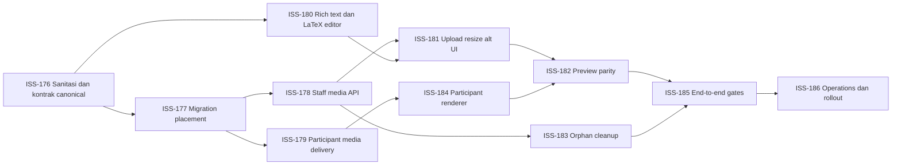

# Rencana Implementasi Rich Content, LaTeX, dan Gambar Soal

**Status:** Ready for implementation
**Versi:** 1.0
**Tanggal:** 4 Oktober 2026
**Product requirements:** [`04-PRD.md`](./04-PRD.md), khususnya `FR-QB-010–FR-QB-013`, `FR-MED-001–FR-MED-013`, dan `FR-MATH-001–FR-MATH-006`
**Backlog:** [`05-ISSUES.md`](./05-ISSUES.md), `ISS-176–ISS-186`
**Keputusan terkait:** [`ADR-005`](./adr/ADR-005-immutable-question-exam-revision.md), [`ADR-009`](./adr/ADR-009-media-storage-and-authorization.md), [`08-OPERATING-BASELINE.md`](./08-OPERATING-BASELINE.md)

Dokumen ini adalah rencana implementasi untuk menambahkan rich text terbatas, LaTeX, gambar pada soal dan opsi jawaban, resize tampilan, teks alternatif, pratinjau soal, serta penghapusan gambar tidak terpakai. Dokumen ini melengkapi PRD dan backlog; detail yang mengubah invariant revision, format konten canonical, atau schema media wajib dicatat dalam ADR sebelum migration digabungkan.

---

## 1. Outcome

Setelah seluruh work package selesai:

1. guru dapat menulis teks terformat dan formula LaTeX inline/block pada stimulus, prompt, penjelasan, opsi, dan pernyataan Benar/Salah;
2. guru dapat mengunggah JPEG/PNG/WebP, menyisipkan gambar pada posisi cursor, mengubah ukuran tampil, mengisi alt text atau menandai dekoratif, mengganti, melepas, dan menghapus gambar orphan;
3. pratinjau guru memakai renderer dan kontrak konten yang sama dengan halaman peserta;
4. peserta menerima konten yang sudah disanitasi tanpa answer key atau metadata storage dan hanya dapat membuka media yang direferensikan session miliknya;
5. published question revision, termasuk konten dan penempatan medianya, tetap immutable;
6. orphan cleanup berjalan bounded, idempotent, dan tidak pernah menghapus media published;
7. fitur lulus security, accessibility, migration, browser, dan participant leakage gate.

---

## 2. Kondisi repository saat audit

Fondasi yang dapat digunakan kembali:

- `question_revisions`, `question_options`, dan `true_false_statements` sudah menyimpan HTML dan memakai immutable revision;
- `media_assets` serta `question_revision_media` sudah tersedia;
- upload service sudah membatasi JPEG/PNG/WebP, 2 MiB, 2.500 pixel, magic bytes, hash, dan random storage key;
- alt text atau explicit decorative flag sudah diwajibkan pada relasi media;
- filesystem protected, Nginx internal location, backup media, serta disk guard sudah tersedia;
- participant manifest sudah mempunyai bentuk media yang tidak membocorkan storage key.

Gap yang harus ditutup:

- nilai `*Html` belum disanitasi server-side sebelum dirender dengan `v-html`;
- kontrak route media guru sudah ada di OpenAPI, tetapi route runtime guru belum terpasang;
- manifest menghasilkan `/api/v1/participant/media/:id`, tetapi endpoint delivery tersebut belum ada;
- relasi media belum mempunyai target option/statement, placement key, urutan, ukuran tampil, atau alignment;
- semua media peserta masih dirender di atas stimulus tanpa melihat target;
- editor guru masih berupa textarea/input dan belum memiliki LaTeX, upload, resize, alt, atau preview;
- media mutation belum mengubah revision version dan belum masuk `content_hash`;
- housekeeping belum membersihkan orphan media;
- batas maksimal tiga media per soal belum ditegakkan end-to-end;
- pemeriksaan gambar production baru membaca container; re-encode dan pembersihan metadata belum tersedia.

Karena sanitasi yang belum tersedia menyentuh `v-html`, `ISS-176` merupakan security blocker dan dikerjakan sebelum toolbar rich text atau upload UI dibuka kepada pengguna.

---

## 3. Keputusan implementasi

### 3.1 Konten canonical

Baseline tetap menyimpan HTML terbatas agar migration tidak mengganti seluruh model question content. HTML canonical hanya boleh memuat elemen dan atribut dalam allowlist aplikasi.

Formula disimpan sebagai source LaTeX pada node terkontrol, bukan sebagai HTML hasil render KaTeX:

```html
<span data-content-node="inline-math" data-latex="x^2+y^2=r^2"></span>
<div data-content-node="block-math" data-latex="\frac{-b\pm\sqrt{b^2-4ac}}{2a}"></div>
```

Penempatan gambar disimpan sebagai placeholder tanpa URL atau path storage:

```html
<figure data-content-node="question-media" data-media-placement="opaque-key"></figure>
```

`data-media-placement` menunjuk relasi media milik revision yang sama. Presenter hanya meresolve placeholder yang valid dan terpasang; placeholder asing, hilang, duplikat yang melanggar kontrak, atau menunjuk asset non-READY membuat validation/publish gagal.

### 3.2 Sanitasi

Sanitasi server-side berlaku pada create, update, import CSV, integration agent, dan migration/backfill. Konfigurasi allowlist disimpan pada satu modul dan diuji dengan corpus XSS.

Baseline allowlist:

- block: `p`, `br`, `blockquote`, `ul`, `ol`, `li`, heading terbatas;
- inline: `strong`, `em`, `u`, `s`, `code`, `sub`, `sup`;
- node aplikasi: math inline/block dan placeholder media;
- atribut: hanya atribut node aplikasi yang tervalidasi.

Baseline melarang `script`, `style`, event handler, `iframe`, embedded object, arbitrary `class/id/style`, external `src`, `srcset`, base64 image, dan URL gambar dari HTML. Link eksternal tidak diaktifkan pada release ini.

Sanitasi terjadi sebelum normalisasi, hashing, persistence, preview, dan participant presentation. Browser boleh menjalankan sanitasi tambahan untuk defense in depth, tetapi tidak menjadi boundary keamanan.

### 3.3 LaTeX

KaTeX digunakan untuk preview editor dan participant renderer dengan konfigurasi bersama:

- `trust: false`;
- macro allowlist tetap;
- `maxSize` dan `maxExpand` bounded;
- error render tidak menjalankan HTML source;
- formula invalid boleh disimpan sebagai draft, tetapi menjadi readiness error dan memblokir publish.

Supported baseline mencakup matematika sekolah umum, matriks, pecahan, akar, superscript/subscript, simbol, serta formula inline dan block. Upload gambar melalui perintah LaTeX, macro buatan pengguna, dan arbitrary HTML command tidak didukung.

### 3.4 Media dan resize

Resize adalah ukuran tampilan, bukan mutasi binary. Simpan `display_width_percent` antara 10 dan 100 dan pertahankan aspect ratio. Renderer selalu memakai `max-width: 100%` agar ukuran aman pada viewport 360 px.

Relasi media mempunyai:

- placement key opaque yang stabil ketika revision dikloning;
- revision ID dan asset ID;
- target `STIMULUS`, `PROMPT`, `EXPLANATION`, `OPTION`, atau `STATEMENT`;
- option ID atau statement ID bila target memerlukannya;
- urutan placement dalam target;
- alt text dan decorative flag;
- display width percent dan alignment;
- created/updated timestamps.

Satu asset boleh dipakai oleh lebih dari satu placement. Alt text tetap milik placement karena maknanya dapat berbeda menurut konteks.

### 3.5 Immutability dan hash

Hash revision canonical meliputi:

- tipe dan seluruh sanitized content;
- urutan serta answer key child;
- placement key, target, urutan, asset ID/hash, alt/decorative, ukuran, dan alignment.

Attach, update placement, detach, dan perubahan alt/resize wajib memakai `expectedUpdatedAt`, mengunci draft revision, memperbarui `question_revisions.updated_at`, dan menghitung ulang hash. Published revision menolak seluruh mutation tersebut.

Ketika published revision diedit menjadi draft baru, clone transaction menyalin placement dan memetakan target option/statement ke child revision baru tanpa mengubah source revision.

---

## 4. Perubahan data

Migration baru tidak mengubah migration `0010_media` yang sudah pernah diterbitkan. Implementasi memilih salah satu pola yang dibuktikan melalui ADR:

1. mengubah `question_revision_media` secara forward-only; atau
2. membuat tabel placement baru dan memigrasikan relasi lama.

Pola tabel placement baru lebih mudah menjaga compatibility dan direkomendasikan:

```text
question_media_placements
├── id
├── placement_key
├── question_revision_id
├── media_asset_id
├── usage
├── question_option_id nullable
├── true_false_statement_id nullable
├── sort_order
├── alt_text nullable
├── is_decorative
├── display_width_percent
├── alignment
├── created_at
└── updated_at
```

Constraint wajib:

- placement key unik per revision;
- target OPTION mempunyai option ID dari revision yang sama;
- target STATEMENT mempunyai statement ID dari revision yang sama;
- target lain tidak mempunyai child ID;
- width 10–100;
- alignment allowlist;
- alt/decorative invariant tetap berlaku;
- maksimal tiga placement pada satu revision ditegakkan service di bawah row lock;
- published references memakai `RESTRICT` dan tidak di-hard-delete.

Backfill relasi lama:

- `STIMULUS`, `PROMPT`, dan `EXPLANATION` dipetakan langsung;
- relasi lama `OPTION` atau `STATEMENT` tanpa child target ditandai sebagai migration error dan deployment dihentikan, kecuali data audit membuktikan tabel production belum berisi bentuk tersebut;
- placeholder ditambahkan secara deterministik pada akhir target terkait;
- hash seluruh draft/published revision terdampak dihitung ulang melalui migration command yang repeatable;
- verification membandingkan jumlah asset, placement, dan reference sebelum/sesudah migration.

Rollback aplikasi boleh memakai release sebelumnya hanya sebelum migration dipakai untuk menulis data baru. Rollback data dilakukan melalui backup/restore, bukan down migration destruktif.

---

## 5. Kontrak API

### 5.1 Guru

| Method | Path | Tujuan |
|---|---|---|
| `POST` | `/api/v1/teacher/media` | Multipart upload asset dan metadata intrinsic. |
| `GET` | `/api/v1/teacher/media/:id/content` | Preview binary setelah ownership/scope check. |
| `GET` | `/api/v1/teacher/media?status=ORPHAN` | Daftar asset orphan milik actor, cursor paginated. |
| `POST` | `/api/v1/teacher/question-revisions/:id/media` | Attach asset dan buat placement pada draft. |
| `PATCH` | `/api/v1/teacher/question-revisions/:id/media/:placementKey` | Ubah alt, decorative, width, alignment, target, atau urutan. |
| `DELETE` | `/api/v1/teacher/question-revisions/:id/media/:placementKey` | Detach placement dari draft. |
| `DELETE` | `/api/v1/teacher/media/:id` | Tandai/hapus asset yang tidak mempunyai reference. |

Seluruh mutation membawa CSRF, idempotency key sesuai baseline, dan `expectedUpdatedAt`. Upload sukses tidak otomatis attach. Bila attach gagal, asset masuk daftar orphan dan tidak hilang sebelum retention berakhir.

### 5.2 Peserta

`GET /api/v1/participant/media/:id` memeriksa bahwa:

1. actor atau practice credential dapat membuka session;
2. session manifest mereferensikan question revision yang memasang asset;
3. asset berstatus READY dan reference published tidak berubah;
4. request tidak mengungkap storage key atau filesystem path.

Setelah authorization, API mengembalikan `X-Accel-Redirect`, MIME yang benar, `nosniff`, dan private cache policy yang telah direview untuk shared-device logout. Direct request ke `/_protected/media/*` tetap ditolak Nginx.

### 5.3 Presenter

Teacher resource memuat authoring metadata dan URL preview. Participant resource hanya memuat sanitized content, placement key/target/order, URL authorized, alt/decorative, width, dan alignment. Answer key, explanation, content hash, original filename, checksum, storage key, serta owner tidak boleh masuk participant schema.

---

## 6. Perubahan web

### 6.1 Editor

Buat komponen reusable:

- `RichContentEditor.vue` untuk rich text dan math;
- `MathEditorDialog.vue` untuk source LaTeX, live preview, dan error;
- `QuestionMediaNode.vue` untuk upload state, alt/decorative, resize, alignment, replace, detach, dan delete orphan;
- `QuestionPreviewDialog.vue` untuk preview viewport ponsel, tablet, dan desktop;
- `SafeQuestionContent.vue` sebagai renderer canonical yang dipakai preview dan peserta.

Toolbar baseline berisi undo/redo, bold, italic, underline, list, subscript, superscript, inline math, block math, upload image, dan hapus format. Paste dari Word/web harus dibersihkan menjadi allowlist; base64 image pada paste ditolak dengan pesan yang dapat ditindaklanjuti.

Upload flow:

1. bila soal belum mempunyai draft ID, simpan draft minimal terlebih dahulu;
2. validasi awal type/size di browser;
3. upload multipart dengan progress dan cancel;
4. minta alt text atau explicit decorative;
5. attach placement pada cursor menggunakan revision version terbaru;
6. ganti temporary preview dengan URL authorized;
7. jika langkah attach gagal, tampilkan retry dan asset tetap tersedia sebagai orphan sementara.

Editor published revision bersifat read-only. Tombol edit membuat draft revision baru lebih dahulu.

### 6.2 Preview

Preview tidak membuat HTML versi lain. Ia menerima resource draft yang sama, memakai `SafeQuestionContent`, dan mematikan penyimpanan jawaban. Mode guru dapat menandai answer key dengan style terpisah yang tidak menjadi bagian participant renderer.

Preview menampilkan:

- urutan teks, formula, dan gambar yang sesungguhnya;
- ukuran serta alignment gambar;
- single/multiple/true-false controls;
- warning formula invalid, placeholder media rusak, alt belum valid, dan overflow;
- switch viewport 360 px, 768 px, dan desktop.

### 6.3 Participant renderer

Renderer tidak memakai raw unsanitized HTML. Ia merender sanitized fragments, mengganti placeholder media berdasarkan placement map, dan menjalankan KaTeX hanya pada node matematika terkontrol. Kegagalan satu formula/gambar menampilkan fallback lokal tanpa menjatuhkan timer, navigation, answer controls, atau outbox.

Gambar mempunyai loading dan retry state. Alt text tidak otomatis diulang sebagai caption; caption hanya tampil bila field caption terpisah tersedia. Decorative image memakai `alt=""` dan tidak diumumkan screen reader.

---

## 7. Orphan lifecycle

Asset disebut orphan bila berstatus READY dan tidak mempunyai placement aktif.

- guru dapat melihat dan menghapus orphan miliknya;
- detach tidak langsung menghapus binary agar undo/retry tetap mungkin;
- housekeeping memilih maksimal 100 orphan berumur lebih dari 7 hari per run, sesuai PRD retention baseline;
- cleanup memakai claim/lock agar dua worker tidak menghapus asset yang sama;
- database ditandai `DELETED`, binary dihapus, dan kegagalan filesystem dapat di-retry;
- asset dengan published atau draft reference tidak pernah menjadi kandidat;
- metric mencatat jumlah kandidat, berhasil, gagal, byte dibebaskan, dan umur orphan tertua tanpa filename/PII.

---

## 8. Dependency

Dependency final dipin oleh lockfile dan seluruh paket Tiptap memakai release line yang sama.

```bash
bun --cwd apps/web add \
  @tiptap/core \
  @tiptap/vue-3 \
  @tiptap/pm \
  @tiptap/starter-kit \
  @tiptap/extension-image \
  @tiptap/extension-mathematics \
  @tiptap/extension-subscript \
  @tiptap/extension-superscript \
  @tiptap/extension-underline \
  katex \
  dompurify

bun --cwd apps/api add katex sanitize-html
bun --cwd apps/api add -d @types/sanitize-html
```

`sharp` adalah hardening opsional setelah compatibility spike Bun. Jika diterima, ia digunakan untuk decode penuh, orientation normalization, metadata stripping, dan output aman; resize editor tetap disimpan sebagai metadata tampilan.

KaTeX CSS dan font dibundle sebagai first-party assets. Tidak ada CDN dan CSP tidak ditambah `unsafe-inline` atau host eksternal.

---

## 9. Urutan delivery



Release dibagi menjadi empat milestone:

1. **Security foundation:** sanitasi aktif untuk konten lama/baru; belum ada toolbar atau upload UI.
2. **Media backend:** migration, route guru/peserta, version/hash, dan orphan cleanup tersedia di balik feature flag.
3. **Authoring dan rendering:** editor, LaTeX, media node, preview, serta participant renderer diaktifkan pada staging.
4. **Pilot gate:** E2E browser/device, migration rehearsal, security corpus, accessibility, backup/restore, dan representative-media load test lulus.

Feature flag tidak boleh membuat participant menerima format yang renderer release aktif belum pahami. Backend membaca format lama selama rollout; writer baru diaktifkan setelah seluruh API/web instance memakai release yang sama.

---

## 10. Verification dan acceptance matrix

### 10.1 Unit/domain

- sanitizer corpus untuk script, event handler, malformed HTML, CSS/URL exfiltration, SVG/MathML namespace, dan arbitrary image source;
- formula valid/invalid, `trust=false`, bounded expansion, serta error escaping;
- media placement target/child ownership, duplicate key, ordering, resize bounds, alt/decorative, dan max-three rule;
- content hash berubah untuk seluruh perubahan media dan tidak berubah untuk serialization yang equivalent;
- published mutation selalu ditolak.

### 10.2 MariaDB integration

- migration dari snapshot sebelum fitur dan backfill count/hash verification;
- FK/check/index serta target child harus berasal dari revision yang sama;
- concurrent attach/update/publish memakai minimal dua connection;
- clone published revision memetakan placement ke child baru;
- cleanup tidak bersaing dengan attach dan tidak menyentuh referenced asset.

### 10.3 API/contract/security

- actual route inventory sama dengan OpenAPI;
- multipart limit, MIME palsu, malformed container, dimensions, dan disk guard;
- teacher cross-scope serta participant cross-session media IDOR ditolak;
- participant schema bebas key, explanation, original filename, hash, dan storage key;
- direct protected URL ditolak;
- CSV dan agent melewati sanitizer yang sama dengan web;
- CSP tetap lulus tanpa CDN/unsafe directives.

### 10.4 Web/E2E

- LaTeX inline/block pada stimulus, prompt, setiap opsi, dan pernyataan;
- gambar disisipkan sebelum/di antara/setelah teks dan tetap pada target setelah reorder;
- upload progress/retry/cancel, resize, alignment, replace, detach, orphan delete;
- draft reload mempertahankan cursor-independent placement dan ukuran;
- preview sama dengan halaman peserta;
- viewport 360/390/768/1366, touch, keyboard, zoom 200%, light/dark/system;
- alt/decorative screen-reader smoke test;
- refresh/resume, temporary offline, image load failure, dan auth expiry tidak menghapus jawaban;
- published revision lama tetap menampilkan media yang sama setelah draft baru dibuat.

### 10.5 Operations

- Nginx multipart envelope dinaikkan secukupnya di atas hard binary limit 2 MiB;
- backup/restore menyertakan asset baru dan placement metadata;
- housekeeping dry run serta real run diverifikasi;
- load test memakai media dan formula representatif tanpa memasukkan editor ke participant bundle;
- bundle size dan mobile render memory dibandingkan dengan baseline.

---

## 11. File map yang diperkirakan

| Area | Perubahan utama |
|---|---|
| `packages/database` | Migration placement, indexes, backfill verification, integration test. |
| `packages/contracts` | Rich content/math/media placement DTO, staff/participant schema, stable error code. |
| `apps/api/modules/questions` | Sanitasi, canonical hash, readiness math/media, clone placement, presenter. |
| `apps/api/modules/media` | Staff/participant delivery, placement mutation, orphan query/cleanup, optional decoder hardening. |
| `apps/api/modules/staff` | Route upload/list/attach/update/detach/delete dan audit mapping. |
| `apps/api/modules/exam-sessions` | Manifest placement resolution serta participant media authorization query. |
| `apps/api/cli/jobs.ts` | Bounded orphan cleanup. |
| `apps/web/components/question` | Rich editor, math dialog, media node, preview, safe renderer. |
| `apps/web/views/QuestionsView.vue` | Editor composition, draft version handling, readonly published state. |
| `apps/web/components/exam/QuestionRenderer.vue` | Canonical content, math, target-aware media, fallback isolation. |
| `ops/nginx` dan runbook | Multipart envelope, cache/headers, deploy/backup/cleanup verification. |

---

## 12. Risiko dan mitigasi

| Risiko | Mitigasi |
|---|---|
| Stored XSS dari rich content | Sanitasi server-side sebelum persistence, allowlist kecil, corpus security, CSP. |
| Placeholder menunjuk media asing | Placement key scoped revision, FK/ownership validation, publish readiness, participant authorization. |
| Published revision berubah melalui media | Row lock, expected version, hash canonical, immutable service/repository checks. |
| Option reorder memindahkan gambar ke jawaban lain | Target memakai stable child ID dan clone/reorder integration tests. |
| Formula berat membekukan browser | Batas source/expansion/size, no user macro, render isolation. |
| Upload orphan memenuhi disk | Disk guard, orphan page, 7-day bounded cleanup, metrics. |
| Gambar tidak tampil saat jaringan buruk | Loading/retry lokal, private cache policy terukur, pertanyaan tetap dapat dijawab. |
| Bundle peserta membesar | Lazy-load editor hanya di staff route; participant hanya memuat KaTeX renderer dan CSS yang diperlukan. |
| Multipart 2 MiB ditolak proxy | Nginx envelope sedikit lebih besar, API tetap menjadi hard binary limit. |
| Native image decoder tidak kompatibel Bun | Pisahkan optional `sharp` spike dari correctness delivery; container validator tetap fallback terbatas. |

---

## 13. Definition of Done program

Program `ISS-176–ISS-186` selesai bila seluruh issue berstatus DONE, migration rehearsal dan rollback decision terdokumentasi, route aktual sesuai OpenAPI, tidak ada high security finding, preview/participant parity lulus, published immutability dan participant leakage lulus, orphan cleanup serta backup/restore terbukti, dan pilot nyata tidak dimulai sebelum seluruh P0 ditutup.
