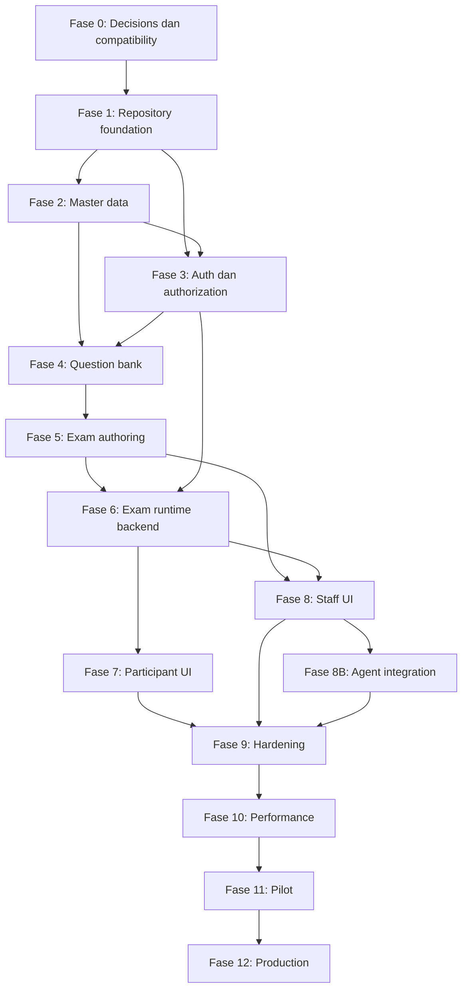

# Development Issues — GezyCBT

**Status:** Backlog awal sebelum implementation  
**Versi dokumen:** 0.1  
**Terakhir diperbarui:** 17 September 2026
**Sumber requirement:** [4-PRD.md](./4-PRD.md)  
**Sumber teknis:** [01-architecture.md](./01-architecture.md), [02-bot-automation.md](./02-bot-automation.md), [03-ui-ux.md](./03-ui-ux.md)

Dokumen ini menerjemahkan PRD dan arsitektur menjadi backlog pekerjaan yang dapat diambil satu per satu. Ia adalah **source backlog awal**, bukan pengganti issue tracker. Ketika repository Git dan issue tracker sudah aktif, setiap item `ISS-*` dapat dibuat sebagai GitHub/GitLab issue dengan ID yang sama agar traceability tetap terjaga.

---

## 1. Cara menggunakan dokumen

### 1.1 Urutan kerja

1. Selesaikan seluruh issue dengan label **Gate Fase 0**.
2. Mulai coding dari Fase 1 hanya setelah `ISS-004` menetapkan database connector.
3. Kerjakan issue berdasarkan dependency, bukan nomor semata.
4. Jangan memulai UI fitur bila kontrak, domain rule, dan API dependency-nya belum Ready.
5. Satu issue idealnya menghasilkan satu perubahan yang dapat direview dan diuji.
6. Pecah kembali issue berukuran `L` ketika detail implementation sudah diketahui.

### 1.2 Status

| Status | Arti |
|---|---|
| `PLANNED` | Sudah tercatat tetapi dependency belum lengkap |
| `READY` | Requirement, dependency, dan acceptance criteria cukup untuk dikerjakan |
| `IN_PROGRESS` | Sedang dikerjakan satu owner |
| `BLOCKED` | Tidak dapat maju karena dependency atau keputusan eksplisit |
| `IN_REVIEW` | Implementation selesai dan menunggu review/gate |
| `DONE` | Acceptance criteria dan verifikasi selesai |

### 1.3 Prioritas

| Prioritas | Makna |
|---|---|
| `P0` | Correctness, security, atau release blocker |
| `P1` | Wajib untuk outcome fase/MVP |
| `P2` | Penting tetapi tidak memblokir critical path saat ini |
| `P3` | Improvement setelah baseline terbukti |

### 1.4 Ukuran

| Ukuran | Panduan |
|---|---|
| `S` | Maksimal sekitar 1 hari kerja, perubahan sempit |
| `M` | Sekitar 2–4 hari kerja, satu concern utama |
| `L` | Lebih dari 4 hari atau lintas concern; wajib dipecah sebelum dimulai |

Ukuran hanya alat perencanaan. Ukuran tidak digunakan untuk mengurangi test atau acceptance criteria.

### 1.5 Status baseline saat ini

| Issue | Status | Evidence |
|---|---|---|
| `ISS-001` | `DONE` | PRD v0.1 telah direview terhadap arsitektur v0.13, integrasi agent v0.3, dan UI/UX v0.6; hasil serta gate terbuka dicatat pada bagian **Status baseline** di [`4-PRD.md`](./4-PRD.md). |
| `ISS-002` | `DONE` | Kandidat matrix versi, primary/fallback database lane, OS/CI/browser matrix, pinning policy, dan handoff spike dicatat di [`6-COMPATIBILITY.md`](./6-COMPATIBILITY.md). |
| `ISS-003` | `DONE` | Bun.SQL lulus lane MariaDB 11.4.13 dan 10.11.19; evidence, skip yang disengaja, serta batas streaming/cursor dicatat di [`7-BUN-SQL-SPIKE.md`](./7-BUN-SQL-SPIKE.md). |
| `ISS-004` | `DONE` | ADR-003 menerima Bun.SQL sebagai default dan menetapkan official MariaDB Connector sebagai fallback adapter; lihat [`ADR-003`](./adr/ADR-003-bun-sql-vs-mariadb-connector.md). |
| `ISS-005` | `DONE` | ADR-001 sampai ADR-012 minimum telah diterima; indeks dan keputusan tersedia di [`docs/adr`](./adr/README.md). |
| `ISS-006` | `DONE` | Browser/device support default, viewport, dan unsupported behavior berada di [`8-OPERATING-BASELINE.md`](./8-OPERATING-BASELINE.md). |
| `ISS-007` | `DONE` | Batas konten, manifest, dan media MVP berada di [`8-OPERATING-BASELINE.md`](./8-OPERATING-BASELINE.md). |
| `ISS-008` | `DONE` | SLO, RPO, RTO, dan alert baseline berada di [`8-OPERATING-BASELINE.md`](./8-OPERATING-BASELINE.md). |
| `ISS-010` | `DONE` | Bun workspace, exact `bun.lock`, strict TypeScript, API/web/package skeleton, serta root validation tersedia di repository. |
| `ISS-011` | `DONE` | Kontrak ID/timestamp UTC, pagination, API error envelope, dan test dasar tersedia di `packages/contracts`. |
| `ISS-012` | `DONE` | Elysia app factory dapat diuji in-memory; bootstrap start/stop idempotent dan konfigurasi dasar gagal cepat. |
| `ISS-013` | `DONE` | Error envelope aman, request ID terverifikasi, dan structured logger metadata-only tersedia pada API foundation. |
| `ISS-014` | `DONE` | Lazy route group admin/guru/peserta/latihan, route fallback/error boundary, serta theme bootstrap tersedia di web shell. |
| `ISS-015` | `DONE` | Migration runner forward-only, checksum SHA-256, advisory lock, dan `schema_migrations` tersedia; unit/integration test lulus. |
| `ISS-016` | `DONE` | MariaDB 11.4 disposable environment dan integration test nyata tersedia pada `ops/docker-compose.test.yml`. |
| `ISS-017` | `DONE` | GitHub Actions menjalankan install, typecheck, lint, unit test, build, dan integration test MariaDB. |
| `ISS-018` | `DONE` | Endpoint `/health/live`, `/health/ready`, metrics bounded, dan readiness dependency checks tersedia pada API. |
| `ISS-019` | `DONE` | Actor context human/agent/system/recovery dan idempotency port tersedia di application layer tanpa dependensi HTTP/Vue. |
| `ISS-020` | `DONE` | Migration identity awal untuk `school_settings`, `users`, dan `auth_sessions` lulus integration test MariaDB dengan constraint dan index baseline. |
| `ISS-021` | `DONE` | Migration academic years, classes, dan class memberships lulus integration test MariaDB dengan FK, unique history, date/status constraints, dan indexes. |
| `ISS-022` | `DONE` | Migration `subjects`, `teacher_subjects`, dan `teacher_classes` lulus integration test MariaDB dengan unique assignment, scope indexes, FK, serta deletion policy `RESTRICT`. |
| `ISS-023` | `DONE` | User repository dan application service menyediakan create, safe profile update, disable berbasis status, optimistic timestamp check, Argon2 hash boundary, dan tidak menyediakan hard delete. |
| `ISS-024` | `DONE` | Academic master service/repository menyediakan tahun ajaran, kelas, roster dengan membership aktif tunggal per tahun, subject, teacher scopes, serta cursor pagination. |
| `ISS-025` | `DONE` | One-time admin bootstrap CLI memakai password melalui stdin, Argon2 async, system lock row transaksional, force password change, dan system audit event; tidak ada route publik. |
| `ISS-026` | `DONE` | Import preview peserta tersedia: parser CSV RFC4180 terbatas 1.500 row/2 MiB, normalisasi dan classification CREATE/UNCHANGED/WOULD_UPDATE/DUPLICATE/ERROR, preview server-side dengan expiry, pagination/filter, dan error CSV aman tanpa credential/token. Unit serta migration integration test lulus. |
| `ISS-027` | `DONE` | Commit import atomic create-only tersedia dengan idempotency replay, temporary password Argon2, encrypted one-time credential artifact 15 menit, re-authentication hook, audit event, dan membership kelas; unit serta MariaDB integration test lulus. |
| `ISS-028` | `DONE` | Generator fixture deterministic tersedia di `packages/database/src/seeds/representative-fixtures.ts`; default menghasilkan 1.500 peserta, 6 kelas, 12 guru, 8 subject, scope guru, namespace terisolasi, dan validasi seed/count. |
| `ISS-030` | `DONE` | Password policy dan `PasswordService` Argon2id tersedia di `apps/api/src/modules/auth`; staff 12–128 karakter, participant 8–128 karakter, validasi username/control character, PHC validation, async hash/verify, dummy verify, bounded queue default 4 concurrent/32 pending, dan `PasswordBusyError` untuk backpressure. Bootstrap admin serta import participant memakai service yang sama. Unit API lulus. |
| `ISS-031` | `DONE` | `AuthSessionService` dan `SqlAuthSessionRepository` menyediakan token opaque 256-bit, digest SHA-256-only di database, cookie `__Host-gezycbt-auth` Secure/HttpOnly/SameSite/Path, idle+absolute expiry, throttled touch, atomic rotation, logout, dan revoke seluruh session user. Unit API lulus. |
| `ISS-032` | `DONE` | CSRF/Origin guard tersedia di `apps/api/src/modules/auth/csrf.ts`; safe methods dilewati, mutation wajib exact same-origin `Origin`, session route wajib synchronizer token `X-CSRF-Token`, public route dapat Origin-only, serta error dipetakan ke 401/403 yang aman. Unit API lulus. |
| `ISS-033` | `DONE` | Login staff dan participant memiliki endpoint terpisah, role/status eligibility, generic authentication failure, dummy verification untuk akun yang tidak eligible, bounded failure limiter sebelum hashing, opaque session cookie, CSRF context, dan trusted client-IP adapter. API typecheck serta 53 test lulus (3 integration test MariaDB ter-skip tanpa database). |
| `ISS-034` | `DONE` | `AuthorizationPolicyService` dan `ActorContext` role/status boundary tersedia untuk admin/staff, teacher ownership + subject/class scope, participant eligibility, session ownership, serta result release visibility. Negative IDOR, cross-role, cross-scope, disabled actor, dan unpublished result tests lulus. API typecheck serta 57 test lulus (3 integration test MariaDB ter-skip tanpa database). |
| `ISS-035` | `DONE` | Password management menyediakan self-change dan admin reset dengan re-authentication, role-aware Argon2 hash, optimistic user update, forced password change untuk reset, revoke seluruh session target, replacement session untuk self-change, dan audit contract tanpa secret. API typecheck serta 62 test lulus (3 integration test MariaDB ter-skip tanpa database). |
| `ISS-036` | `DONE` | Auth expiry contract membedakan cookie hilang vs session expired, mengembalikan `AUTH_SESSION_EXPIRED`, mempertahankan resume context opaque berumur pendek, dan mewajibkan ownership check peserta setelah login ulang. Test expiry, route-bound context, ownership, dan final deadline behavior lulus. API typecheck serta 66 test lulus (3 integration test MariaDB ter-skip tanpa database). |

| `ISS-037` | `DONE` | `auth_throttles` MariaDB migration dan `SqlLoginFailureLimiter` menyimpan bucket kegagalan account/IP berbasis SHA-256, memakai row lock transaction, bertahan restart, mengembalikan `Retry-After`, membersihkan bucket lama secara bounded, serta mempertahankan in-memory limiter untuk fallback. Unit API lulus. |
| `ISS-040` | `DONE` | Migration `question_banks`, `questions`, dan `question_revisions` tersedia dengan ownership subject/teacher, status/lifecycle checks, tiga question type, content hash, revision numbering, published timestamp invariant, foreign key `RESTRICT`, dan query indexes. Migration registry serta integration coverage diperbarui. |
| `ISS-041` | `DONE` | Migration `question_options` dan `true_false_statements` tersedia dengan posisi unik dan bounded (1–10 untuk choice, 1–3 untuk TRUE/FALSE), answer key server-side, foreign key `RESTRICT`, index revision/key, serta integration coverage migration. |

Gate Fase 0 sampai `ISS-041` telah selesai. Issue berikutnya adalah `ISS-042` sesuai urutan backlog.

---

## 2. Definition of Ready

Issue boleh berubah menjadi `READY` bila:

- tujuan dan outcome dapat dijelaskan dalam satu paragraf;
- requirement PRD atau alasan teknisnya disebutkan;
- dependency yang wajib telah `DONE`;
- data/API/UI yang terdampak diketahui;
- acceptance criteria dapat diuji;
- risiko security, migration, dan concurrency sudah diidentifikasi bila relevan;
- tidak ada keputusan produk yang masih perlu ditebak oleh implementer.

Jika issue membutuhkan keputusan yang belum tersedia, buat issue spike/ADR terlebih dahulu dan tandai implementation sebagai `BLOCKED`.

---

## 3. Definition of Done

Issue implementation selesai bila:

1. acceptance criteria issue terpenuhi;
2. requirement ID yang relevan dapat ditelusuri;
3. typecheck, lint, build, dan test yang relevan lulus;
4. negative authorization/security case diuji bila ada boundary akses;
5. migration dan rollback/compatibility impact direview bila schema berubah;
6. error, loading, retry, empty, dan conflict state tersedia bila mempunyai UI;
7. log, metric, dan audit tidak membocorkan data terlarang;
8. dokumentasi/API contract diperbarui bila behavior berubah;
9. tidak ada TODO correctness/security yang ditinggalkan;
10. reviewer dapat menjalankan langkah verifikasi secara reproducible.

---

## 4. Label issue yang disarankan

### Area

`area:foundation`, `area:database`, `area:auth`, `area:academic`, `area:questions`, `area:exams`, `area:sessions`, `area:participant-ui`, `area:staff-ui`, `area:results`, `area:audit`, `area:agent`, `area:ops`, `area:performance`.

### Concern

`security`, `correctness`, `concurrency`, `migration`, `accessibility`, `performance`, `observability`, `documentation`, `testing`, `spike`, `adr`.

### Workflow

`blocked`, `ready`, `needs-product-decision`, `needs-architecture-decision`, `release-blocker`.

---

## 5. Template issue

~~~markdown
## Outcome

Perilaku atau artifact yang harus tersedia setelah issue selesai.

## Requirement

- PRD: FR-... / NFR-... / AC-...
- Architecture/UI/Agent section terkait.

## Scope

- Termasuk: ...
- Tidak termasuk: ...

## Dependencies

- ISS-...

## Acceptance criteria

- [ ] Kriteria yang dapat diuji.
- [ ] Negative/error case.
- [ ] Dokumentasi/contract diperbarui bila perlu.

## Verification

Perintah test, skenario manual, migration check, atau bukti lain.

## Risks

Concurrency, security, data migration, performance, atau operasional.
~~~

---

## 6. Dependency utama

Agent-ready application service, actor context, idempotency, dan audit foundation dibuat sejak Fase 1–3. Tool agent yang dapat digunakan baru dimulai setelah workflow domain terkait stabil.

---

## 7. Fase 0 — Product gate dan compatibility

**Outcome:** keputusan yang memengaruhi fondasi repository dan database telah dibuktikan sebelum coding domain dimulai.

| ID | P | Size | Issue | Dependency | Acceptance ringkas |
|---|---:|---:|---|---|---|
| ISS-001 | P0 | S | Baseline dan freeze PRD v0.1 | — | P-01–P-12, scope MVP, agent staging, SLO, RPO/RTO dapat ditelusuri; konflik dokumen dicatat |
| ISS-002 | P0 | S | Tentukan compatibility matrix inti | ISS-001 | Kandidat versi exact Bun, Elysia, Vue, Vite, TypeScript, MariaDB, dan OS tercatat |
| ISS-003 | P0 | M | Jalankan compatibility spike Bun.SQL × MariaDB | ISS-002 | Seluruh skenario spike reproducible dan menghasilkan bukti pass/fail |
| ISS-004 | P0 | S | Putuskan database connector melalui ADR-003 | ISS-003 | Bun.SQL atau MariaDB Connector dipilih dengan rationale, consequence, dan fallback |
| ISS-005 | P1 | M | Finalisasi ADR-001 sampai ADR-012 minimum | ISS-001, ISS-004 | Setiap concern wajib mempunyai accepted ADR sebelum implementation terkait |
| ISS-006 | P1 | S | Tetapkan browser dan device support matrix | ISS-001 | Browser nyata sekolah, versi minimum, viewport, dan unsupported behavior tercatat |
| ISS-007 | P1 | S | Validasi batas content production | ISS-001 | Jumlah soal, durasi, ukuran manifest, media, jumlah peserta, dan pola jadwal dikonfirmasi |
| ISS-008 | P1 | S | Setujui production SLO, RPO, dan RTO | ISS-001 | Pemilik operasional menyetujui target dan batas single VPS |

### ISS-003 — Skenario minimum spike Bun.SQL

Spike wajib menguji:

- koneksi TCP dan Unix socket bila digunakan;
- pool min/max, acquire timeout, reconnect, dan graceful shutdown;
- parameterized query serta prepared statement behavior;
- `BIGINT UNSIGNED` tanpa precision loss;
- `DECIMAL`, `JSON`, `BOOLEAN`, `utf8mb4`, dan Unicode;
- UTC `DATETIME(6)` round-trip;
- transaction commit, rollback, nested behavior yang diharapkan, dan connection pinning;
- `SELECT ... FOR UPDATE` dengan dua connection nyata;
- unique/foreign key/check error mapping;
- deadlock dan lock-wait-timeout error code;
- batch insert sekitar 100 session-question rows;
- conditional update dan affected-row count;
- streaming/cursor behavior untuk export bila tersedia;
- query timeout/cancellation;
- MariaDB restart dan broken connection recovery;
- memory/RSS saat concurrency representatif.

**Exit criteria:** tidak ada gap correctness pada transaction, type conversion, error mapping, atau reconnect. Gap convenience/performance boleh diterima hanya bila mempunyai wrapper/test yang jelas. Jika exit criteria gagal, ADR-003 memilih official MariaDB Connector tanpa mengubah repository port.

---

## 8. Fase 1 — Repository dan platform foundation

**Outcome:** clean checkout dapat install, migrate, test, build, dan start dengan konfigurasi tervalidasi.

| ID | P | Size | Issue | Dependency | Acceptance ringkas |
|---|---:|---:|---|---|---|
| ISS-010 | P0 | M | Buat Bun workspace dan root configuration | ISS-004, ISS-005 | Workspace API/web/contracts/database/config dikenali; exact lockfile dan strict TS aktif |
| ISS-011 | P0 | M | Buat shared contracts package | ISS-010 | Schema/error/ID/time conventions tersedia tanpa entity DB atau business logic |
| ISS-012 | P0 | M | Buat Elysia app factory dan bootstrap | ISS-010 | App dapat dibuat pada test, start/stop graceful, invalid config gagal cepat |
| ISS-013 | P0 | M | Buat API error envelope, request ID, dan logging | ISS-012 | Error aman, request ID end-to-end, log tanpa raw body sensitif |
| ISS-014 | P1 | M | Buat Vue/Vite route-group shell | ISS-010 | Admin/guru/peserta/latihan lazy routes, route error boundary, theme bootstrap tersedia |
| ISS-015 | P0 | M | Buat migration runner forward-only | ISS-004, ISS-010 | Checksum, single-runner lock, schema_migrations, empty/upgraded DB tests lulus |
| ISS-016 | P0 | M | Siapkan local/CI MariaDB | ISS-010 | Disposable DB reproducible; bukan SQLite; timezone/charset sesuai baseline |
| ISS-017 | P0 | M | Buat CI foundation | ISS-010–ISS-016 | Install, lint, typecheck, unit, build, migrate, integration skeleton berjalan clean |
| ISS-018 | P1 | S | Buat health, readiness, dan metrics foundation | ISS-012, ISS-016 | Live tanpa DB; ready memeriksa DB; metrics localhost/protected |
| ISS-019 | P0 | M | Buat application-service dan actor-context conventions | ISS-011, ISS-012 | Human/agent/system/recovery actor serta idempotency port tidak bergantung HTTP/Vue |

---

## 9. Fase 2 — Database inti dan master data

**Outcome:** admin dapat mengelola data sekolah dan akademik melalui API yang tervalidasi.

| ID | P | Size | Issue | Dependency | Acceptance ringkas |
|---|---:|---:|---|---|---|
| ISS-020 | P0 | M | Migration school settings, users, dan auth sessions | ISS-015 | FK/index/normalized username dan singleton settings tervalidasi |
| ISS-021 | P0 | M | Migration academic years, classes, dan memberships | ISS-015 | Satu membership aktif/tahun ditegakkan application+integration test |
| ISS-022 | P0 | M | Migration subjects dan teacher scopes | ISS-015 | Unique assignment serta deletion/history policy tersedia |
| ISS-023 | P1 | M | Implement user application service dan repository | ISS-020, ISS-019 | Create/update/disable aman; no hard delete untuk user historis |
| ISS-024 | P1 | M | Implement academic master services | ISS-021, ISS-022, ISS-019 | Tahun, kelas, roster, subject, dan scope dapat dikelola dengan pagination |
| ISS-025 | P0 | M | Implement one-time admin bootstrap CLI | ISS-020, ISS-023 | Tidak ada public bootstrap; invocation kedua aman/ditolak; system audit tersedia |
| ISS-026 | P0 | L | Implement import preview pipeline | ISS-020, ISS-021, ISS-023 | 1.500 row dipaginasi/filter; classification dan error CSV aman |
| ISS-027 | P0 | M | Implement import commit dan credential artifact | ISS-026 | Idempotent, create-only blocking, once-download, re-auth hook, audit |
| ISS-028 | P1 | M | Buat representative fixture generator | ISS-020–ISS-022 | 1.500 peserta, kelas, guru, subject, dan data deterministik tersedia |

`ISS-026` telah dipecah menjadi parser/normalizer, persistence preview, query pagination, dan error export. Endpoint HTTP akan dihubungkan pada issue API surface berikutnya setelah application wiring siap.

---

## 10. Fase 3 — Authentication dan authorization

**Outcome:** identity boundary aman untuk tiga role dan application service menerima actor yang terverifikasi.

| ID | P | Size | Issue | Dependency | Acceptance ringkas |
|---|---:|---:|---|---|---|
| ISS-030 | P0 | M | Implement password policy dan Argon2id service | ISS-012, ISS-020 | Async only, PHC string, participant/staff length policy, bounded concurrency benchmark |
| ISS-031 | P0 | L | Implement opaque auth sessions | ISS-020, ISS-030 | Token 256-bit, digest-only DB, Secure/HttpOnly cookie, rotation/logout/revoke |
| ISS-032 | P0 | M | Implement CSRF dan Origin protection | ISS-031 | State mutation tanpa token/origin ditolak; rotation membatalkan token lama |
| ISS-033 | P0 | M | Implement staff/participant login policies | ISS-031 | Endpoint role-specific, generic failure, dummy verify, failure limiter |
| ISS-034 | P0 | L | Implement resource authorization policies | ISS-021–ISS-024, ISS-019, ISS-033 | Admin/teacher/participant matrix dan IDOR negative tests lulus |
| ISS-035 | P0 | M | Implement password change/reset dan session revoke | ISS-031, ISS-034 | Re-auth untuk tindakan sensitif, staff revoke, audit |
| ISS-036 | P0 | M | Implement auth expiry dan participant re-login contract | ISS-031, ISS-011 | `AUTH_SESSION_EXPIRED` tidak mengubah exam session/outbox; return context aman |
| ISS-037 | P1 | M | Implement throttling persistence dan cleanup | ISS-020, ISS-033 | Failure budget bertahan restart untuk account yang ada; coarse IP limit tersedia |

---

## 11. Fase 4 — Bank soal, media, dan scoring

**Outcome:** tiga tipe soal dapat dibuat, divalidasi, dipublish, dipreview aman, dan dinilai deterministik.

| ID | P | Size | Issue | Dependency | Acceptance ringkas |
|---|---:|---:|---|---|---|
| ISS-040 | P0 | M | Migration question bank dan question revisions | ISS-015, ISS-022 | Logical/revision split, ownership, revision number, immutable state tersedia |
| ISS-041 | P0 | M | Migration options dan true/false statements | ISS-040 | 2–10 choice rules dan tepat tiga statement dapat divalidasi |
| ISS-042 | P0 | M | Implement question draft service | ISS-040, ISS-041, ISS-034 | Tiga discriminated contracts, foreign ID rejection, scope enforcement |
| ISS-043 | P0 | M | Implement question readiness validator | ISS-042 | Stable issue code/path/severity; error blocks publish |
| ISS-044 | P0 | M | Implement publish dan immutable revision | ISS-043 | Publish atomic; revision lama tidak berubah; edit membuat draft baru |
| ISS-045 | P0 | M | Implement exact-match scoring engine | ISS-041 | Table/property tests semua correct/incorrect/incomplete/duplicate cases lulus |
| ISS-046 | P0 | L | Implement secure media pipeline | ISS-034 | JPEG/PNG/WebP, 2 MiB, 2500px, magic/decode, random key, atomic cleanup |
| ISS-047 | P0 | M | Implement media relation dan alt policy | ISS-040, ISS-046 | Informative alt wajib; decorative explicit; published reference melarang delete |
| ISS-048 | P0 | M | Implement participant-safe question presenter | ISS-042 | Key/explanation/internal metadata tidak dapat masuk participant schema |
| ISS-049 | P1 | M | Implement question API contract dan OpenAPI | ISS-042–ISS-048 | List/search/detail/draft/validate/publish/media contracts dan negative leakage lulus |

---

## 12. Fase 5 — Exam authoring dan schedule

**Outcome:** guru berwenang dapat menyusun immutable exam revision dan membuat schedule siap diakses.

| ID | P | Size | Issue | Dependency | Acceptance ringkas |
|---|---:|---:|---|---|---|
| ISS-050 | P0 | M | Migration exams, revisions, dan exam questions | ISS-015, ISS-040 | Unique position/revision question, positive points, total score fields |
| ISS-051 | P0 | M | Implement exam draft service | ISS-050, ISS-034 | Add/remove/reorder, expectedVersion, no duplicate, scope enforcement |
| ISS-052 | P0 | M | Implement exam readiness dan publish | ISS-044, ISS-050, ISS-051 | Minimal satu published question; total deterministic; immutable publish |
| ISS-053 | P0 | M | Migration schedules dan targets | ISS-050, ISS-021 | MAIN/PRACTICE, class/participant targets, time/result/attempt policy |
| ISS-054 | P0 | M | Implement schedule service dan lifecycle | ISS-052, ISS-053 | DRAFT/READY/OPEN/CLOSED/ARCHIVED; timestamp authoritative |
| ISS-055 | P0 | M | Implement schedule access code lifecycle | ISS-053, ISS-054 | MAIN/PRACTICE five-character code, uppercase/hyphen normalization, digest/HMAC, teacher proposal/generation, rotate, one-time plaintext, safe hint, generic errors |
| ISS-056 | P0 | M | Implement identity field configuration | ISS-053 | Allowlisted field schema, name required, server normalization/snapshot contract |
| ISS-057 | P1 | M | Implement lifecycle reconciler | ISS-054 | Idempotent; delayed job tidak memperluas eligibility |
| ISS-058 | P1 | M | Implement authoring/schedule API contracts | ISS-051–ISS-057 | Resource version, error, pagination, and audit contracts documented/tested |

---

## 13. Fase 6 — Exam runtime backend

**Outcome:** session runtime terbukti aman terhadap retry, concurrency, deadline, dan restart.

| ID | P | Size | Issue | Dependency | Acceptance ringkas |
|---|---:|---:|---|---|---|
| ISS-060 | P0 | M | Migration exam sessions dan session questions | ISS-015, ISS-053 | Attempt/start unique, status/deadline/finalization constraints, indexes |
| ISS-061 | P0 | M | Migration answers dan results | ISS-060 | Answer PK/version, unique result/session, decimal score fields |
| ISS-062 | P0 | M | Migration attempt grants | ISS-060 | Source/attempt/consumed uniqueness dan FK tersedia |
| ISS-063 | P0 | L | Implement main session start | ISS-052–ISS-055, ISS-060, ISS-034 | Username/password plus optional MAIN access code, eligibility, idempotency, hard deadline, deterministic shuffle, bulk manifest |
| ISS-064 | P0 | M | Implement practice resolve/start | ISS-055, ISS-056, ISS-060, ISS-063 | Generic token error, immutable identity, isolated practice cookie |
| ISS-065 | P0 | L | Implement batch answer save | ISS-061, ISS-063 | Max 20, baseVersion, SAVED/UNCHANGED/CONFLICT, partial item outcome |
| ISS-066 | P0 | M | Implement resume participant-safe manifest | ISS-063–ISS-065 | Same order/deadline, authoritative answers, no key leakage |
| ISS-067 | P0 | L | Implement submit with finalAnswers | ISS-045, ISS-061, ISS-065 | Final sync atomic, conflict semantics, unique result, idempotent retry |
| ISS-068 | P0 | M | Implement timeout finalizer | ISS-067 | Request-path deadline enforcement, small idempotent batches, lag metric |
| ISS-069 | P0 | M | Implement time extension | ISS-060, ISS-068 | Positive only, expectedVersion, deadline event, audit |
| ISS-070 | P0 | M | Implement Akhiri Sesi | ISS-067 | One session only, committed answers, `STAFF_END`, normal release policy |
| ISS-071 | P0 | M | Implement Tutup Jadwal | ISS-068, ISS-070 | Schedule close atomic boundary, batch finalization, `SCHEDULE_CLOSE` |
| ISS-072 | P0 | M | Implement reset attempt dan grant consumption | ISS-062, ISS-063, ISS-070 | Historical reason preserved, one unused grant, one replacement session |
| ISS-073 | P0 | L | Buat runtime concurrency suite | ISS-063–ISS-072 | Two-connection barriers untuk semua race wajib; invariant data diverifikasi |
| ISS-074 | P1 | M | Implement participant runtime error contract | ISS-065–ISS-072 | Stable 401/409/422/429/503 codes dan safe finalization reason |

`ISS-063`, `ISS-065`, `ISS-067`, dan `ISS-073` adalah critical correctness issues. Jangan menggabungkan ke satu PR.

---

## 14. Fase 7 — Participant web

**Outcome:** peserta utama dan latihan dapat menyelesaikan ujian pada perangkat target serta jaringan tidak stabil.

| ID | P | Size | Issue | Dependency | Acceptance ringkas |
|---|---:|---:|---|---|---|
| ISS-080 | P0 | M | Implement participant login dan dashboard | ISS-033, ISS-054, ISS-063 | Server eligibility, state cards, released results, reset badge |
| ISS-081 | P0 | M | Implement practice token dan identity flow | ISS-055, ISS-064 | Two-step form, five-character normalization, configurable fields, token/identity memory-only |
| ISS-082 | P0 | M | Implement pre-exam dan idempotent start UX | ISS-063, ISS-064 | Double-click disabled, 3s/15s states, status lookup/retry key sama |
| ISS-083 | P0 | M | Implement exam shell responsive | ISS-014 | 360px+, no sidebar/footer, timer/save/connectivity/palette/navigation |
| ISS-084 | P0 | M | Implement three question renderers | ISS-048, ISS-083 | Semantic controls, exact-match instruction, keyboard/touch support |
| ISS-085 | P0 | L | Implement IndexedDB outbox | ISS-065, ISS-066, ISS-083 | Snapshot/pending stores, ack removal, reload persistence, no token storage |
| ISS-086 | P0 | L | Implement autosave/reconnect/conflict UI | ISS-065, ISS-085 | Change-driven batch+jitter, truthful save state, backoff, conflict recovery |
| ISS-087 | P0 | M | Implement timer dan deadline announcements | ISS-066, ISS-083 | Server offset, thresholds, dedup hidden/visible, reduced motion |
| ISS-088 | P0 | L | Implement submit/finalization UX | ISS-067, ISS-074, ISS-085 | finalAnswers, failure matrix, outcome check, no double submit |
| ISS-089 | P0 | M | Implement auth-expired resume overlay | ISS-036, ISS-066, ISS-085 | Outbox/timer retained, ownership checked, no cross-user send |
| ISS-090 | P0 | M | Implement result pages | ISS-061, ISS-067 | Main release gate; practice aggregate/canRetry; no key; no print claim |
| ISS-091 | P1 | M | Implement multi-tab warning dan focus policy | ISS-083–ISS-088 | BroadcastChannel advisory, heading focus, palette focus return |
| ISS-092 | P0 | L | Participant E2E matrix | ISS-080–ISS-091 | Mobile/desktop, refresh, offline, conflict, auth expiry, timeout, theme, a11y |

---

## 15. Fase 8 — Admin dan guru web

**Outcome:** seluruh workflow web dari data peserta sampai export hasil dapat dilakukan tanpa tool database.

| ID | P | Size | Issue | Dependency | Acceptance ringkas |
|---|---:|---:|---|---|---|
| ISS-100 | P1 | L | Implement admin users dan academic UI | ISS-023–ISS-027, ISS-034 | List/form/import wizard, mobile states, role menu, re-auth flows |
| ISS-101 | P1 | M | Implement teacher scope switcher | ISS-024, ISS-034, ISS-014 | URL scope, reset incompatible filters/selection, unsaved confirmation |
| ISS-102 | P1 | L | Implement question bank/editor UI | ISS-049, ISS-046, ISS-047 | Three types, preview, media, alt, readiness links, unsaved state |
| ISS-103 | P1 | L | Implement exam editor dan picker | ISS-051, ISS-052 | 100+ paginated search, selected tray, keyboard reorder, readiness report |
| ISS-104 | P1 | L | Implement schedule UI | ISS-054–ISS-058 | MAIN/PRACTICE forms, targets, five-character code proposal/generation, one-time/hint, lifecycle states |
| ISS-105 | P0 | L | Implement monitoring UI | ISS-069–ISS-072 | Poll+jitter/pause/stale, aggregate, cursor list, session drawer, operations |
| ISS-106 | P1 | L | Implement results dan release UI | ISS-061, ISS-067, ISS-034 | subset/all-filter selection, partial outcome, unrelease warning |
| ISS-107 | P1 | M | Implement export jobs UI | ISS-106 | History, QUEUED/RUNNING/READY/FAILED/EXPIRED, notification, recreate |
| ISS-108 | P1 | M | Implement audit viewer UI | ISS-023, ISS-034 | Cursor/filter/drawer/redaction markers/safe JSON |
| ISS-109 | P1 | M | Implement staff route/section error boundaries | ISS-014, ISS-100–ISS-108 | Widget isolation, request ID, focus recovery, no sensitive telemetry |
| ISS-110 | P0 | L | Staff E2E dan accessibility matrix | ISS-100–ISS-109 | Core admin/guru journeys, mobile strategy, keyboard, light/dark/system |

---

## 16. Fase 8B — External agent integration

**Outcome:** external agent dapat memakai selected application services melalui machine API tanpa mengubah security boundary web.

### 16.1 Agent-ready foundation check

| ID | P | Size | Issue | Dependency | Acceptance ringkas |
|---|---:|---:|---|---|---|
| ISS-120 | P0 | S | Audit agent-readiness application services | ISS-019, ISS-049, ISS-058, ISS-074 | Tidak ada rule hanya di route/Vue; actor dan idempotency tersedia |
| ISS-121 | P0 | M | Migration integration client/credential/grant | ISS-015, ISS-120 | Digest credential, versioned explicit grants, expiry/revoke indexes |
| ISS-122 | P0 | M | Implement machine authentication dan capability policy | ISS-121, ISS-034 | Bearer only, no CSRF/cookie, owner∩grant∩scope, rate limits |
| ISS-123 | P0 | M | Implement management UI dan kill switch | ISS-121, ISS-122 | One-time credential, re-auth, grant snapshot, revoke immediate |

### 16.2 Tool stages

| ID | P | Size | Issue | Dependency | Acceptance ringkas |
|---|---:|---:|---|---|---|
| ISS-124 | P1 | M | Implement `/me`, capabilities, dan discovery tools | ISS-122 | Effective capability/scope, ambiguity ≤20/page, no auto-select |
| ISS-125 | P1 | L | Implement agent question/media authoring | ISS-049, ISS-124 | Separate read_key, sensitive audit, CRUD draft, validation, upload |
| ISS-126 | P1 | L | Implement agent exam authoring | ISS-058, ISS-124 | Stable IDs, expectedVersion, attach/reorder/publish plan |
| ISS-127 | P1 | M | Implement agent result dan practice reads | ISS-090, ISS-124 | Scope/PII separation, canRetry contract, pagination |
| ISS-128 | P1 | L | Implement agent controlled export | ISS-107, ISS-122 | Job, one active, 5-minute one-use download token, audit |
| ISS-129 | P0 | L | Implement exact action plan dan approval | ISS-122 | Canonical hash, 30-minute expiry, grant/target version recheck, web approval |
| ISS-130 | P1 | M | Implement high-risk agent operations | ISS-069–ISS-072, ISS-129 | End/close/extend/reset/release memakai domain service dan reason yang benar |
| ISS-131 | P1 | M | Buat Hivekeep/Hermes compatibility spikes | ISS-124, ISS-129 | HTTP/tool/MCP/vault/approval/file/polling evidence dan pinned matrix |
| ISS-132 | P0 | L | Agent contract/security/load isolation suite | ISS-125–ISS-131 | Replay, revoke, leakage, prompt data, polling, burst tidak merusak exam SLO |

Agent A–E dapat dirilis terpisah. `ISS-130` tidak memblokir penggunaan agent untuk CRUD draft soal.

---

## 17. Fase 9 — Security dan operations hardening

**Outcome:** deployment dapat dioperasikan dan dipulihkan dengan prosedur yang telah diuji.

| ID | P | Size | Issue | Dependency | Acceptance ringkas |
|---|---:|---:|---|---|---|
| ISS-140 | P0 | M | Implement Nginx/TLS/security headers | ISS-012, ISS-014 | HTTPS, CSP, frame deny, nosniff, referrer, permissions policy |
| ISS-141 | P0 | M | Implement filesystem dan protected media/export serving | ISS-046, ISS-107 | Outside webroot, internal redirect, permission, expiry, atomic write |
| ISS-142 | P0 | M | Implement systemd services dan timers | ISS-068, ISS-107 | API/worker/finalize/housekeeping/backup/reconcile units dan locks |
| ISS-143 | P0 | M | Implement structured observability | ISS-018, ISS-065–ISS-068 | Route/query metrics, pool wait, save/conflict/finalization, no high-cardinality PII |
| ISS-144 | P0 | M | Implement log rotation dan disk protection | ISS-143 | Disk alert, reject upload/export first, no query secret logging |
| ISS-145 | P0 | L | Implement backup dan offsite workflow | ISS-015, ISS-141 | DB+media encrypted, checksum, retention, binary log decision |
| ISS-146 | P0 | L | Buat dan uji restore runbook | ISS-145 | Empty-server restore lulus RTO/RPO smoke test |
| ISS-147 | P0 | M | Implement release layout dan deploy/rollback procedure | ISS-017, ISS-142 | Immutable release, migration gate, symlink, readiness rollback |
| ISS-148 | P0 | M | Security review dan leakage test gate | ISS-140–ISS-147 | No high finding; secret rotation, CSP, upload, IDOR, redaction lulus |
| ISS-149 | P1 | M | Buat failure runbooks | ISS-142–ISS-147 | Bun/DB/TLS/disk/backup/finalizer/deploy diagnosis dan response tersedia |

---

## 18. Fase 10 — Performance validation

**Outcome:** kapasitas production dibuktikan dengan correctness validation, bukan latency saja.

| ID | P | Size | Issue | Dependency | Acceptance ringkas |
|---|---:|---:|---|---|---|
| ISS-150 | P0 | M | Buat k6 workload dan data verifier | ISS-028, ISS-073, ISS-092 | Login/start/autosave/reconnect/submit/timeout/monitor scenarios reproducible |
| ISS-151 | P0 | M | Capture dan review hot-query plans | ISS-028, ISS-143 | EXPLAIN dataset representative, scan target tercapai, index berbukti |
| ISS-152 | P0 | L | Jalankan load test 1.000 peserta | ISS-148, ISS-150, ISS-151 | SLO/error/no-loss/no-duplicate dan pool/backpressure target terpenuhi |
| ISS-153 | P0 | M | Jalankan soak dan restart recovery | ISS-152 | Durasi ujian+margin, RSS stabil, Bun restart pulih, ack tetap ada |
| ISS-154 | P0 | M | Tune production baseline dan tulis capacity report | ISS-152, ISS-153 | Pool/Argon2/Nginx/InnoDB/process limit terdokumentasi tanpa mengurangi durability |

---

## 19. Fase 11 — Pilot

**Outcome:** workflow, perangkat, jaringan, dan operasi divalidasi bersama pengguna nyata.

| ID | P | Size | Issue | Dependency | Acceptance ringkas |
|---|---:|---:|---|---|---|
| ISS-160 | P0 | M | Siapkan staging production-like dan dry run | ISS-154 | No production secret/data; staff dapat menjalankan workflow lengkap |
| ISS-161 | P0 | M | Jalankan pilot 30–100 peserta | ISS-160 | Device/network mix, metric, support issue, dan reconciliation dicatat |
| ISS-162 | P0 | M | Simulasikan failure dan recovery saat pilot | ISS-160 | Process/DB/network/timeout/restore response dipahami operator |
| ISS-163 | P0 | M | Triage dan tutup temuan pilot | ISS-161, ISS-162 | Semua correctness/security dan UX severity tinggi selesai |
| ISS-164 | P1 | S | Finalisasi training dan operator handbook | ISS-163 | Admin/guru memahami login, monitoring, recovery, export, support |

---

## 20. Fase 12 — Production

**Outcome:** rilis production pertama berlangsung terkendali dan dapat direkonsiliasi.

| ID | P | Size | Issue | Dependency | Acceptance ringkas |
|---|---:|---:|---|---|---|
| ISS-170 | P0 | S | Freeze release candidate dan checklist | ISS-163, ISS-164 | Artifact checksum, versions, migration, known limits, approval lengkap |
| ISS-171 | P0 | S | Verifikasi backup, disk, TLS, monitoring, dan on-call | ISS-170 | Semua readiness indicator hijau sebelum deploy |
| ISS-172 | P0 | M | Deploy production dan jalankan smoke test | ISS-171 | Tiga role, practice, save/submit, worker, backup, metrics sehat |
| ISS-173 | P0 | M | Jalankan ujian production pertama bertahap | ISS-172 | Operator standby, load/lag/error diawasi, no critical incident |
| ISS-174 | P0 | M | Reconcile session, answer, dan result | ISS-173 | Attempt/result/count konsisten; tidak ada acknowledged loss |
| ISS-175 | P1 | S | Post-launch review | ISS-174 | Incident/UX/performance findings masuk backlog terprioritas |

---

## 21. Backlog setelah baseline

Item berikut tidak dibuat sebagai issue implementation sebelum ada kebutuhan dan keputusan produk:

- MFA staff;
- self-service password recovery;
- recovery code practice guest;
- PDF/template hasil siap cetak;
- review per soal untuk latihan;
- equation editor lanjutan;
- video/audio question media;
- proctoring/anti-cheating lanjutan;
- high availability multi-host;
- Redis/shared limiter;
- native mobile app;
- essay/manual grading;
- configurable multi-role user;
- multi-tenant deployment.

Jika salah satu dipromosikan, buat PRD delta dan ADR/migration analysis sebelum issue implementation.

---

## 22. Urutan issue yang sudah dijalankan dan langkah berikutnya

Urutan yang sudah dijalankan:

1. `ISS-001` — review/freeze PRD dan traceability.
2. `ISS-002` — tentukan kandidat versi compatibility matrix.
3. `ISS-003` — tulis dan jalankan Bun.SQL compatibility spike.
4. `ISS-004` — terima ADR-003 berdasarkan bukti spike.
5. `ISS-005` — finalisasi ADR minimum.
6. `ISS-006` sampai `ISS-008` — baseline browser/perangkat, content, dan operasi.

Langkah berikutnya:

7. `ISS-010` — repository skeleton dan root configuration (selesai).

Langkah berikutnya:

8. `ISS-011` — shared contracts package (selesai).
9. `ISS-012` — Elysia app factory dan bootstrap (selesai).
10. `ISS-013` — error envelope, request ID, dan structured logging (selesai).
11. `ISS-014` — Vue/Vite route-group shell (selesai).
12. `ISS-015` — migration runner forward-only (selesai).
13. `ISS-016` — local/CI MariaDB disposable environment (selesai).
14. `ISS-017` — CI foundation (selesai).
15. `ISS-018` — health, readiness, dan metrics foundation (selesai).
16. `ISS-019` — application-service dan actor-context conventions (selesai).
17. Database adapter/repository conventions — selesai sebagai infrastructure foundation.
18. `ISS-020` — migration school settings, users, dan auth sessions (selesai).
19. `ISS-021` — migration academic years, classes, dan memberships (selesai).
20. `ISS-022` — migration subjects dan teacher scopes (selesai).
21. `ISS-023` — user application service dan repository (selesai).
22. `ISS-024` — academic master services (selesai).
23. `ISS-025` — one-time admin bootstrap CLI (selesai).

Langkah berikutnya:

24. `ISS-026` — import preview pipeline (selesai).

Langkah berikutnya:

25. `ISS-027` — import commit dan credential artifact (selesai).

Langkah berikutnya:

26. `ISS-028` — representative fixture generator (selesai).

Langkah berikutnya:

27. `ISS-030` — password policy dan Argon2id service (selesai).

Langkah berikutnya:

28. `ISS-031` — opaque auth sessions (selesai).

Langkah berikutnya:

29. `ISS-032` — CSRF dan Origin protection (selesai).
30. `ISS-033` — staff/participant login policies (selesai).

Langkah berikutnya:

31. `ISS-034` — resource authorization policies (selesai).

Langkah berikutnya:

32. `ISS-035` — password change/reset dan session revoke (selesai).

Langkah berikutnya:

33. `ISS-036` — auth expiry dan participant re-login contract (selesai).

Langkah berikutnya:

34. `ISS-037` — throttling persistence dan cleanup (selesai).
35. `ISS-040` — migration question bank dan question revisions (selesai).

Langkah berikutnya:

36. `ISS-041` — migration options dan true/false statements (selesai).

Langkah berikutnya:

37. `ISS-042` — implement question draft service.

**Coding production tidak dimulai dari halaman login atau UI.** Kode pertama yang layak dibuat adalah harness compatibility spike `ISS-003`. Skeleton aplikasi production dimulai pada `ISS-010` setelah hasil spike dan ADR-003 diterima.

---

## 23. Aturan perubahan backlog

- ID issue tidak digunakan ulang setelah diterbitkan.
- Issue baru ditempatkan pada rentang fase terkait.
- Perubahan scope produk memperbarui PRD terlebih dahulu.
- Perubahan arsitektur sulit dibalik membutuhkan ADR.
- Issue `DONE` tidak diedit untuk menyembunyikan perubahan; buat follow-up issue.
- Dependency baru dapat mengubah status issue kembali menjadi `BLOCKED` dengan alasan tertulis.
- Temuan correctness atau security selalu mengalahkan feature priority.
- Backlog diperbarui setelah setiap fase, pilot, incident, dan capacity test.

---

## Batas dokumen

Backlog ini cukup rinci untuk menentukan urutan dan outcome, tetapi belum menggantikan technical design per issue. Implementer tetap harus membaca requirement dan section sumber sebelum coding. Estimasi kalender, penugasan orang, serta sprint belum ditentukan karena bergantung pada ukuran tim dan hasil Fase 0.
